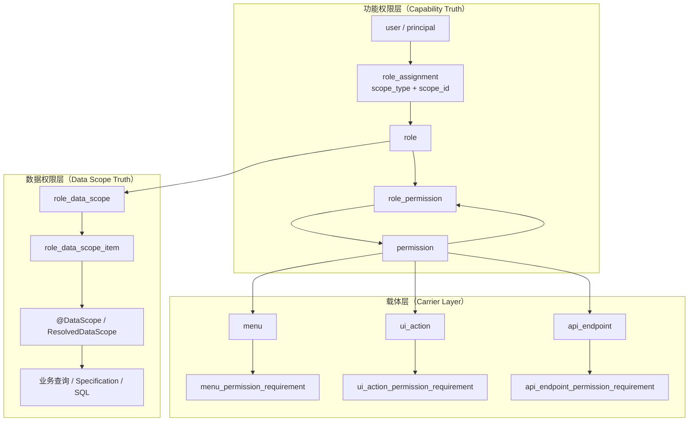

# Tiny Platform 功能权限 + 数据权限分层总图

> 状态：当前分层基线（已部分落地到运行态）  
> 适用范围：`auth / oauth / security / role / resource / menu / tenant / datascope`  
> 配套文档：[TINY_PLATFORM_AUTHORIZATION_MODEL.md](./TINY_PLATFORM_AUTHORIZATION_MODEL.md)、[TINY_PLATFORM_DATASCOPE_EXPANSION_GUIDE.md](./TINY_PLATFORM_DATASCOPE_EXPANSION_GUIDE.md)、控制面 Session/Bearer 与 `GET /sys/users/current` / `POST /sys/users/current/active-scope` 契约见 [TINY_PLATFORM_SESSION_BEARER_AUTH_MATRIX.md](./TINY_PLATFORM_SESSION_BEARER_AUTH_MATRIX.md) §8。

---

## 1. 目的

本文件只回答一件事：

**tiny-platform 的功能权限与数据权限，应该如何分层，才能保持单一真相源、可审计、fail-closed，并允许后续把 `resource` 从“万能表”逐步减载。**

这里不重复维护任务状态；状态与优先级仍以 [TINY_PLATFORM_AUTHORIZATION_TASK_LIST.md](./TINY_PLATFORM_AUTHORIZATION_TASK_LIST.md) 为准。

---

## 2. 总图



---

## 3. 当前落地口径

### 3.1 功能权限

当前运行态功能权限主链路固定为：

```text
principal -> role_assignment -> role -> role_permission -> permission
```

说明：

- `permission` 是**能力真相源**；
- `role_permission` 是**角色到能力的关系真相源**；
- `resource` 已不再属于当前活动 schema；旧文档若仍提到它，只能按历史兼容层理解。

补充（ORG/DEPT active scope 主线口径，2026-03-28）：

- role_assignment 的 `scopeType=ORG/DEPT` 已作为一等公民进入运行态“有效赋权集合”（由 RoleAssignmentSyncService 的 applicability filter 决定该赋权对当前用户是否生效）。
- **请求级 active scope 已主线启用**：`TenantContextFilter` 在每个请求上设置 `TenantContext.activeScopeType` / `activeScopeId`。**成对解析（2026-03-28）**：`activeScopeType` 与 `activeScopeId` 不得跨来源拼装——要么整对来自 **JWT**（JWT 显式携带 `activeScopeType` 时，`activeScopeId` 仅读 JWT；ORG/DEPT 的 unit id 禁止再回落 session），要么整对来自 **Session**（JWT **未**携带 `activeScopeType` 时，ORG/DEPT 的 id 仅读 session）。**Session 仅写 `activeScopeId` 未写 `activeScopeType` 的残留**：在 JWT **已**显式断言作用域时，该残留 id 必须与 JWT 成对下的可比 id 一致，否则按 **Bearer–Session 成对冲突** fail-closed（避免历史上「JWT type + 仅 session id」被静默忽略）。**Bearer 优先于 session 仅在「是否由 JWT 断言作用域」这一层**：有 JWT type 则以 JWT 成对为准；无 JWT type 则完全以 session 成对为准。若请求上 **同时**存在 Bearer 与 session，且二者对 active scope 的成对断言不一致，则 **fail-closed**（**401** `invalid_active_scope` + `invalid_token`，并将会话内 active scope 重置为 TENANT、清理 `SecurityContextHolder` 与会话内 `SPRING_SECURITY_CONTEXT`，**不**静默降级放行）。JWT 单独携带 `activeScopeId` 却无可用 `activeScopeType` 视为孤儿声明，同样拒绝。`UserDetailsServiceImpl`、`PermissionVersionService` 按 active scope 计算 authorities / `permissionsVersion`。**业务扩面（2026-03-28）**：`DataScopeResolverService.resolve` 在 `@DataScope` 解析时调用 `EffectiveRoleResolutionService.findEffectiveRoleIdsForUserInTenant(userId, tenantId, activeScopeType, activeScopeId)`（TENANT/PLATFORM 与历史两参等价）；并对 ORG/DEPT 类 `role_data_scope` 几何使用 **活动 ORG/DEPT 单元锚点**（TENANT 下仍回退主部门，见任务清单阶段 4 扩面补充），从而影响 **用户列表**（`UserServiceImpl.users` → `resolveVisibleUserIdsForRead`）及 **组织树/列表**（`OrganizationUnitService`）等已挂 `@DataScope` 的读路径；`UserServiceImpl.getRoleIdsByUserId`（含工作流身份解析）同步按 active scope 取有效角色。**第二批控制面**：`SchedulingService.listDags` 在库侧 `Specification` 消费 `ResolvedDataScope`；`ExportTaskService.findReadableTasks` 经 `@DataScope` 后在 **第三批** 下推为库侧 `Specification`（见下条）；前端调度 **DAG 列表**（`Dag.vue`）与 **导出任务列表**（`ExportTask.vue`）在 `active-scope-changed` 后重拉，使 TENANT/ORG/DEPT 切换后的后端差异可在页面上体现。**TENANT** 默认行为保持兼容。
- **数据范围 Contract B（2026-03-28 固化）**：`activeScopeType=ORG` 时，`role_data_scope` 中 ORG 形规则以活动组织为几何锚点；**DEPT / DEPT_AND_CHILD** 形规则以用户**主部门**为几何锚点（与 TENANT 一致），不是活动组织下的推断部门——此为稳定产品边界，实现与验证见 `DataScopeResolverService` 与 `TINY_PLATFORM_DATASCOPE_EXPANSION_GUIDE.md`（Contract B）。
- **平台模板副本（契约 B，2026-03-29）**：**不**提供删除租户 carrier/角色副本后「一键重建 / 回退」的治理 API；`initialize` 仅回填缺失的 `tenant_id IS NULL` 平台模板，`diff` 为治理前证据；重复 bootstrap **fail-closed**。见 `TINY_PLATFORM_TENANT_GOVERNANCE.md` §3.2。
- **第三批收口（2026-03-28）**：主线议题已从「是否启用 active scope」转为 **读链查询层下推** 与 **边界声明**。**export**：`findReadableTasks` 使用 `tenant_id` +（`user_id` / `username` 命中可见 owner 键 OR）的 JPA `Specification`，按 `createdAt` 降序在库侧过滤；无有效 `activeTenantId` 时返回空列表（读路径 fail-closed）。**调度运行历史（正式契约）**：`getDagRuns` / `DagHistory` **不**接入 `@DataScope`，不按 active scope 收缩；租户 + DAG 归属校验 + 全量 Run 分页，理由与验证见 `TINY_PLATFORM_DATASCOPE_EXPANSION_GUIDE.md`「运行历史契约」。**第四批（2026-03-28）— menu/resource 控制面证据**：`Menu.vue`、`resource.vue` 监听 `active-scope-changed` 重拉后端；`ResourceServiceImpl.findTopLevelDtos` / `findChildDtos` / `findResourceTreeDtos` 在库侧追加与分页 `resources` 一致的 `created_by` 谓词；`MenuServiceImpl.list` 等保持 `@DataScope` + `DataScopeContext`。**字典**：后端 dict 读已 `@DataScope`；租户字典管理 `dictType.vue` / `dictItem.vue` 通过 `shouldReloadTenantControlPlaneOnActiveScopeChange()`（`activeScopeEvents.ts`）统一判定：仅已选活动租户时随 `active-scope-changed` 重拉；无活动租户时不跟 scope（正式边界，见 `TINY_PLATFORM_DATASCOPE_EXPANSION_GUIDE.md` §10）。**口径澄清**：外部若仍见「ORG/DEPT active scope 尚未启用」类表述，应视为 **旧快照**；与现状不符时以本段及 `TINY_PLATFORM_AUTHORIZATION_TASK_LIST.md` 阶段 4 为准。
- **非法 ORG/DEPT active scope** 必须 fail-closed：无 Bearer 时 Filter 对 Session 路径返回 **403** `invalid_active_scope` 并重置 session 内 scope 为 TENANT、清理 `SecurityContext`；带 Bearer 时返回 **401** `invalid_active_scope` 与 `WWW-Authenticate: Bearer error="invalid_token"`（与上述冲突、孤儿声明同一错误码），并同样清理会话安全上下文，避免混合态残留；**不得**以未捕获校验异常落到 **500**。

### 3.2 载体层

当前仓库中，载体层的活动 schema / 运行时口径已经收口为：

- 活动载体表：`menu`、`ui_action`、`api_endpoint`
- 显式绑定字段：carrier 表的 `required_permission_id`
- 组合需求表：
  - `menu_permission_requirement`
  - `ui_action_permission_requirement`
  - `api_endpoint_permission_requirement`

历史说明：

- `resource` 曾在迁移期作为兼容总表存在，但已通过 Liquibase 131 物理删除；
- `resource.permission`、`resource.required_permission_id` 只应按历史迁移阶段名词理解，不再代表当前数据库表结构；
- compatibility group 仍统一使用 `requirement_group = 0`、`negated = false` 对齐单权限旧模型，但承载位置已切到 carrier / requirement 表。

### 3.3 复杂需求（当前已落地的最小语义）

当前 requirement 层已经落到库和代码中，但只实现了**最小确定性语义**：

- **组内**：`AND`
- **组间**：`OR`
- **单条 requirement**：支持 `negated=true` 表示“该 permission 不得出现”
- **无 requirement 行**：回退到 carrier 的单权限字段（兼容旧模型）

当前运行态消费范围：

- 菜单运行时树：已消费 `menu_permission_requirement`
- `api_endpoint`：统一守卫已接入 Spring Security filter chain，命中已登记 endpoint 后按 requirement fail-closed（含模板 URI 严格匹配）；但“覆盖哪些接口”仍取决于登记数据与真实测试证据，见 `docs/TINY_PLATFORM_API_ENDPOINT_GUARD_COVERAGE.md`
- `ui_action`：已闭合为统一运行时按钮/操作门控入口：后端 `findAllowedUiActionDtos(...)` 按 requirement 求值并写 requirement-aware 审计；前端页面统一通过 runtime `ui_action` allow 集合决定按钮可见性（允许额外更严格隐藏，但不允许放宽后端结论）

### 3.4 数据权限

数据权限不进入 `permission_code`，也不直接塞进 `resource`。

数据权限主链路保持为：

```text
principal/effective roles -> role_data_scope -> role_data_scope_item -> @DataScope -> 业务查询
```

约束：

- `permission` 只回答“能不能做这件事”；
- `role_data_scope` 只回答“在允许做的前提下，能看到哪些数据”；
- `@DataScope` 只在业务查询层消费，不在通用菜单/API 载体层硬编码。

---

## 4. 分层原则

### 4.1 单一真相源

- 功能授权只看 `role_permission -> permission`
- 数据范围只看 `role_data_scope*`
- 不允许在 `menu/resource/api` 侧再维护第二套授权真相

### 4.2 显式绑定，避免字符串漂移

历史迁移期曾保留 `resource.permission`，但它只应作为：

- 兼容字段
- 运营可读字段
- 历史回填输入

真正的载体绑定应逐步收敛为：

```text
resource.required_permission_id -> permission.id
menu.required_permission_id -> permission.id
ui_action.required_permission_id -> permission.id
api_endpoint.required_permission_id -> permission.id
```

### 4.3 fail-closed

禁用权限或移除角色后：

- JWT / Session 中的权限集合应同步收紧；
- 载体解析应因缺少 `permission` 命中而拒绝，不允许兜底放行；
- 数据范围解析为空时，应得到空集合或拒绝结果，而不是默认全量；
- compatibility group 缺失时，rollout 脚本应直接失败，而不是静默跳过。

### 4.4 复杂需求独立建模

一个页面、按钮或 API 不一定只依赖一个 permission。

复杂组合不应塞进 `permission_code` 或 `resource` 字段，而应由独立 requirement 表表达：

- `menu_permission_requirement`
- `ui_action_permission_requirement`
- `api_endpoint_permission_requirement`

当前已经落地：

- requirement 表与 compatibility group 回填
- `CarrierPermissionRequirementEvaluator`
- 菜单运行时按 requirement 求值

仍未完全落地：

- （已完成）`ui_action` 运行时展示/门控统一消费 requirement
- （已完成）`api_endpoint` 运行时路由守卫统一消费 requirement
- （已完成）requirement-aware 访问审计（可查询、可导出、与前端筛选参数一致）

### 4.5 兼容清退矩阵（2026-03）

#### 可立刻删除（已完成）

- `MenuServiceImpl.mergeTreeMenus(...)`
- `MenuServiceImpl.resolveCurrentUsername()`
- `MenuEntryRepository.findGranted*ByUsername*` 旧菜单运行时查询
- `ResourceRepository.findGrantedResourcesByUsername*` 旧资源运行时查询

这些逻辑已经不再被当前菜单树、资源管理控制面或 requirement evaluator 使用，删除后后端回归已通过。

#### 需要先迁 runtime 再删除（已完成部分迁移）

- 资源管理控制面按钮门控：已从“只看权限码常量”迁到 `/sys/resources/runtime/ui-actions` + `ui_action` requirement 求值；
- 资源管理控制面 API 调试/门控：已提供 `/sys/resources/runtime/api-access`，由 `api_endpoint` requirement evaluator 统一判断；
- 菜单运行时主读链：已迁到 `menu + permission + requirement`；
- 资源管理树 / 按类型列表 / 父级选择：已迁到 `menu / ui_action / api_endpoint` 读模型。

本轮删除的旧运行时查询和 helper 以这批迁移为前提。

#### 当前仍保留的历史语义与安全约束

- `resource`：已不再是活动表；若在旧文档、旧 SQL 或历史 runbook 中出现，应按“pre-131 兼容层”理解，而不是当前数据库事实；
- `resource.permission`：仅作为历史迁移命名口径、运营可读字段来源和旧文档术语保留；运行时逻辑与当前 schema 均不依赖该字段；
- `CarrierCompatibilitySafetyService`：承接 legacy projection bridge 剩余的两段显式安全语义：`replaceCompatibilityRequirement(requirement_group=0)` 与 `existsPermissionReference`（用于“最后载体撤 role_permission”的判断）；运行时主线不再依赖 `ResourceCarrierProjectionSyncService`；
- `ResourceRepository` 中依赖总表的写链装载 / 回填查询：已退出运行时主线；如仍存在仅允许用于历史/迁移脚本，不得回流主链。
- 2026-03-27 收缩进展：菜单父子关系校验、循环引用检查和递归删除子菜单已优先改读 `menu` 载体（`MenuEntryRepository`）；运行时删除链 direct-delete carrier，不再依赖 `resource` 表。
- 2026-03-27 收缩进展（追加）：`ResourceServiceImpl.findByRoleId/findByUserId` 已从 `resourceId -> ResourceRepository.findAllById` 回读收缩为 `role_permission(permission_id)` -> `menu/ui_action/api_endpoint(required_permission_id)` 组装返回。
- 2026-03-27 收缩进展（追加）：`RoleServiceImpl.updateRoleResources` 已从 `resource` 投影校验切换为 carrier 读模型校验并按 `required_permission_id` 去重写入 `role_permission`；`TenantBootstrapServiceImpl` 模板资源主读已切到 carrier template snapshot（`menu/ui_action/api_endpoint` 统一快照）。
- 2026-03-27 收缩进展（追加）：`RoleServiceImpl.updateRoleResources` 已补事务边界并改为先校验后删写，fail-closed 异常不会留下授权中间态。
- 2026-03-27 收缩进展（追加）：`TenantBootstrapServiceImpl` 已将模板资源实体复制主读切到 carrier template snapshot，并改为直接写入 carrier 表；授权回放仅依赖 carrier `required_permission_id`，缺失即 fail-closed，不再保留 resource fallback。
- 2026-03-27 收缩进展（追加）：资源管理控制面的列表、按类型、详情、按字段/权限查询与存在性校验已迁到 `menu/ui_action/api_endpoint` 读模型组装；`resource` 在阶段 1 中已退出“控制面主读模型”角色。
- 2026-03-27 收缩进展（追加）：`ResourceServiceImpl` / `MenuServiceImpl` 的正常 create/update/updateSort/delete 已下线 bridge `sync/delete` 双写，改为 service 内 direct-write / direct-delete carrier；`resource` 仅作为历史字段承载/可观测/迁移输入保留，不再参与运行时主线读写。
- 2026-03-27 收缩进展（追加）：`RoleRepository.findResourceIdsByRoleId/findGrantedRoleCarrierPairs*` 已从 `resource.required_permission_id` 反查改为 carrier union 推导；`TenantBootstrapServiceImpl.assertPermissionBindingsReady` 也已改为 carrier template snapshot 校验，不再依赖 `resource` 快照做绑定就绪判定。
- 2026-03-27 收缩进展（追加）：`resource` 的 locator 字段（`carrier_type + carrier_source_id`）作为历史资产维度保留（用于归档/迁移/排障等）；运行时主线不依赖 locator 做兼容删除或定位。
- 2026-03-27 收缩进展（追加）：角色授权 API 主契约已支持 `permissionIds`，`resourceIds` 仅保留兼容 alias；最终写入仍统一落 `role_permission(permission_id)`。
- 2026-03-27 收缩进展（追加）：`replaceCompatibilityRequirement` 已改为显式 carrier 主键输入，compatibility group 回填写入 requirement 表时不再读取 `resource.id`。
- 2026-03-27 收缩进展（追加）：legacy `ResourceCarrierProjectionSyncService` 已退出运行时主线；剩余 `replaceCompatibilityRequirement` / `existsPermissionReference` 已迁入 `CarrierCompatibilitySafetyService`，不再作为 projection sync bridge 保留。
- 2026-03-27 收缩进展（追加）：新增 `128-carrier-id-autoincrement-safe-migration.yaml`，在 requirement 外键约束不丢失前提下启用 carrier 主键自增；新建 carrier 默认允许与 compatibility resource 使用不同 id。

这些兼容项的退场前提：

1. 已完成（本次）：已下线 bridge `sync/delete` 双写接口；当前正常写链不再维护 compatibility `resource` 行，写入仅落到 carrier 并维护 `requirement_group=0`，legacy projection bridge 已退出运行时主线；
2. （已完成）共享 ID（`resource.id == carrier.id`）耦合清零；后续仅剩兼容层保留项收缩；
3. `ui_action` 运行时门控与 `api_endpoint` 路由守卫成为统一入口真相源；
4. requirement-aware 审计落地；
5. MySQL/Liquibase rollout 与 backfill 脚本不再依赖 `resource` 作为兼容锚点。

#### 模型推荐

- 继续保持 `role_assignment -> role_permission -> permission` 为唯一功能权限真相源；
- `menu / ui_action / api_endpoint` 只承载展示、路由与运行时入口，不再承担授权关系真相；
- `resource` 目标态应退化为历史兼容视图或完全下线，而不是继续承载新语义。

---

## 5. 当前到目标态的迁移顺序

### 第一步：稳住真相源（已完成）

- `permission / role_permission` 已成为功能权限主链；
- 不再新增任何依赖 `resource.permission = permission_code` 的新逻辑。

### 第二步：把 `resource` 从字符串对齐推进到显式绑定（已完成）

- 已维护 `resource.required_permission_id`
- 新增 / 更新 / bootstrap 已同步写入 `required_permission_id`
- rollout 已检查非空 `resource.permission` 是否全部绑定

### 第三步：把 carrier 表拆出并回填（已完成）

- 已建 `menu / ui_action / api_endpoint`
- 已完成回填与双写同步
- 管理面主要读路径已逐步改读 carrier 表

### 第四步：落 requirement 层（已完成）

- 已建 requirement 表并完成 compatibility group 回填
- 已实现 evaluator、菜单运行时消费、`ui_action` 统一运行时门控与 `api_endpoint` 统一守卫
- requirement-aware 审计已覆盖 `menu/ui_action/api_endpoint` 运行时决策；后续只需持续回归与覆盖证据维护，不再作为阶段闭环阻断

### 第五步：`resource` 兼容层退场（已完成）

当前阶段已经完成：

- 运行时与活动 schema 不再依赖 `resource`；
- carrier 与 requirement 成为唯一活动载体层；
- `resource` 仅在少量历史文档、迁移说明和参考 SQL 中继续出现。

当前阶段性结论：

- 阶段 1（主读迁移）已关闭；
- shared-id 运行时依赖已清零；
- **`resource compatibility` 已退出运行时主线**：正常 create/update/updateSort/delete 与 bootstrap/backfill 不再对 `resource` 表做业务读写；
- 当前仅剩与 `resource` 相关的内容属于历史资产（可观测/迁移输入/运营可读字段）治理范畴，而不是运行时阻断；
- `replaceCompatibilityRequirement` / `existsPermissionReference` 已不再是 `resource`/projection bridge 阻断，而是 carrier requirement / last-reference 的显式安全语义；
- 后续若继续推进，只讨论历史资产治理与物理清理（不在本轮范围），不再把“是否退场”作为门槛语义。

---

## 6. 当前禁止事项

- 禁止把数据权限编码进 `permission_code`
- 禁止在 `resource/menu/api` 上直接拼接组织、部门或 SQL 条件
- 禁止新写链路继续依赖 `resource.permission = permission.permission_code`
- 禁止让 `resource` 重新变成“能力真相源 + 载体真相源 + 数据权限真相源”三者合一
- 禁止在 requirement 层之外新增第二套 AND/OR 判定语义

---

## 7. 一句话裁决

**功能权限与数据权限必须分层：`permission` 管能力，`role_permission` 管授权，`role_assignment` 管作用域，`role_data_scope` 管数据范围，`menu/ui_action/api_endpoint + *_permission_requirement` 管载体及组合需求，`resource` 只保留兼容职责。**
