# Tiny Platform 多租户 SaaS 平台基于 RBAC3 的组织权限、数据权限与数据划拨一体化 ER 图及字段说明

> 状态：定型稿（当前工程审计 + 目标态裁决）  
> 审计基线：2026-03-26 当前仓库 `docs/`、Liquibase changelog、领域实体与运行时实现  
> 关联文档：
>
> - [TINY_PLATFORM_AUTHORIZATION_MODEL.md](./TINY_PLATFORM_AUTHORIZATION_MODEL.md)
> - [TINY_PLATFORM_AUTHORIZATION_LAYERED_MODEL.md](./TINY_PLATFORM_AUTHORIZATION_LAYERED_MODEL.md)
> - [TINY_PLATFORM_DATASCOPE_EXPANSION_GUIDE.md](./TINY_PLATFORM_DATASCOPE_EXPANSION_GUIDE.md)
> - [TINY_PLATFORM_TENANT_GOVERNANCE.md](./TINY_PLATFORM_TENANT_GOVERNANCE.md)
> - [TINY_PLATFORM_AUTHORIZATION_TASK_LIST.md](./TINY_PLATFORM_AUTHORIZATION_TASK_LIST.md)
> - [TINY_PLATFORM_API_ENDPOINT_GUARD_COVERAGE.md](./TINY_PLATFORM_API_ENDPOINT_GUARD_COVERAGE.md)

---

## 1. 文档目标

本文档不是再发明一套与 tiny-platform 并行的权限模型，而是基于当前工程真实实现，整理出一套可执行的一体化模型，用于同时回答以下问题：

1. tiny-platform 当前已经落地了哪些租户、组织、RBAC3、数据权限能力；
2. 当前工程中的真实表名、真实边界和通用方案中的命名差异是什么；
3. 若要继续向“组织权限 + 数据权限 + 数据归属 + 数据划拨”一体化推进，建议如何在现有模型上增量演进；
4. 哪些部分已经是当前运行时真相源，哪些仍属于后续待建设域。

本文档覆盖的统一主题为：

- 租户边界
- 组织边界
- RBAC3 功能权限
- 模块级数据权限
- 业务数据当前/发生/历史归属
- 机构调整与数据划拨

---

## 2. 当前工程审计结论

### 2.1 当前已落地的能力

基于当前代码、实体和 Liquibase 迁移，tiny-platform 已经落地以下能力：

1. **租户边界**
   - `tenant` 已包含 `code / domain / plan_code / lifecycle_status / quota` 等治理字段。
   - 租户生命周期已支持 `ACTIVE / FROZEN / DECOMMISSIONED`。

2. **用户与 membership 分离**
   - 用户主体是 `user`。
   - 用户属于哪个租户，以 `tenant_user` 为运行时真相源。
   - `user.tenant_id` 已退场，仅作历史展示兼容，不再作为授权依据。

3. **RBAC3 功能权限主链**
   - 当前能力真相源是 `role_assignment -> role -> role_permission -> permission`。
   - 角色治理表已落库：`role_hierarchy`、`role_mutex`、`role_prerequisite`、`role_cardinality`。
   - `role_assignment.scope_type/scope_id` 已支持 `PLATFORM / TENANT / ORG / DEPT`。

4. **组织树与用户任职**
   - 当前组织统一表是 `organization_unit`，当前代码支持 `ORG / DEPT`。
   - 用户组织归属表是 `user_unit`，支持多归属与主部门。

5. **模块级数据权限**
   - 当前数据权限真相源是 `role_data_scope` + `role_data_scope_item`。
   - 当前 `scope_type` 支持 `ALL / TENANT / ORG / ORG_AND_CHILD / DEPT / DEPT_AND_CHILD / SELF / CUSTOM`。
   - 当前运行时已有 `@DataScope` 与 `ResolvedDataScope` 解析链。

6. **权限载体层**
   - 载体层结构已经从 `resource` 向 `menu / ui_action / api_endpoint` 拆分。
   - 但当前写链路仍是 `resource` 主写 + carrier 即时投影，并回填 compatibility group（`requirement_group=0`），尚未完成 carrier 独立主写切换。
   - requirement 层已经落地：`menu_permission_requirement / ui_action_permission_requirement / api_endpoint_permission_requirement`。

### 2.2 当前尚未落地、但本方案需要补齐的能力

当前仓库中尚未看到以下“数据归属 / 划拨”域的正式落库：

1. 业务数据当前归属字段标准化，例如 `current_unit_id / occur_unit_id / owner_user_id`；
2. 统一的业务数据归属历史表，例如 `data_unit_history`；
3. 机构调整批次、规则、明细表，例如 `org_adjust_batch / org_adjust_rule / org_adjust_detail`；
4. 组织调整后权限、任职、数据范围、缓存的统一联动闭环。

### 2.3 审计后必须明确的三个现实差异

1. **当前工程不是 `sys_user / sys_role / sys_user_role` 命名体系**
   - 当前真实命名是 `user / role / role_assignment / role_permission / permission`。

2. **当前工程的数据权限不是“角色上挂一个固定 scope_unit_id”**
   - 当前 `role_data_scope` 描述的是“模块访问策略”，不是“固定组织节点”。
   - `CUSTOM` 细项由 `role_data_scope_item` 表达。

3. **当前组织权限作用域与数据权限锚点还没有完全统一**
   - `role_assignment` 已支持 `ORG / DEPT` scope。
   - 但当前 `DataScopeResolverService` 主要仍以 `user_unit` 主部门与组织树为锚点解析范围。
   - 这意味着“角色授权作用域”和“数据可见范围锚点”目前尚未完全合并为同一事实源。

### 2.4 本文定型后的五条裁决

为避免后续在组织数据权限、数据归属和机构划拨上再次出现“每个模块写一套解释”，本文定型后明确以下 5 条裁决：

1. **查询口径必须显式选择**
   - 任一管理查询、导出、统计、报表，都必须在设计上明确属于：
     - 当前归属；
     - 发生归属；
     - 历史时点归属。
   - 禁止在没有声明口径的情况下，既想查“当前归属”，又想得到“历史稳定结果”。

2. **当前数据权限默认只作用于“当前归属口径”**
   - 在 `data_unit_history` 尚未落库前，运行态 `@DataScope` 默认只应用于“当前归属数据”。
   - 任何需要“按历史时点看数”的功能，不得直接复用当前归属查询假装完成。

3. **机构划拨是业务事件，不是批量 update**
   - 单条数据的小范围手工纠偏可以更新业务主表；
   - 但组织撤销、拆分、合并、整批迁移等场景，必须通过 `org_adjust_batch / rule / detail + data_unit_history` 建模；
   - 禁止将机构调整实现为“直接批量 update `current_unit_id` 然后不留历史”。

4. **角色作用域与业务归属必须长期分层**
   - `role_assignment.scope_type/scope_id` 表达“角色在哪个组织范围生效”；
   - `current_unit_id / occur_unit_id / data_unit_history` 表达“数据属于哪个组织节点”；
   - 二者允许联动，但禁止混成一个字段或一套解释。

5. **后续新模块如果要接组织数据权限，必须先接入本文口径**
   - 至少补齐 `tenant_id + current_unit_id + owner_user_id` 中与该模块语义对应的字段；
   - 明确它的查询口径属于 current / occur / history 中哪一种；
   - 否则不应宣称“已经支持组织数据权限”。

---

## 3. 通用术语与当前工程命名映射

| 通用术语 | 当前工程真实表/对象 | 说明 |
| --- | --- | --- |
| tenant | `tenant` | 已落地 |
| sys_user | `user` | 用户主体 |
| tenant membership | `tenant_user` | 当前租户 membership 真相源 |
| sys_role | `role` | 角色模板 |
| sys_permission | `permission` | 权限主数据 |
| sys_user_role | `role_assignment` | 当前不再使用 `user_role` |
| sys_role_permission | `role_permission` | 已落地 |
| sys_role_inherit | `role_hierarchy` | RBAC3 继承 |
| sys_role_constraint | `role_mutex` + `role_prerequisite` + `role_cardinality` | RBAC3 约束拆表 |
| org_unit | `organization_unit` | 当前支持 `ORG / DEPT` |
| user_unit_assignment | `user_unit` | 用户组织归属 |
| role_data_scope_unit | `role_data_scope_item` | 自定义范围项 |
| menu/button/api 载体 | `menu / ui_action / api_endpoint` | 载体层 |

---

## 4. 一体化设计原则

### 4.1 租户边界先于组织边界

所有业务主对象都必须先过 `tenant_id` 过滤，再谈 `ORG / DEPT / SELF / CUSTOM` 等数据范围。

### 4.2 用户、membership、角色赋权三层分离

当前工程已经证明，把“用户是谁”“用户属于哪个租户”“用户在什么作用域被赋什么角色”拆成三层是正确方向：

- `user`
- `tenant_user`
- `role_assignment`

### 4.3 功能权限与数据权限继续保持分离

- 功能权限回答“能不能做”
- 数据权限回答“能看哪些数据”

当前工程中的正确分层仍应保持为：

- 功能权限：`role_assignment -> role_permission -> permission`
- 数据权限：`role_data_scope -> role_data_scope_item -> @DataScope`

### 4.4 组织作用域与业务数据归属必须区分

组织作用域是“角色在哪个组织/部门范围生效”，业务数据归属是“这条业务数据当前/历史属于哪个组织节点”。两者相关，但不是同一个概念。

### 4.5 数据划拨必须单独建模

机构撤销、新设、拆分、合并场景下，不能只更新业务表的 `current_unit_id`。必须有：

- 批次
- 规则
- 明细
- 历史归属
- 审计

---

## 5. 当前工程审计版 ER 图

本图只表达“当前仓库已落地的核心授权结构”。

```mermaid
erDiagram
    tenant ||--o{ tenant_user : membership
    user ||--o{ tenant_user : joins

    user ||--o{ role_assignment : receives
    role ||--o{ role_assignment : granted
    tenant ||--o{ role_assignment : scoped
    organization_unit ||--o{ role_assignment : scoped_by

    role ||--o{ role_permission : owns
    permission ||--o{ role_permission : bound

    role ||--o{ role_hierarchy : parent_of
    role ||--o{ role_hierarchy : child_of
    role ||--o{ role_mutex : mutex_with
    role ||--o{ role_prerequisite : requires
    role ||--o{ role_cardinality : limited_by

    tenant ||--o{ organization_unit : contains
    organization_unit ||--o{ organization_unit : parent_child
    user ||--o{ user_unit : belongs
    organization_unit ||--o{ user_unit : assigns

    role ||--o{ role_data_scope : controls
    role_data_scope ||--o{ role_data_scope_item : expands
    organization_unit ||--o{ role_data_scope_item : targets
    user ||--o{ role_data_scope_item : targets

    permission ||--o{ menu : required_by
    permission ||--o{ ui_action : required_by
    permission ||--o{ api_endpoint : required_by

    menu ||--o{ menu_permission_requirement : requires
    ui_action ||--o{ ui_action_permission_requirement : requires
    api_endpoint ||--o{ api_endpoint_permission_requirement : requires
    permission ||--o{ menu_permission_requirement : item
    permission ||--o{ ui_action_permission_requirement : item
    permission ||--o{ api_endpoint_permission_requirement : item
```

---

## 6. 目标态一体化 ER 图

本图在第 5 章基础上，补入“业务数据归属 + 数据划拨”域。  
其中 `customer_info / contract_info / loan_info` 仅是业务主表占位示例，不代表当前仓库已存在这些表。

```mermaid
erDiagram
    tenant ||--o{ organization_unit : contains
    tenant ||--o{ user : owns
    tenant ||--o{ tenant_user : membership
    tenant ||--o{ role : defines
    tenant ||--o{ role_assignment : scopes
    tenant ||--o{ role_data_scope : controls
    tenant ||--o{ data_unit_history : owns
    tenant ||--o{ org_adjust_batch : owns
    tenant ||--o{ org_adjust_rule : owns
    tenant ||--o{ org_adjust_detail : owns

    user ||--o{ tenant_user : joins
    user ||--o{ role_assignment : receives
    user ||--o{ user_unit : belongs

    organization_unit ||--o{ organization_unit : parent_child
    organization_unit ||--o{ user_unit : assigns
    organization_unit ||--o{ role_assignment : scope_anchor
    organization_unit ||--o{ role_data_scope_item : custom_target
    organization_unit ||--o{ data_unit_history : source_unit
    organization_unit ||--o{ data_unit_history : target_unit
    organization_unit ||--o{ org_adjust_batch : source_scope
    organization_unit ||--o{ org_adjust_rule : source_target
    organization_unit ||--o{ org_adjust_detail : source_target

    role ||--o{ role_permission : binds
    permission ||--o{ role_permission : granted
    role ||--o{ role_hierarchy : parent_child
    role ||--o{ role_mutex : conflict
    role ||--o{ role_prerequisite : prerequisite
    role ||--o{ role_cardinality : cardinality
    role ||--o{ role_data_scope : defines

    role_data_scope ||--o{ role_data_scope_item : expands

    customer_info ||--o{ data_unit_history : tracked_by
    contract_info ||--o{ data_unit_history : tracked_by
    loan_info ||--o{ data_unit_history : tracked_by

    org_adjust_batch ||--o{ org_adjust_rule : includes
    org_adjust_batch ||--o{ org_adjust_detail : executes
    org_adjust_batch ||--o{ data_unit_history : drives
```

---

## 7. 六个域的实体与字段说明

本章按“已落地 / 建议新增”分别说明。

### 7.1 租户域

#### 7.1.1 `tenant` [已落地]

用途：租户隔离根边界，承载生命周期与配额治理。

核心字段：

| 字段 | 当前状态 | 说明 |
| --- | --- | --- |
| `id` | 已落地 | 主键 |
| `code` | 已落地 | 租户编码，唯一 |
| `name` | 已落地 | 租户名称 |
| `domain` | 已落地 | 域名/访问入口 |
| `enabled` | 已落地 | 启用状态 |
| `lifecycle_status` | 已落地 | `ACTIVE / FROZEN / DECOMMISSIONED` |
| `plan_code` | 已落地 | 套餐 |
| `expires_at` | 已落地 | 到期时间 |
| `max_users` | 已落地 | 用户配额 |
| `max_storage_gb` | 已落地 | 存储配额 |
| `contact_*` | 已落地 | 联系人信息 |
| `remark` | 已落地 | 备注 |
| `created_at / updated_at / deleted_at` | 已落地 | 审计时间 |

设计说明：

- 当前仓库的租户治理语义已经比较完整，后续不建议再造第二张“租户状态表”。
- 对业务表而言，`tenant_id` 仍应是第一过滤条件。

### 7.2 主体与 membership 域

#### 7.2.1 `user` [已落地]

用途：全局用户主体。

核心字段：

| 字段 | 当前状态 | 说明 |
| --- | --- | --- |
| `id` | 已落地 | 用户主键 |
| `tenant_id` | 已退场 | 仅历史展示兼容，非授权真相源 |
| `username` | 已落地 | 全局唯一 |
| `nickname` | 已落地 | 显示名 |
| `enabled` | 已落地 | 是否启用 |
| `account_non_expired / account_non_locked / credentials_non_expired` | 已落地 | 账号状态 |
| `email / phone` | 已落地 | 联系方式 |
| `last_login_* / failed_login_*` | 已落地 | 登录与风控审计辅助 |

关键说明：

- 当前工程必须用 `tenant_user` 判断用户属于哪个租户。
- 后续若需要“平台账号 + 多租户账号统一人主体”，当前 `user` 结构可继续复用。

#### 7.2.2 `tenant_user` [已落地]

用途：用户与租户 membership 真相源。

核心字段：

| 字段 | 当前状态 | 说明 |
| --- | --- | --- |
| `id` | 已落地 | 主键 |
| `tenant_id` | 已落地 | 所属租户 |
| `user_id` | 已落地 | 用户 ID |
| `status` | 已落地 | `ACTIVE / INVITED / SUSPENDED / LEFT` |
| `is_default` | 已落地 | 默认激活租户 |
| `joined_at / left_at / last_activated_at` | 已落地 | membership 生命周期 |
| `created_at / updated_at` | 已落地 | 审计时间 |

设计说明：

- 这张表比传统 `user.tenant_id` 更适合多租户 SaaS。
- 未来如果要做“跨租户运营账号切换上下文”，仍应沿用这张表，而不是回退到 `user.tenant_id`。

### 7.3 组织域

#### 7.3.1 `organization_unit` [已落地，建议增强]

用途：统一组织/部门树。

当前已落地字段：

| 字段 | 当前状态 | 说明 |
| --- | --- | --- |
| `id` | 已落地 | 主键 |
| `tenant_id` | 已落地 | 租户边界 |
| `parent_id` | 已落地 | 父节点 |
| `unit_type` | 已落地 | 当前支持 `ORG / DEPT` |
| `code` | 已落地 | 租户内唯一编码 |
| `name` | 已落地 | 节点名称 |
| `sort_order` | 已落地 | 同级排序 |
| `status` | 已落地 | `ACTIVE / DISABLED` |
| `created_by / created_at / updated_at` | 已落地 | 审计字段 |

建议为“数据划拨”补充的字段：

| 字段 | 建议状态 | 说明 |
| --- | --- | --- |
| `root_org_id` | 建议新增 | 当前所属顶级 `ORG` 节点 |
| `unit_path` | 建议新增 | 祖先路径，便于范围查询和划拨对账 |
| `setup_date` | 建议新增 | 设立日期 |
| `cancel_date` | 建议新增 | 撤销日期 |
| `manager_user_id` | 建议新增 | 负责人 |
| `ext_json` | 建议新增 | 组织扩展属性 |

设计说明：

- 当前表足以支撑权限与组织树展示。
- 但若要支撑“拆分 / 合并 / 划拨 / 历史追溯”，建议补 `root_org_id + unit_path + 生效时间字段`。

#### 7.3.2 `user_unit` [已落地，建议增强]

用途：用户组织/部门归属。

当前已落地字段：

| 字段 | 当前状态 | 说明 |
| --- | --- | --- |
| `id` | 已落地 | 主键 |
| `tenant_id` | 已落地 | 租户 |
| `user_id` | 已落地 | 用户 |
| `unit_id` | 已落地 | 组织节点 |
| `is_primary` | 已落地 | 是否主归属 |
| `status` | 已落地 | `ACTIVE / LEFT` |
| `joined_at / left_at` | 已落地 | 生效周期 |
| `created_at / updated_at` | 已落地 | 审计时间 |

建议增强字段：

| 字段 | 建议状态 | 说明 |
| --- | --- | --- |
| `post_code` | 建议新增 | 岗位/任职编码 |
| `assignment_type` | 建议新增 | 主岗/兼岗/挂靠等 |
| `effective_reason` | 建议新增 | 任职变更原因 |

设计说明：

- 当前 `user_unit` 已可表达“多部门兼任 + 主部门”。
- 如果后续需要组织调整联动任职迁移，建议增强为“任职”而不只是“归属”。

### 7.4 RBAC3 功能权限域

#### 7.4.1 `role` [已落地]

用途：角色模板。

核心字段：

| 字段 | 当前状态 | 说明 |
| --- | --- | --- |
| `id` | 已落地 | 主键 |
| `tenant_id` | 已落地 | `NULL` 可表示平台模板 |
| `role_level` | 已落地 | `PLATFORM / TENANT` |
| `code` | 已落地 | 角色编码 |
| `name` | 已落地 | 展示名称 |
| `enabled / builtin` | 已落地 | 状态与内置标识 |
| `description` | 已落地 | 描述 |
| `created_at / updated_at` | 已落地 | 审计时间 |

#### 7.4.2 `permission` [已落地]

用途：能力真相源。

核心字段：

| 字段 | 当前状态 | 说明 |
| --- | --- | --- |
| `id` | 已落地 | 主键 |
| `permission_code` | 已落地 | 规范权限码 |
| `permission_name` | 已落地 | 权限名称 |
| `module_code` | 已落地 | 模块编码 |
| `action_code` | 已落地 | 动作编码 |
| `permission_type` | 已落地 | 权限分类 |
| `description` | 已落地 | 描述 |
| `enabled / built_in_flag` | 已落地 | 状态 |
| `tenant_id` | 已落地 | `NULL` 可表示平台模板 |
| `created_* / updated_*` | 已落地 | 审计字段 |

#### 7.4.3 `role_permission` [已落地]

用途：角色与权限绑定关系。

核心字段：

| 字段 | 当前状态 | 说明 |
| --- | --- | --- |
| `id` | 已落地 | 主键 |
| `tenant_id` | 已落地 | 可为空，表示平台模板 |
| `role_id` | 已落地 | 角色 ID |
| `permission_id` | 已落地 | 权限 ID |
| `created_by / created_at` | 已落地 | 审计字段 |

#### 7.4.4 `role_assignment` [已落地]

用途：谁在什么作用域下拥有哪个角色。

核心字段：

| 字段 | 当前状态 | 说明 |
| --- | --- | --- |
| `id` | 已落地 | 主键 |
| `principal_type` | 已落地 | 当前固定 `USER` |
| `principal_id` | 已落地 | 用户 ID |
| `role_id` | 已落地 | 角色 ID |
| `tenant_id` | 已落地 | 租户 |
| `scope_type` | 已落地 | `PLATFORM / TENANT / ORG / DEPT` |
| `scope_id` | 已落地 | 作用域锚点 |
| `status` | 已落地 | `ACTIVE / DISABLED / EXPIRED` |
| `start_time / end_time` | 已落地 | 生效周期 |
| `granted_by / granted_at / updated_at` | 已落地 | 审计字段 |

设计说明：

- 这是当前工程最关键的“组织权限作用域”承载表。
- 后续如果要把“组织管理员仅能管理某个组织范围数据”与“业务数据归属”打通，应优先围绕 `scope_type/scope_id` 统一口径，而不是再造第三套作用域字段。

#### 7.4.5 `role_hierarchy / role_mutex / role_prerequisite / role_cardinality` [已落地]

用途：RBAC3 角色治理。

字段要点：

| 表 | 核心字段 | 说明 |
| --- | --- | --- |
| `role_hierarchy` | `tenant_id, parent_role_id, child_role_id` | 子角色继承父角色 |
| `role_mutex` | `tenant_id, left_role_id, right_role_id` | 角色互斥 |
| `role_prerequisite` | `tenant_id, role_id, required_role_id` | 先决条件 |
| `role_cardinality` | `tenant_id, role_id, scope_type, max_assignments` | 指定 scope 下最大赋权数 |

审计说明：

- 当前代码已接入约束校验链，但 `enforce` 仍可按开关灰度启用。
- 文档上应视其为“已落地的治理域”，而不是未来概念。

### 7.5 数据权限域

#### 7.5.1 `role_data_scope` [已落地]

用途：定义角色在某业务模块下的数据可见范围。

核心字段：

| 字段 | 当前状态 | 说明 |
| --- | --- | --- |
| `id` | 已落地 | 主键 |
| `tenant_id` | 已落地 | 所属租户 |
| `role_id` | 已落地 | 角色 ID |
| `module` | 已落地 | 模块标识，如 `user / menu / org / dict` |
| `scope_type` | 已落地 | `ALL / TENANT / ORG / ORG_AND_CHILD / DEPT / DEPT_AND_CHILD / SELF / CUSTOM` |
| `access_type` | 已落地 | `READ / WRITE` |
| `created_by / created_at / updated_at` | 已落地 | 审计字段 |

关键说明：

- 当前 tiny-platform 中，`role_data_scope` 不直接保存 `scope_unit_id`。
- 数据范围锚点来自“用户所属组织 + 角色适用范围 + CUSTOM 明细”的组合解析。
- 若后续希望完全与 `role_assignment.scope_id` 对齐，可在不破坏当前模型的前提下，增加“按 assignment scope 优先锚定”的解析策略，而不一定需要新增字段。

#### 7.5.2 `role_data_scope_item` [已落地]

用途：当 `scope_type = CUSTOM` 时，记录具体目标。

核心字段：

| 字段 | 当前状态 | 说明 |
| --- | --- | --- |
| `id` | 已落地 | 主键 |
| `role_data_scope_id` | 已落地 | 父规则 ID |
| `target_type` | 已落地 | `ORG / DEPT / USER` |
| `target_id` | 已落地 | 对应节点/用户 ID |
| `created_at` | 已落地 | 创建时间 |

### 7.6 权限载体域

#### 7.6.1 `menu / ui_action / api_endpoint` [已落地]

用途：承载菜单、按钮、接口三个运行时入口。

共同核心字段：

| 字段 | 当前状态 | 说明 |
| --- | --- | --- |
| `id` | 已落地 | 与 legacy `resource.id` 对齐 |
| `tenant_id` | 已落地 | 可为空，表示平台模板 |
| `resource_level` | 已落地 | `PLATFORM / TENANT` |
| `permission` | 已落地 | 兼容权限码字段 |
| `required_permission_id` | 已落地 | 显式绑定 `permission.id` |
| `enabled` | 已落地 | 启用状态 |
| `created_* / updated_*` | 已落地 | 审计字段 |

设计说明：

- 这三张表属于“功能权限载体层”，不应承担数据归属真相。
- 后续新增业务数据归属模型时，不应把 `current_unit_id` 之类字段塞进载体层。
- 当前完成度应区分“表结构已落地”和“运行时统一消费已闭合”：
  - 当前仍是 `resource` 主写 + `menu / ui_action / api_endpoint` 即时投影 + `requirement_group=0` 回填；
  - 菜单运行时树已按 requirement 求值；
  - `ui_action` 已具备读模型、表结构与 evaluator，但尚未成为全站按钮门控统一真相源；
  - `api_endpoint` 已接入统一守卫，但覆盖完成度与证据等级应以 `docs/TINY_PLATFORM_AUTHORIZATION_TASK_LIST.md` 和 `docs/TINY_PLATFORM_API_ENDPOINT_GUARD_COVERAGE.md` 为准，当前并非所有模块都已闭合。

#### 7.6.2 `menu_permission_requirement / ui_action_permission_requirement / api_endpoint_permission_requirement` [已落地]

用途：表达复杂组合权限需求。

核心字段：

| 字段 | 当前状态 | 说明 |
| --- | --- | --- |
| `tenant_id` | 已落地 | 所属租户 |
| `*_id` | 已落地 | 对应载体 ID |
| `requirement_group` | 已落地 | 组间 OR |
| `sort_order` | 已落地 | 组内顺序 |
| `permission_id` | 已落地 | 权限项 |
| `negated` | 已落地 | 排除条件 |

补充说明：

- 这三张 requirement 表与 `CarrierPermissionRequirementEvaluator` 已经落地，说明“组合权限模型”在表结构和基础运行时能力上已具备；
- 但 requirement 已落地不等于所有消费入口都已收口，当前运行时完成度仍以 `docs/TINY_PLATFORM_AUTHORIZATION_TASK_LIST.md` 为唯一真相源。

---

## 8. 建议新增的数据归属域

本域是本文档相对当前仓库新增的重点。

### 8.1 业务主表统一归属字段

无论最终是 `customer_info`、`contract_info`、`loan_info` 还是其它业务表，只要需要按组织、部门、人员、历史时点查询，就建议统一具备以下字段：

| 字段 | 建议状态 | 说明 |
| --- | --- | --- |
| `tenant_id` | 必须 | 第一层隔离边界 |
| `current_unit_id` | 建议新增 | 当前归属组织节点 |
| `current_org_id` | 建议新增 | 当前顶级 `ORG`，高频汇总冗余 |
| `occur_unit_id` | 建议新增 | 业务发生时归属节点 |
| `occur_org_id` | 建议新增 | 业务发生时顶级 `ORG` |
| `owner_user_id` | 建议新增 | 当前归属人员 |
| `created_at / updated_at` | 建议新增 | 审计时间 |

设计说明：

- `current_*` 用于当前查询与当前权限过滤。
- `occur_*` 用于开户/发生机构统计，不应被后续划拨覆盖。
- `current_org_id` 与 `occur_org_id` 可以看作对 `organization_unit` 顶层 `ORG` 祖先的冗余快照。

### 8.2 `data_unit_history` [建议新增]

用途：统一记录业务对象的组织归属变更历史。

建议字段：

| 字段 | 说明 |
| --- | --- |
| `id` | 主键 |
| `tenant_id` | 所属租户 |
| `object_type` | 对象类型，如 `CUSTOMER / CONTRACT / LOAN` |
| `object_id` | 对象主键 |
| `source_unit_id` | 原归属节点 |
| `source_org_id` | 原顶级机构 |
| `target_unit_id` | 目标归属节点 |
| `target_org_id` | 目标顶级机构 |
| `effective_start_time` | 生效开始时间 |
| `effective_end_time` | 生效结束时间 |
| `allocation_type` | `INIT / TRANSFER / SPLIT / MERGE / MANUAL_ADJUST` |
| `batch_no` | 对应调整批次号 |
| `rule_code` | 命中规则编码 |
| `is_current` | 是否当前有效 |
| `created_by` | 操作人 |
| `created_at` | 创建时间 |

关键说明：

- 当前归属查业务主表。
- 历史归属查 `data_unit_history`。
- 审计对账也查 `data_unit_history`。

---

## 9. 建议新增的数据划拨域

### 9.1 `org_adjust_batch` [建议新增]

用途：记录一次组织调整或数据划拨任务。

建议字段：

| 字段 | 说明 |
| --- | --- |
| `id` | 主键 |
| `tenant_id` | 所属租户 |
| `batch_no` | 批次号，租户内唯一 |
| `batch_name` | 批次名称 |
| `adjust_scene` | `CANCEL / SETUP / SPLIT / MERGE / INTERNAL_TRANSFER` |
| `adjust_level` | `ORG / DEPT / UNIT` |
| `source_unit_id` | 来源组织节点 |
| `source_org_id` | 来源顶级机构 |
| `effective_date` | 生效日期 |
| `status` | `DRAFT / APPROVED / EXECUTING / SUCCESS / FAIL / ROLLBACK` |
| `apply_by / approve_by / execute_by` | 申请/审批/执行人 |
| `apply_time / approve_time / execute_time` | 时间戳 |
| `remark` | 备注 |

### 9.2 `org_adjust_rule` [建议新增]

用途：定义批次内的划拨规则。

建议字段：

| 字段 | 说明 |
| --- | --- |
| `id` | 主键 |
| `tenant_id` | 所属租户 |
| `batch_no` | 批次号 |
| `rule_code` | 规则编码 |
| `source_unit_id` | 来源节点 |
| `target_unit_id` | 目标节点 |
| `object_type` | 作用对象类型 |
| `rule_type` | `ORG_ALL / ATTRIBUTE / REGION / OWNER / PRODUCT / CUSTOM_SQL` |
| `rule_expr` | 规则表达式 |
| `priority_no` | 优先级 |
| `enabled_flag` | 是否启用 |
| `created_at` | 创建时间 |

### 9.3 `org_adjust_detail` [建议新增]

用途：记录每条数据的最终划拨结果。

建议字段：

| 字段 | 说明 |
| --- | --- |
| `id` | 主键 |
| `tenant_id` | 所属租户 |
| `batch_no` | 批次号 |
| `object_type` | 对象类型 |
| `object_id` | 对象 ID |
| `source_unit_id / source_org_id` | 来源归属 |
| `target_unit_id / target_org_id` | 目标归属 |
| `rule_code` | 命中规则 |
| `execute_status` | `INIT / SUCCESS / FAIL` |
| `error_msg` | 错误信息 |
| `created_at / executed_at` | 时间戳 |

---

## 10. 查询口径与联动口径

### 10.1 当前归属口径

用于：

- 当前列表
- 当前统计
- 当前数据权限过滤

字段建议：

- 业务主表 `current_unit_id / current_org_id`

### 10.2 发生归属口径

用于：

- 开户机构
- 业务发生机构
- 历史新增统计

字段建议：

- 业务主表 `occur_unit_id / occur_org_id`

### 10.3 历史时点归属口径

用于：

- 月末/季末/年末统计
- 审计追溯
- 划拨前后核查

字段建议：

- `data_unit_history`

### 10.4 权限范围口径

用于：

- 先判定用户在什么 scope 下有效拥有角色
- 再按模块计算数据可见范围
- 最后用业务数据的 `current_unit_id` 或历史口径字段做过滤

当前建议链路：

1. `tenant_id` 先过滤；
2. `role_assignment` 判定有效角色与作用域；
3. `role_data_scope` 计算模块级可见范围；
4. 业务查询按 `current_unit_id / owner_user_id / history window` 实际落 SQL。

### 10.5 定型后的查询裁决规则

为防止后续查询“口径摇摆”，本文定型后统一要求所有新模块、新报表、新导出都按下表选择口径：

| 场景 | 必须使用的归属口径 | 主字段/主表 | 不应混用 |
| --- | --- | --- | --- |
| 当前管理列表 | 当前归属 | `current_unit_id / current_org_id / owner_user_id` | `occur_*`、历史口径 |
| 当前数据权限过滤 | 当前归属 | `current_unit_id / owner_user_id` + `role_data_scope` | `occur_*`、历史口径 |
| 开户/发生机构统计 | 发生归属 | `occur_unit_id / occur_org_id` | `current_*` |
| 历史时点统计 | 历史时点归属 | `data_unit_history` | 直接查当前归属 |
| 划拨对账/审计追溯 | 历史 + 批次明细 | `data_unit_history + org_adjust_detail` | 单独依赖业务主表当前字段 |

补充裁决：

1. **默认口径**
   - 若接口/报表没有特别声明，管理端列表与控制面查询默认按“当前归属”。

2. **接口契约必须显式**
   - 任何历史统计、发生统计、划拨核查接口，都应在接口命名、参数或文档里显式说明口径；
   - 禁止用同一个列表接口同时承担 current / history 两种语义。

3. **当前 `@DataScope` 的使用边界**
   - 在 `data_unit_history` 尚未正式落地前，`@DataScope` 只应承载“当前归属”过滤；
   - 不应把历史时点权限查询硬塞进现有 `ResolvedDataScope`。

### 10.6 定型后的机构调整执行口径

机构撤销、拆分、合并、内部划拨必须视为“批次化业务事件”，执行口径固定为：

1. 建立 `org_adjust_batch`
   - 明确场景、来源节点、生效日期、审批状态。

2. 建立 `org_adjust_rule`
   - 明确本批次按什么规则筛对象、如何从来源节点映射到目标节点。

3. 生成 `org_adjust_detail`
   - 先得到每条业务数据的“将被迁移到哪里”的明细结果。

4. 更新业务主表当前归属
   - 将 `current_unit_id / current_org_id / owner_user_id` 更新到新值。

5. 追加 `data_unit_history`
   - 记录迁移前后的 source/target、生效区间、批次号、规则编码，并维护 `is_current`。

6. 联动权限与缓存
   - 触发任职、数据范围缓存、查询缓存、索引、统计快照的必要刷新。

7. 写统一审计
   - 批次审批、执行、回滚都必须可审计、可追责。

禁止事项：

- 禁止将整批机构调整实现为“直接批量 update 当前归属字段”；
- 禁止没有 `org_adjust_detail` 与 `data_unit_history` 就宣称“支持历史追溯”；
- 禁止在大批量调整后只修业务主表、不修缓存和统计口径。

---

## 11. 基于当前工程的关键差距与建议收口顺序

### 11.1 当前最大差距

1. **组织权限作用域与数据范围锚点未完全统一**
   - 当前 `role_assignment.scope_id` 与 `DataScopeResolverService` 的主部门锚点是两条并行线。

2. **组织树字段偏轻**
   - 当前 `organization_unit` 足够做权限树，但不足以支撑复杂划拨。

3. **业务数据归属域尚未标准化**
   - 尚未看到统一的 `current_unit_id / occur_unit_id / data_unit_history` 模型。

4. **组织调整域尚未正式落库**
   - 尚未看到 `org_adjust_batch / rule / detail`。

### 11.2 建议落地顺序

1. **先定统一归属字段标准**
   - 为首批业务主表补 `current_unit_id / current_org_id / occur_unit_id / occur_org_id / owner_user_id`；
   - 先从“控制面列表 + 权限过滤一定要依赖哪个字段”说清楚。

2. **再落 `data_unit_history`**
   - 把“当前归属”和“历史归属”拆开；
   - 没有 `data_unit_history` 前，不应上线历史时点统计承诺。

3. **增强 `organization_unit`**
   - 补 `root_org_id / unit_path / setup_date / cancel_date`；
   - 让组织树既能做权限锚点，也能做划拨审计锚点。

4. **让 DataScope 感知 `role_assignment` 作用域**
   - 在 ORG/DEPT scope 角色上，优先消费 `activeScopeType / activeScopeId` 或等价 assignment scope；
   - 不再只依赖主部门作为唯一锚点。

5. **最后建设 `org_adjust_*` 三表与执行链**
   - 批次、规则、明细、历史、审计、回滚一起设计；
   - 一旦进入“组织批量调整”能力，就不允许再靠手工 SQL 维护业务归属。

---

## 12. 推荐索引与约束建议

### 12.1 当前已落地模型继续保持

- `tenant_user`
  - `unique(tenant_id, user_id)`
  - `index(user_id, status)`
  - `index(tenant_id, status)`

- `role_assignment`
  - 当前唯一键已包含 `principal + role + tenant + scope`
  - 建议继续保持 `tenant_id + scope_type + status` 查询索引

- `organization_unit`
  - `unique(tenant_id, code)`
  - `index(tenant_id, parent_id)`

- `user_unit`
  - `unique(tenant_id, user_id, unit_id)`
  - `index(tenant_id, unit_id, status)`

- `role_data_scope`
  - `unique(tenant_id, role_id, module, access_type)`

### 12.2 建议新增模型

- 业务主表
  - `index(tenant_id, current_unit_id)`
  - `index(tenant_id, current_org_id)`
  - `index(tenant_id, owner_user_id)`

- `data_unit_history`
  - `index(tenant_id, object_type, object_id)`
  - `index(tenant_id, target_unit_id, effective_start_time, effective_end_time)`
  - `index(tenant_id, batch_no)`
  - 建议增加“单对象单当前记录”约束，避免同一对象出现多条 `is_current=1`

- `org_adjust_batch`
  - `unique(tenant_id, batch_no)`
  - `index(tenant_id, status, effective_date)`

- `org_adjust_detail`
  - `index(tenant_id, batch_no, execute_status)`
  - `index(tenant_id, object_type, object_id)`
  - 建议增加 `unique(tenant_id, batch_no, object_type, object_id)`，避免同一批次重复处理同一对象

---

## 13. 最终结论

结合当前工程审计，tiny-platform 已经具备比较扎实的授权主线基础：

- `tenant` 负责租户边界
- `tenant_user` 负责 membership
- `role_assignment` 负责“谁在什么作用域拥有角色”
- `role_permission -> permission` 负责功能授权真相源
- `organization_unit / user_unit` 负责组织边界
- `role_data_scope / role_data_scope_item` 负责模块级数据可见范围

这意味着：

1. **核心权限模型已经稳定**
   - 后续基础模块可以继续以 `tenant_user + role_assignment + role_permission + permission + role_data_scope` 作为基线推进；
   - 不需要再回退到历史 `role_resource` 或 `user.tenant_id` 授权模型。

2. **一体化组织数据权限模型还没有闭合**
   - 当前最大的缺口不是功能权限本身，而是“组织作用域、当前归属、发生归属、历史归属、机构划拨”之间的统一口径还未正式落库。

若要真正走到“组织权限、数据权限与数据划拨一体化”，还需要在当前模型之上继续补齐两块能力：

1. **业务数据归属域**
   - 统一 `current / occur / history` 三类归属口径

2. **组织调整与数据划拨域**
   - 统一 `batch / rule / detail / history / audit` 五类执行要素

因此，tiny-platform 的推荐目标态不是推翻现有授权模型，而是以当前已落地的：

- `tenant_user`
- `role_assignment`
- `organization_unit`
- `role_data_scope`

为骨架，增量补齐：

- `data_unit_history`
- `org_adjust_batch`
- `org_adjust_rule`
- `org_adjust_detail`

从而形成一套真正适合多租户 SaaS 平台的：

**租户隔离 + 组织权限 + RBAC3 + 数据权限 + 数据归属 + 数据划拨**

一体化模型。

定型后的执行口径再强调一次：

- 功能权限先按 `role_assignment -> role_permission -> permission` 判定；
- 数据权限默认按“当前归属”口径落在业务主表；
- 发生统计只看 `occur_*`；
- 历史统计与划拨审计只看 `data_unit_history + org_adjust_*`；
- 没有完成这层归属/划拨建模前，不应对外承诺“组织数据权限已经完整稳定”。
