---

> 说明：本文件是 **目标模型对齐分析 / 历史设计讨论**，包含阶段性差异与候选结构，不作为当前运行态权限主链的唯一真相源。  
> 当前仓库实现请以 [TINY_PLATFORM_AUTHORIZATION_MODEL.md](./TINY_PLATFORM_AUTHORIZATION_MODEL.md) 和 [TINY_PLATFORM_PERMISSION_REFACTOR_FINAL_APPROVAL.md](./TINY_PLATFORM_PERMISSION_REFACTOR_FINAL_APPROVAL.md) 为准。

## 38. 现有数据库与目标模型对齐分析

本章用于解决“现有数据库结构”与“本文档目标模型”之间的映射关系问题，避免后续基于单文件继续细化设计时出现理解漂移。

### 38.1 本章目的

本章不是重新设计一套新模型，而是回答以下问题：

1. 当前数据库里已经有哪些表与目标模型一致。
2. 当前数据库里哪些表与目标模型部分一致，但命名或职责不同。
3. 当前数据库里哪些表是插件表、中间件表、历史兼容表，不应混入平台核心对象设计。
4. 后续 Cursor 生成代码时，究竟应以“现状表”为准，还是以“目标表”为准。

### 38.2 对齐判断原则

本章统一按以下 4 类判断：

#### A. 已对齐

现有表与目标模型的对象职责基本一致，可直接纳入平台主线。

#### B. 部分对齐

现有表与目标模型语义接近，但存在：

- 表名不同
- 字段命名不同
- 表职责合并或拆分不同
- 字段层级不一致

这类表不建议直接推倒重来，而应先做映射收敛。

#### C. 待补齐

目标模型中已有明确对象，但现库尚未形成稳定主表，或仍依赖历史替代实现。

#### D. 非核心域

这类表虽然存在于数据库中，但属于：

- 中间件托管表
- 插件模块表
- 示例数据表
- 平台通用基础设施表

不应直接参与 SaaS 核心对象主线判断。

### 38.3 对齐范围说明

本章当前只覆盖 V1 核心主线相关对象，优先覆盖：

- `tenant`
- `user`
- `tenant_user`
- `role`
- `resource`
- `organization_unit`
- `user_unit`
- `role_assignment`
- `role_data_scope`
- `authorization_audit_log`
- `user_authentication_audit`

暂不在本章做字段级展开的对象：

- `act_*`
- `QRTZ_*`
- `oauth2_*`
- `dict_*`
- `scheduling_*`
- `sys_idempotent_*`
- `export_*`

这些对象后续可在插件或基础设施章节中单独分析。

### 38.4 现状表与目标表映射总览

| 现有表 | 目标模型对象 | 对齐结论 | 说明 |
|---|---|---|---|
| `tenant` | `tenant` | 部分对齐 | 主对象一致，但字段命名与状态口径未完全统一 |
| `user` | `user` | 部分对齐 | 主对象一致，但当前更偏认证表风格 |
| `tenant_user` | `tenant_user` | 已对齐 | 已体现“平台身份 + 租户成员身份分离” |
| `role` | `role` | 部分对齐 | 主对象一致，但字段规范仍需统一 |
| `resource` | `resource` | 部分对齐 | 现状为菜单/路由/API 合并模型，目标模型更强调资源统一抽象 |
| `organization_unit` | `org / dept` | 部分对齐 | 现状为合并树模型，目标模型支持拆分模型 |
| `user_unit` | `user_org / user_dept` | 部分对齐 | 现状为合并归属表，目标模型支持拆分归属表 |
| `role_assignment` | `user_role` | 部分对齐 | 现状授权模型更强，目标 V1 可先收敛为简化关系模型 |
| `role_data_scope` | `role_data_scope` | 已对齐 | 主职责一致 |
| `role_data_scope_item` | `role_data_scope_item` | 已对齐 | 主职责一致 |
| `authorization_audit_log` | `permission_change_log / audit_log` | 部分对齐 | 现状更偏授权审计专表 |
| `user_authentication_audit` | `login_log` | 部分对齐 | 现状更偏认证审计表，目标模型偏统一登录日志 |
| `role_resource` | `role_permission / resource` | 历史阶段部分对齐 | `role_resource` 曾承载资源直授语义；当前主迁移路径已切到 `role_permission -> permission -> resource`，且 Liquibase 117 已删除该表 |
| `organization_unit + user_unit` | `org/dept + user_org/user_dept` | 部分对齐 | 现状适合作为 V1 合并实现 |

### 38.5 已对齐对象

#### 1. tenant_user

结论：**已对齐**。

原因：

1. 已经明确体现 `user` 与 `tenant_user` 分层。
2. 已经具备租户成员状态、加入时间、离开时间等成员语义。
3. 与本文档“平台用户是全局身份，租户成员是租户内身份”的设计高度一致。

后续原则：

- 保留该对象作为 V1 核心主线的一部分。
- 不再回退为“直接在 user 表中固化租户身份”。

#### 2. role_data_scope

结论：**已对齐**。

原因：

1. 已经明确数据权限独立于普通 RBAC。
2. 已经具备 `scope_type` 设计。
3. 已经开始支持模块级数据范围。

后续原则：

- 继续沿用“角色数据范围独立建模”的方向。
- V1 如暂不完全启用，也应保留对象口径。

#### 3. role_data_scope_item

结论：**已对齐**。

原因：

1. 已具备 `CUSTOM` 明细配置的核心能力。
2. 与目标模型完全同方向。

### 38.6 部分对齐对象

#### 1. tenant

结论：**部分对齐**。

现状特点：

- 已有租户编码、名称、启用状态、域名、套餐、到期、配额、联系人等字段。
- 已有生命周期字段，但命名口径与目标文档不完全统一。

与目标模型差异：

1. 现表常用字段为：
   - `code`
   - `name`
   - `enabled`
   - `plan_code`
   - `expires_at`
   - `lifecycle_status`
2. 目标模型常用字段为：
   - `tenant_code`
   - `tenant_name`
   - `status`
   - `package_code`
   - `expire_at`
   - `owner_user_id`
   - `isolation_mode`

结论说明：

- 主对象一致。
- 字段命名与状态表达尚未完全统一。
- 后续应做字段级映射，而不是直接认为两者完全同构。

#### 2. user

结论：**部分对齐**。

现状特点：

- 更偏 Spring Security / 认证主体表风格。
- 包含 `enabled`、`account_non_locked`、`credentials_non_expired` 等安全字段。

与目标模型差异：

1. 目标模型希望 `user` 更偏“平台全局身份主表”。
2. 现表仍带有较多认证实现细节。
3. 现表中存在 `tenant_id` 兼容字段，而目标模型强调以 `tenant_user` 为租户成员身份主表。

结论说明：

- `user` 仍应保留为平台全局身份主表。
- 但后续要进一步弱化 `user.tenant_id` 的主语义，避免与 `tenant_user` 冲突。

#### 3. role

结论：**部分对齐**。

现状特点：

- 已有角色编码、名称、描述、启用、内置、租户维度、平台/租户层级等字段。

与目标模型差异：

1. 目标模型期望统一字段口径：
   - `role_code`
   - `role_name`
   - `role_type`
   - `status`
   - `built_in_flag`
2. 现表部分字段语义一致，但命名未完全收敛。
3. `data_scope_type` 在目标模型中属于角色核心设计，而现状更多通过独立数据权限表表达。

结论说明：

- 角色对象主线正确。
- 后续应统一命名与字段规范，不建议推翻角色模型本身。

#### 4. resource

结论：**部分对齐**。

现状特点：

- 同时承载菜单展示、前端路由、按钮权限、接口路径等信息。
- 更像“菜单资源 + API 资源”的合并实现。

与目标模型差异：

1. 目标模型中 `resource` 是统一受控对象。
2. 当前现状里，`resource` 承担了更多前端菜单职责。
3. 本章初稿语境下，`permission` 作为独立主表尚未完全替代“resource.permission / role_resource”这种旧路径；当前仓库运行态已切到 `role_permission -> permission -> resource`。

结论说明：

- 现有 `resource` 仍可保留。
- 但后续应逐步收敛为“资源对象”本身，不让它继续过度承担菜单/路由/权限混合职责。

#### 5. organization_unit

结论：**部分对齐**。

现状特点：

- 采用单表树模型，同时表达 `ORG / DEPT`。
- 对 V1 非常实用。

与目标模型差异：

1. 目标模型在总体设计上同时支持：
   - 合并模型（一个树）
   - 拆分模型（org + dept）
2. 当前现状显然属于“合并模型”。

结论说明：

- 不能把 `organization_unit` 误判为设计错误。
- 它应被视为 V1 可接受的“合并实现版本”。
- 若未来需要更强治理，再向 `org / dept` 拆分演进。

#### 6. user_unit

结论：**部分对齐**。

现状特点：

- 表达用户与组织/部门节点的归属关系。
- 与 `organization_unit` 成对出现。

与目标模型差异：

1. 目标模型中可拆为：
   - `user_org`
   - `user_dept`
2. 当前现状是统一归属表。

结论说明：

- 当前实现适合作为 V1 合并模型。
- 后续若拆分 `org / dept`，则再同步拆分 `user_unit`。

#### 7. role_assignment

结论：**部分对齐**。

现状特点：

- 当前模型比简单 `user_role` 更强。
- 已包含 `scope_type`、`scope_id`、生效时间、状态等概念。

与目标模型差异：

1. 目标文档中的 V1 关系模型更偏简化：`user_role`。
2. 当前现状更接近“RBAC3 / scoped assignment”模型。

结论说明：

- 这不是错误，而是现状比目标 V1 草案更复杂。
- 若 V1 要降低复杂度，可在语义上把 `role_assignment` 视作 `user_role` 的增强版，而不是另起一套平行模型。

#### 8. authorization_audit_log

结论：**部分对齐**。

现状特点：

- 更偏授权变更专用审计表。

与目标模型差异：

1. 目标模型中授权类审计最终希望收敛到：
   - `audit_log`
   - `permission_change_log`
2. 当前现状已经形成专表能力。

结论说明：

- 可视为目标模型中的“授权审计域现状实现”。
- 后续不应简单删除，而应在统一审计域中重新定位。

#### 9. user_authentication_audit

结论：**部分对齐**。

现状特点：

- 更偏认证事件表，覆盖登录、登出、MFA、Token 等。

与目标模型差异：

1. 目标模型中 `login_log` 更偏统一登录审计主表。
2. 当前现状范围更广，超出单纯登录。

结论说明：

- 可视为 `login_log` 的增强实现。
- 后续若统一审计域，需要决定：
  - 保留专表
  - 或抽取其中登录子集映射到 `login_log`

### 38.7 待补齐对象

以下对象在目标模型中已经明确，但现库尚未形成足够清晰的核心主表口径：

#### 1. permission

当前问题：

- 历史阶段曾存在 `role_resource`、`resource.permission` 一类旧路径影响；当前运行态已改为 `role_permission -> permission -> resource`，`resource.permission` 仅保留对齐字段语义。
- 尚未完全形成“权限作为独立动作能力主表”的统一实现。

#### 2. role_permission

当前问题：

- 现状授权仍部分绕过 `permission`，直接面向 `resource`。
- 目标模型强调：
  `role -> permission -> resource`

#### 3. module / tenant_module

当前问题：

- 现有插件与模块能力很多，但平台级统一模块开通模型还未完全固化为核心主表。

#### 4. tenant_setting / tenant_security_policy

当前问题：

- 这些能力在设计上已明确，但现状表层还没有形成统一标准口径。

#### 5. audit_log / login_log / permission_change_log

当前问题：

- 现状审计表较多，但统一审计模型尚未完全收敛。

### 38.8 非核心域对象说明

以下对象不纳入本章核心对齐判断：

#### 1. 中间件托管表

- `act_*`
- `QRTZ_*`
- `oauth2_*`
- `databasechangelog*`

原因：

- 它们属于工作流引擎、调度器、认证服务器、Liquibase 的托管表。
- 不应与 SaaS 核心对象表混为同一层设计。

#### 2. 插件域对象

- `dict_*`
- `scheduling_*`
- `sys_idempotent_*`

原因：

- 它们属于插件能力或通用基础设施。
- 后续应在插件章节或平台基础设施章节单独建模。

#### 3. 示例 / 演示对象

- `demo_*`
- `export_demo_*`
- `resource_backup`

原因：

- 不属于平台核心主线。

### 38.9 后续设计收敛原则

从本章开始，后续细化设计应遵循以下规则：

1. **对象级设计以本文档目标模型为准。**
2. **现状实现的合并模型，允许作为 V1 实现形态存在。**
3. **现状表若已体现正确方向，不轻易推翻。**
4. **若现状表与目标模型冲突，以“目标模型 + 现状兼容迁移”方式处理。**
5. **后续字段级比对时，应优先覆盖 V1 核心表。**

### 38.10 Cursor 实现提示

当 Cursor 基于本文档继续生成代码或细化 DDL 时，应按以下优先级理解：

1. 领域边界以本文档总体设计为准。
2. `tenant_user`、`role_data_scope`、`role_data_scope_item` 视为已稳定对象。
3. `organization_unit + user_unit` 视为 V1 合并实现，不强行拆分为 `org/dept` 与 `user_org/user_dept`。
4. `role_assignment` 视为 `user_role` 的增强现状模型，不要把两者当作完全独立平行体系。
5. `act_* / QRTZ_* / oauth2_*` 等表不参与平台核心对象对齐判断。

### 38.11 本章结论

当前数据库并不是与本文档完全脱节，而是已经具备明显的平台化雏形。

结论可以概括为：

1. 核心主线已经存在。
2. 现状实现中存在若干“合并模型”与“增强模型”。
3. 文档目标模型与现状数据库并非冲突关系，而是“目标规范”与“现状实现”关系。
4. 后续真正需要补的，不再是对象级大改，而是 **V1 核心表字段级最终对齐**。

---

## 39. 下一步收敛建议

在第 38 章基础上，下一步不建议继续横向扩展新主题，而建议继续补充：

1. `39. V1 核心表字段级对齐表`
2. `40. 现状字段 -> 目标字段映射规则`
3. `41. V1 保留字段 / 兼容字段 / 废弃字段清单`

其中最优先的是：

> 先完成 `tenant / user / tenant_user / role / resource / organization_unit / user_unit / role_assignment` 的字段级对齐表

这样这份文档才能从“总体设计 + 对象对齐”进一步升级为“可直接约束后续实现的字段级主规范”。

# tiny-platform SaaS 平台总体设计文档

> 说明：本文档用于沉淀 tiny-platform 面向 SaaS 平台建设的核心设计。

## 1. 文档目标

本文档用于沉淀 `tiny-platform` 面向 SaaS 平台建设时的核心对象模型、关系主线、图示表达、建表骨架、字段规范、枚举规范、索引规范、软删除规范、审计规范、命名规范以及初始化内置数据清单。

本文档的目标不是只描述一个传统后台管理系统，而是定义一套可支撑以下能力的平台级基础模型：

- 多租户隔离
- 平台级 / 租户级身份体系
- 组织 / 部门 / 岗位治理
- RBAC + 数据权限
- 模块 / 功能点 / 插件开通
- 安全审计与合规留痕
- 后续工作流、报表、分析、字典、调度等插件扩展

---

## 2. 设计目标

`tiny-platform` 作为 SaaS 级平台，核心模型不能只停留在“用户-角色-菜单”三件套，而应建立覆盖以下能力的统一平台模型：

1. 多租户隔离
2. 平台级 / 租户级身份管理
3. 组织 / 部门 / 岗位管理
4. RBAC 授权模型
5. 模块 / 功能点开通模型
6. 数据权限模型
7. 安全审计与合规留痕
8. 插件化扩展模型

---

## 3. 核心对象分域

建议将核心对象分为五个域：

### 3.1 租户域

- `tenant`
- `tenant_setting`
- `tenant_security_policy`
- `tenant_module`
- `tenant_feature`

### 3.2 身份组织域

- `user`
- `tenant_user`
- `org`
- `dept`
- `post`
- `user_org`
- `user_dept`
- `user_post`

### 3.3 授权域

- `role`
- `permission`
- `resource`
- `user_role`
- `role_permission`
- `role_data_scope`
- `role_data_scope_item`

### 3.4 平台功能域

- `module`
- `feature`
- `feature_permission`

### 3.5 审计安全域

- `login_log`
- `audit_log`
- `security_event`
- `data_change_log`
- `permission_change_log`

---

## 4. 核心关系主线

平台骨架建议采用下面这条主线：

```text
tenant -> org/dept -> user -> role -> permission -> resource
```

同时再增加两条辅助主线：

```text
tenant -> module -> feature -> permission
user/role -> data_scope -> business_data
```

这三条线分别解决：

- 谁属于哪个隔离空间
- 谁拥有哪些能力
- 谁能看哪些数据

### 4.1 主线一：租户隔离主线

```text
tenant -> org/dept -> tenant_user -> user
```

说明：

1. `tenant` 是最核心的数据隔离边界。
2. `user` 是平台全局身份。
3. `tenant_user` 表示“用户加入租户后的成员身份”。
4. `org` / `dept` 只在租户内存在，不应脱离 `tenant` 单独存在。

### 4.2 主线二：授权主线

```text
user -> user_role -> role -> role_permission -> permission -> resource
```

说明：

1. 用户通过 `user_role` 获得角色。
2. 角色是权限集合。
3. 权限是动作能力。
4. 资源是受控对象。
5. `permission` 与 `resource` 组合后形成资源动作控制点。

### 4.3 主线三：平台功能主线

```text
tenant -> tenant_module -> module -> feature -> feature_permission -> permission
```

说明：

1. `module` 表示平台模块，例如 `iam`、`workflow`、`report`。
2. `feature` 表示模块下更细的能力点。
3. `tenant_module` 表示租户开通了哪些模块。
4. 即使角色有权限，如果租户未开通模块，也不能使用对应功能。

### 4.4 主线四：数据权限主线

```text
role -> role_data_scope -> role_data_scope_item -> org/dept/other biz target
```

说明：

1. 数据权限应独立于普通菜单 / API 权限。
2. 角色绑定数据范围，例如 `ALL / TENANT / ORG / DEPT / SELF / CUSTOM`。
3. `CUSTOM` 类型通过明细表配置具体授权目标。

### 4.5 主线五：审计主线

```text
user / tenant / role / module / resource -> audit_log / security_event / data_change_log / permission_change_log
```

说明：

1. 所有关键操作必须有审计留痕。
2. 登录、授权变更、数据导出、租户冻结、模块开通都属于强审计对象。

---

## 5. 对象职责说明

### 5.1 tenant（租户）

租户是平台的隔离边界，不只是一个“公司名”。它还需要承载：

- 套餐信息
- 状态
- 到期时间
- 安全策略
- 模块开通状态
- 配置隔离
- 数据访问边界

### 5.2 user（用户）

用户是平台全局身份主体，不建议直接绑定单一租户。

应拆为：

- `user`：平台级身份
- `tenant_user`：租户级成员身份

这样一个用户可以加入多个租户，在不同租户中拥有不同名称、状态、组织归属和角色。

### 5.3 tenant_user（租户成员）

表示用户加入租户后的成员身份，建议承载：

- `display_name`
- `tenant_status`
- `default_org_id`
- `default_dept_id`
- `tenant_admin_flag`
- `join_time / leave_time`

### 5.4 org（组织）

偏机构、法人、区域、分支组织，适合表达企业正式组织架构。

### 5.5 dept（部门）

偏内部行政部门、职能部门，适合权限、审批与人员归属。

### 5.6 post（岗位）

岗位不是必须，但通常在企业客户场景会需要。岗位更适合做：

- 审批候选人规则
- 岗位职责管理
- 岗位授权模板

不建议使用岗位替代角色。

### 5.7 role（角色）

角色是权限集合，不是菜单集合。建议区分：

- 平台超级管理员
- 平台管理员
- 平台审计员
- 租户管理员
- 租户安全管理员
- 部门管理员
- 普通成员
- 只读用户

### 5.8 permission（权限）

权限表示动作能力，建议统一编码格式：

```text
模块:资源:动作
```

例如：

```text
sys:user:view
sys:user:create
sys:tenant:freeze
wf:task:complete
report:dataset:export
```

### 5.9 resource（资源）

资源表示被控制对象，建议统一纳入：

- 菜单
- 页面
- 按钮
- API
- 文件
- 报表
- 字典
- 配置
- 工作流
- 仪表盘
- 定时任务

### 5.10 module（模块）

表示平台功能域，例如：

- `system`
- `tenant`
- `iam`
- `workflow`
- `report`
- `analytics`
- `dict`
- `scheduler`

### 5.11 feature（功能点）

表示模块内更细粒度能力，例如：

- `user.manage`
- `role.assign`
- `workflow.deploy`
- `workflow.start`
- `report.export`
- `dict.publish`

### 5.12 审计对象

建议至少拆为：

- `login_log`：登录审计
- `audit_log`：操作审计
- `security_event`：安全事件
- `data_change_log`：数据变更审计
- `permission_change_log`：权限变更审计

---

## 6. 核心对象关系说明（原始说明整合）

### 6.1 一级对象

建议把核心对象定义为：

- 用户 `user`
- 租户 `tenant`
- 组织 `org`
- 部门 `dept`
- 岗位 `post`
- 资源 `resource`
- 权限 `permission`
- 角色 `role`
- 模块 `module`
- 功能点 `feature`
- 审计日志 `audit_log`
- 安全事件 `security_event`

### 6.2 核心关系主线补充

平台骨架建议采用下面这条主线：

```text
tenant -> org/dept -> user -> role -> permission -> resource
```

同时再增加两条辅助主线：

```text
tenant -> module -> feature -> permission
user/role -> data_scope -> business_data
```

### 6.3 用户 user

#### 定位

用户是全局身份主体，不建议直接把租户信息固化在 `user` 表中。

#### 为什么

因为在 SaaS 平台里，一个自然人可能：

- 同时加入多个租户
- 在不同租户中有不同名称 / 状态 / 角色
- 在一个租户是管理员，在另一个租户只是普通成员

#### 建议拆分

##### user

存全局身份信息：

- id
- username
- phone
- email
- real_name
- avatar
- gender
- status
- password_hash
- password_salt
- last_login_at
- mfa_enabled
- source_type
- created_at
- updated_at

##### tenant_user

存租户内身份信息：

- id
- tenant_id
- user_id
- display_name
- tenant_status
- join_time
- leave_time
- default_org_id
- default_dept_id
- tenant_admin_flag
- remark

这样设计后，`user` 是平台身份，`tenant_user` 是租户成员身份。

### 6.4 租户 tenant

#### 定位

租户是平台最核心的隔离边界。

#### 租户要承载的不只是“公司名”

还包括：

- 业务隔离
- 配置隔离
- 安全策略隔离
- 功能开通隔离
- 数据访问边界

#### 建议字段

##### tenant

- id
- tenant_code
- tenant_name
- tenant_type
- status
- package_code
- expire_at
- owner_user_id
- contact_name
- contact_phone
- contact_email
- isolation_mode
- created_at
- updated_at

##### tenant_setting

- tenant_id
- timezone
- locale
- theme
- password_policy_id
- mfa_policy_id
- login_policy_id
- storage_quota
- api_enabled
- sso_enabled

##### tenant_security_policy

- tenant_id
- password_min_length
- password_complexity_level
- login_fail_limit
- login_lock_minutes
- force_mfa
- token_ttl_minutes
- refresh_token_ttl_days
- ip_whitelist_mode

### 6.5 组织 org 与部门 dept

#### 是否都需要

看目标客户复杂度。

#### 方案 A：前期简化

先只做一个 `org` 树，通过 `org_type` 区分：

- 公司
- 分公司
- 部门
- 小组

这个方案实现快，适合平台早期。

#### 方案 B：正式企业级

分开建模：

##### org

偏机构、法人、区域、分支组织。

##### dept

偏内部行政部门、职能部门。

#### 建议字段

##### org

- id
- tenant_id
- parent_id
- org_code
- org_name
- org_type
- leader_user_id
- sort_no
- status

##### dept

- id
- tenant_id
- org_id
- parent_id
- dept_code
- dept_name
- leader_user_id
- sort_no
- status

#### 用户与组织关系

##### user_org

- id
- tenant_id
- user_id
- org_id
- primary_flag

##### user_dept

- id
- tenant_id
- user_id
- dept_id
- primary_flag

这样可以支持：

- 一人多部门兼职
- 一人多机构挂靠
- 主部门 / 副部门

### 6.6 岗位 post

岗位不是必须，但很多企业客户最终都会要。

##### post

- id
- tenant_id
- post_code
- post_name
- post_level
- status

##### user_post

- id
- tenant_id
- user_id
- post_id

岗位更适合做：

- 流程审批候选人规则
- 组织职责管理
- 岗位授权模板

不建议用岗位替代角色。

### 6.7 授权域设计

#### 角色 role

##### 定位

角色是权限集合，不是菜单集合。

##### 角色层级建议

平台至少区分：

- 平台超级管理员
- 平台运维管理员
- 租户管理员
- 租户安全管理员
- 部门管理员
- 普通成员
- 审计员
- 只读用户

##### role 建议字段

- id
- tenant_id
- role_code
- role_name
- role_type
- data_scope_type
- built_in_flag
- status
- sort_no
- remark

说明：

- `tenant_id` 可为空，表示平台级角色
- `built_in_flag` 标记内置角色，内置角色不能随意删除
- `role_type` 可区分平台角色、租户角色、业务角色

#### 权限 permission

##### 定位

权限表示动作，不建议用菜单直接代替权限。

##### 建议粒度

权限最好到“资源动作级”：

- `sys:user:view`
- `sys:user:create`
- `sys:user:update`
- `sys:user:delete`
- `sys:user:export`

##### permission 建议字段

- id
- permission_code
- permission_name
- module_code
- resource_type
- action_code
- risk_level
- built_in_flag
- status
- remark

##### 权限命名规范

建议统一：

```text
<模块>:<资源>:<动作>
```

例如：

- `sys:tenant:view`
- `sys:tenant:freeze`
- `iam:role:grant`
- `wf:process:deploy`
- `wf:task:complete`
- `report:dataset:export`

#### 资源 resource

##### 定位

资源是被访问或被控制的对象。

资源建议不要只等于菜单，而是统一纳入：

- 菜单
- 页面
- 按钮
- API
- 文件
- 报表
- 工作流定义
- 数据字典
- 数据集
- 租户配置项

##### resource 建议字段

- id
- tenant_id
- resource_code
- resource_name
- resource_type
- parent_id
- uri
- method
- component
- icon
- visible_flag
- enabled_flag
- sort_no
- remark

##### resource_type 建议枚举

- MENU
- PAGE
- BUTTON
- API
- FILE
- REPORT
- WORKFLOW
- DICT
- CONFIG

#### 角色关系表

##### user_role

- id
- tenant_id
- user_id
- role_id
- source_type
- effective_from
- effective_to

##### role_permission

- id
- tenant_id
- role_id
- permission_id

##### role_resource（历史可选项 / 非当前态）

这个表可选，不一定必须。如果权限已足够细，很多情况下不必单独建 `role_resource`。但如果要支持“菜单授权”和“动作授权”分离，可以补这个表。

### 6.8 数据权限设计

很多平台做到 RBAC 就停了，但 SaaS 平台通常还需要数据权限。

#### 数据权限范围建议枚举

- ALL：全部数据
- TENANT：本租户
- ORG：本机构及下级
- DEPT：本部门及下级
- SELF：本人
- CUSTOM：自定义范围

#### 表设计建议

##### role_data_scope

- id
- tenant_id
- role_id
- scope_type

##### role_data_scope_item

- id
- tenant_id
- role_id
- target_type
- target_id

说明：

- `scope_type = CUSTOM` 时，通过明细表配置具体机构、部门、项目等范围
- 这样后续可扩展到客户、区域、产品线

### 6.9 平台功能域设计

#### 为什么模块功能必须独立

SaaS 平台不是固定后台，而是：

- 平台核心功能
- 可选插件功能
- 按套餐开通
- 按租户启用
- 按版本灰度发布

所以必须把：

- 模块
- 功能点
- 租户开通关系

独立出来。

#### 模块 module

##### 建议模块

- system
- tenant
- iam
- dict
- workflow
- report
- analytics
- scheduler
- message
- file
- audit

##### module 表

- id
- module_code
- module_name
- module_type
- built_in_flag
- enabled_flag
- sort_no
- route_base
- icon
- remark

##### module_type 建议枚举

- CORE
- PLUGIN
- OPTIONAL

#### 功能点 feature

功能点是模块下面更细的能力单元。

例如模块 `workflow` 下有：

- process.design
- process.deploy
- process.start
- task.claim
- task.complete
- task.transfer

##### feature 表

- id
- module_id
- feature_code
- feature_name
- feature_type
- enabled_flag
- risk_level
- remark

##### feature_type 建议枚举

- PAGE
- ACTION
- API
- SWITCH

#### 功能与权限关系

##### feature_permission

- id
- feature_id
- permission_id

这样平台就能表达：

- 某个功能需要哪些权限
- 某个租户开了模块但没授予角色，不一定能用
- 某个角色有权限，但租户没开功能，也不能用

这非常关键。

#### 租户模块关系

##### tenant_module

- id
- tenant_id
- module_id
- enabled_flag
- effective_from
- effective_to
- source_type

##### tenant_feature

如需要细粒度开关，再加：

- id
- tenant_id
- feature_id
- enabled_flag

通常做法是：

- 默认开到模块级
- 个别复杂场景再下钻到 feature 级

### 6.10 菜单、路由、资源、权限的边界

这个边界一定要提前定，否则后面会失控。

#### menu

前端导航结构，只解决“看见什么”。

#### resource

后端或平台统一受控对象，只解决“控制什么”。

#### permission

动作能力，只解决“能做什么”。

#### feature

产品能力，只解决“平台提供什么”。

#### module

业务模块，只解决“属于哪个产品域”。

不要让一张 `menu` 表同时承担：

- 菜单展示
- 接口鉴权
- 按钮控制
- 模块开通
- 资源编码
- 权限编码

### 6.11 安全审计域设计

SaaS 平台一定要做审计，不是可选项。

#### 审计对象建议拆成 5 类

1. 登录审计 `login_log`
2. 操作审计 `audit_log`
3. 安全事件 `security_event`
4. 数据变更审计 `data_change_log`
5. 权限变更审计 `permission_change_log`

#### 登录审计 login_log

应记录：

- 用户ID
- 租户ID
- 登录名
- 登录时间
- 登录结果
- 失败原因
- IP
- User-Agent
- 设备类型
- 登录方式
- MFA 是否通过
- trace_id

#### 操作审计 audit_log

应记录：

- 谁做的
- 在哪个租户
- 操作了哪个模块
- 操作了哪个对象
- 动作是什么
- 请求参数摘要
- 响应结果
- 是否成功
- 执行耗时
- 来源IP / 设备
- trace_id

#### 安全事件 security_event

典型事件：

- 登录失败过多
- 越权访问
- 跨租户访问尝试
- API 签名失败
- 重放攻击命中
- Token 异常刷新
- 高危接口调用
- 权限提升
- MFA 解绑
- 异地登录

#### 数据变更审计 data_change_log

对于关键主数据建议记录变更前后值，重点覆盖：

- 用户
- 租户
- 组织
- 部门
- 角色
- 权限
- 字典
- 安全策略
- 模块开通配置

#### 权限变更审计 permission_change_log

应覆盖：

- 用户加角色
- 用户移除角色
- 角色新增 / 删除
- 角色权限调整
- 数据权限调整
- 内置角色授权变更
- 管理员变更

---

## 7. Mermaid 核心对象关系图

```mermaid
flowchart TD

%% =========================
%% 租户域
%% =========================
tenant[tenant 租户]
tenant_setting[tenant_setting 租户配置]
tenant_security_policy[tenant_security_policy 租户安全策略]
tenant_module[tenant_module 租户模块开通]
tenant_feature[tenant_feature 租户功能开通]

tenant --> tenant_setting
tenant --> tenant_security_policy
tenant --> tenant_module
tenant --> tenant_feature

%% =========================
%% 身份组织域
%% =========================
user[user 平台用户]
tenant_user[tenant_user 租户成员]
org[org 组织]
dept[dept 部门]
post[post 岗位]
user_org[user_org 用户组织关系]
user_dept[user_dept 用户部门关系]
user_post[user_post 用户岗位关系]

tenant --> tenant_user
user --> tenant_user

tenant --> org
tenant --> dept
tenant --> post

tenant_user --> user_org
tenant_user --> user_dept
tenant_user --> user_post

org --> user_org
dept --> user_dept
post --> user_post

org --> dept

%% =========================
%% 授权域
%% =========================
role[role 角色]
permission[permission 权限]
resource[resource 资源]
user_role[user_role 用户角色]
role_permission[role_permission 角色权限]
role_data_scope[role_data_scope 数据权限范围]
role_data_scope_item[role_data_scope_item 数据权限明细]

tenant --> role
user --> user_role
role --> user_role

role --> role_permission
permission --> role_permission

permission --> resource

role --> role_data_scope
role_data_scope --> role_data_scope_item
org --> role_data_scope_item
dept --> role_data_scope_item

%% =========================
%% 平台功能域
%% =========================
module[module 模块]
feature[feature 功能点]
feature_permission[feature_permission 功能权限关系]

module --> feature
feature --> feature_permission
permission --> feature_permission

tenant_module --> module
tenant_feature --> feature

%% =========================
%% 审计安全域
%% =========================
login_log[login_log 登录日志]
audit_log[audit_log 操作日志]
security_event[security_event 安全事件]
data_change_log[data_change_log 数据变更日志]
permission_change_log[permission_change_log 权限变更日志]

tenant --> login_log
tenant --> audit_log
tenant --> security_event
tenant --> data_change_log
tenant --> permission_change_log

user --> login_log
user --> audit_log
user --> security_event
user --> data_change_log
user --> permission_change_log

role --> permission_change_log
permission --> permission_change_log
module --> audit_log
feature --> audit_log
resource --> audit_log
```



---

## 8. PlantUML 核心对象关系图

```plantuml
@startuml
skinparam shadowing false
skinparam packageStyle rectangle
skinparam classAttributeIconSize 0

package "租户域" {
  class tenant
  class tenant_setting
  class tenant_security_policy
  class tenant_module
  class tenant_feature

  tenant --> tenant_setting
  tenant --> tenant_security_policy
  tenant --> tenant_module
  tenant --> tenant_feature
}

package "身份组织域" {
  class user
  class tenant_user
  class org
  class dept
  class post
  class user_org
  class user_dept
  class user_post

  tenant --> tenant_user
  user --> tenant_user

  tenant --> org
  tenant --> dept
  tenant --> post

  tenant_user --> user_org
  tenant_user --> user_dept
  tenant_user --> user_post

  org --> user_org
  dept --> user_dept
  post --> user_post

  org --> dept
}

package "授权域" {
  class role
  class permission
  class resource
  class user_role
  class role_permission
  class role_data_scope
  class role_data_scope_item

  tenant --> role
  user --> user_role
  role --> user_role

  role --> role_permission
  permission --> role_permission

  permission --> resource

  role --> role_data_scope
  role_data_scope --> role_data_scope_item
  org --> role_data_scope_item
  dept --> role_data_scope_item
}

package "平台功能域" {
  class module
  class feature
  class feature_permission

  module --> feature
  feature --> feature_permission
  permission --> feature_permission

  tenant_module --> module
  tenant_feature --> feature
}

package "审计安全域" {
  class login_log
  class audit_log
  class security_event
  class data_change_log
  class permission_change_log

  tenant --> login_log
  tenant --> audit_log
  tenant --> security_event
  tenant --> data_change_log
  tenant --> permission_change_log

  user --> login_log
  user --> audit_log
  user --> security_event
  user --> data_change_log
  user --> permission_change_log

  role --> permission_change_log
  permission --> permission_change_log
  module --> audit_log
  feature --> audit_log
  resource --> audit_log
}

note right of tenant
租户是隔离边界
承载套餐、配置、安全策略、
模块开通状态
end note

note right of user
平台全局身份主体
不直接固化单一租户关系
end note

note right of tenant_user
用户加入租户后的成员身份
支持一个用户加入多个租户
end note

note right of role
角色是权限集合
不是菜单集合
end note

note right of permission
权限建议编码：
模块:资源:动作
例如 sys:user:view
end note

note right of resource
资源类型建议支持：
MENU/PAGE/BUTTON/API/FILE/
REPORT/DICT/CONFIG/WORKFLOW
end note

note right of module
模块表示平台功能域
如 iam/workflow/report/dict
end note

note right of feature
功能点表示模块内更细的能力
end note

note right of audit_log
操作审计要覆盖：
谁、何时、在哪个租户、
对什么对象做了什么
end note

@enduml
```



---

## 9. 建表 SQL 骨架

```sql
-- =========================================================
-- tiny-platform SaaS 核心建表 SQL 骨架
-- 说明：
-- 1. 以下为骨架版本，便于后续扩展
-- 2. 表名使用单数形式
-- 3. 默认以 MySQL 8.x 风格编写
-- 4. 审计字段统一：created_by/created_at/updated_by/updated_at
-- 5. 软删除字段统一：deleted_flag
-- =========================================================


-- =========================================================
-- 一、租户域
-- =========================================================

CREATE TABLE tenant (
    id                   BIGINT PRIMARY KEY AUTO_INCREMENT COMMENT '主键ID',
    tenant_code          VARCHAR(64)  NOT NULL COMMENT '租户编码',
    tenant_name          VARCHAR(128) NOT NULL COMMENT '租户名称',
    tenant_type          VARCHAR(32)  DEFAULT NULL COMMENT '租户类型',
    status               VARCHAR(32)  NOT NULL DEFAULT 'ACTIVE' COMMENT '状态',
    package_code         VARCHAR(64)  DEFAULT NULL COMMENT '套餐编码',
    expire_at            DATETIME     DEFAULT NULL COMMENT '过期时间',
    owner_user_id        BIGINT       DEFAULT NULL COMMENT '租户拥有者用户ID',
    contact_name         VARCHAR(64)  DEFAULT NULL COMMENT '联系人',
    contact_phone        VARCHAR(32)  DEFAULT NULL COMMENT '联系电话',
    contact_email        VARCHAR(128) DEFAULT NULL COMMENT '联系邮箱',
    isolation_mode       VARCHAR(32)  NOT NULL DEFAULT 'ROW' COMMENT '隔离模式',
    remark               VARCHAR(500) DEFAULT NULL COMMENT '备注',

    deleted_flag         TINYINT      NOT NULL DEFAULT 0 COMMENT '删除标记 0未删 1已删',
    created_by           BIGINT       DEFAULT NULL COMMENT '创建人',
    created_at           DATETIME     NOT NULL DEFAULT CURRENT_TIMESTAMP COMMENT '创建时间',
    updated_by           BIGINT       DEFAULT NULL COMMENT '更新人',
    updated_at           DATETIME     NOT NULL DEFAULT CURRENT_TIMESTAMP ON UPDATE CURRENT_TIMESTAMP COMMENT '更新时间',

    UNIQUE KEY uk_tenant_code (tenant_code),
    KEY idx_tenant_status (status),
    KEY idx_tenant_owner_user_id (owner_user_id)
) COMMENT='租户表';

CREATE TABLE tenant_setting (
    id                   BIGINT PRIMARY KEY AUTO_INCREMENT COMMENT '主键ID',
    tenant_id            BIGINT       NOT NULL COMMENT '租户ID',
    timezone             VARCHAR(64)  DEFAULT NULL COMMENT '时区',
    locale               VARCHAR(32)  DEFAULT NULL COMMENT '地区语言',
    theme                VARCHAR(64)  DEFAULT NULL COMMENT '主题',
    storage_quota        BIGINT       DEFAULT NULL COMMENT '存储配额',
    api_enabled          TINYINT      NOT NULL DEFAULT 1 COMMENT '是否开启API能力',
    sso_enabled          TINYINT      NOT NULL DEFAULT 0 COMMENT '是否开启SSO',
    remark               VARCHAR(500) DEFAULT NULL COMMENT '备注',

    deleted_flag         TINYINT      NOT NULL DEFAULT 0,
    created_by           BIGINT       DEFAULT NULL,
    created_at           DATETIME     NOT NULL DEFAULT CURRENT_TIMESTAMP,
    updated_by           BIGINT       DEFAULT NULL,
    updated_at           DATETIME     NOT NULL DEFAULT CURRENT_TIMESTAMP ON UPDATE CURRENT_TIMESTAMP,

    UNIQUE KEY uk_tenant_setting_tenant_id (tenant_id)
) COMMENT='租户配置表';

CREATE TABLE tenant_security_policy (
    id                         BIGINT PRIMARY KEY AUTO_INCREMENT COMMENT '主键ID',
    tenant_id                  BIGINT      NOT NULL COMMENT '租户ID',
    password_min_length        INT         NOT NULL DEFAULT 8 COMMENT '密码最小长度',
    password_complexity_level  VARCHAR(32) NOT NULL DEFAULT 'MEDIUM' COMMENT '密码复杂度等级',
    login_fail_limit           INT         NOT NULL DEFAULT 5 COMMENT '登录失败次数限制',
    login_lock_minutes         INT         NOT NULL DEFAULT 30 COMMENT '登录锁定分钟数',
    force_mfa                  TINYINT     NOT NULL DEFAULT 0 COMMENT '是否强制MFA',
    token_ttl_minutes          INT         NOT NULL DEFAULT 120 COMMENT '访问令牌有效期（分钟）',
    refresh_token_ttl_days     INT         NOT NULL DEFAULT 7 COMMENT '刷新令牌有效期（天）',
    ip_whitelist_mode          TINYINT     NOT NULL DEFAULT 0 COMMENT 'IP白名单模式',
    remark                     VARCHAR(500) DEFAULT NULL COMMENT '备注',

    deleted_flag               TINYINT      NOT NULL DEFAULT 0,
    created_by                 BIGINT       DEFAULT NULL,
    created_at                 DATETIME     NOT NULL DEFAULT CURRENT_TIMESTAMP,
    updated_by                 BIGINT       DEFAULT NULL,
    updated_at                 DATETIME     NOT NULL DEFAULT CURRENT_TIMESTAMP ON UPDATE CURRENT_TIMESTAMP,

    UNIQUE KEY uk_tenant_security_policy_tenant_id (tenant_id)
) COMMENT='租户安全策略表';

CREATE TABLE module (
    id                   BIGINT PRIMARY KEY AUTO_INCREMENT COMMENT '主键ID',
    module_code          VARCHAR(64)  NOT NULL COMMENT '模块编码',
    module_name          VARCHAR(128) NOT NULL COMMENT '模块名称',
    module_type          VARCHAR(32)  NOT NULL DEFAULT 'CORE' COMMENT '模块类型 CORE/PLUGIN/OPTIONAL',
    built_in_flag        TINYINT      NOT NULL DEFAULT 0 COMMENT '是否内置模块',
    enabled_flag         TINYINT      NOT NULL DEFAULT 1 COMMENT '是否启用',
    route_base           VARCHAR(255) DEFAULT NULL COMMENT '前端路由基础路径',
    icon                 VARCHAR(128) DEFAULT NULL COMMENT '图标',
    sort_no              INT          NOT NULL DEFAULT 0 COMMENT '排序号',
    remark               VARCHAR(500) DEFAULT NULL COMMENT '备注',

    deleted_flag         TINYINT      NOT NULL DEFAULT 0,
    created_by           BIGINT       DEFAULT NULL,
    created_at           DATETIME     NOT NULL DEFAULT CURRENT_TIMESTAMP,
    updated_by           BIGINT       DEFAULT NULL,
    updated_at           DATETIME     NOT NULL DEFAULT CURRENT_TIMESTAMP ON UPDATE CURRENT_TIMESTAMP,

    UNIQUE KEY uk_module_code (module_code),
    KEY idx_module_type (module_type),
    KEY idx_module_enabled_flag (enabled_flag)
) COMMENT='平台模块表';

CREATE TABLE tenant_module (
    id                   BIGINT PRIMARY KEY AUTO_INCREMENT COMMENT '主键ID',
    tenant_id            BIGINT      NOT NULL COMMENT '租户ID',
    module_id            BIGINT      NOT NULL COMMENT '模块ID',
    enabled_flag         TINYINT     NOT NULL DEFAULT 1 COMMENT '是否启用',
    effective_from       DATETIME    DEFAULT NULL COMMENT '生效时间',
    effective_to         DATETIME    DEFAULT NULL COMMENT '失效时间',
    source_type          VARCHAR(32) DEFAULT NULL COMMENT '来源，如套餐、手工开通',
    remark               VARCHAR(500) DEFAULT NULL COMMENT '备注',

    deleted_flag         TINYINT      NOT NULL DEFAULT 0,
    created_by           BIGINT       DEFAULT NULL,
    created_at           DATETIME     NOT NULL DEFAULT CURRENT_TIMESTAMP,
    updated_by           BIGINT       DEFAULT NULL,
    updated_at           DATETIME     NOT NULL DEFAULT CURRENT_TIMESTAMP ON UPDATE CURRENT_TIMESTAMP,

    UNIQUE KEY uk_tenant_module (tenant_id, module_id),
    KEY idx_tenant_module_tenant_id (tenant_id),
    KEY idx_tenant_module_module_id (module_id)
) COMMENT='租户模块开通表';

CREATE TABLE feature (
    id                   BIGINT PRIMARY KEY AUTO_INCREMENT COMMENT '主键ID',
    module_id            BIGINT       NOT NULL COMMENT '模块ID',
    feature_code         VARCHAR(128) NOT NULL COMMENT '功能点编码',
    feature_name         VARCHAR(128) NOT NULL COMMENT '功能点名称',
    feature_type         VARCHAR(32)  NOT NULL DEFAULT 'ACTION' COMMENT '功能类型',
    enabled_flag         TINYINT      NOT NULL DEFAULT 1 COMMENT '是否启用',
    risk_level           VARCHAR(32)  DEFAULT 'LOW' COMMENT '风险等级',
    remark               VARCHAR(500) DEFAULT NULL COMMENT '备注',

    deleted_flag         TINYINT      NOT NULL DEFAULT 0,
    created_by           BIGINT       DEFAULT NULL,
    created_at           DATETIME     NOT NULL DEFAULT CURRENT_TIMESTAMP,
    updated_by           BIGINT       DEFAULT NULL,
    updated_at           DATETIME     NOT NULL DEFAULT CURRENT_TIMESTAMP ON UPDATE CURRENT_TIMESTAMP,

    UNIQUE KEY uk_feature_code (feature_code),
    KEY idx_feature_module_id (module_id),
    KEY idx_feature_type (feature_type)
) COMMENT='功能点表';

CREATE TABLE tenant_feature (
    id                   BIGINT PRIMARY KEY AUTO_INCREMENT COMMENT '主键ID',
    tenant_id            BIGINT      NOT NULL COMMENT '租户ID',
    feature_id           BIGINT      NOT NULL COMMENT '功能点ID',
    enabled_flag         TINYINT     NOT NULL DEFAULT 1 COMMENT '是否启用',
    remark               VARCHAR(500) DEFAULT NULL COMMENT '备注',

    deleted_flag         TINYINT      NOT NULL DEFAULT 0,
    created_by           BIGINT       DEFAULT NULL,
    created_at           DATETIME     NOT NULL DEFAULT CURRENT_TIMESTAMP,
    updated_by           BIGINT       DEFAULT NULL,
    updated_at           DATETIME     NOT NULL DEFAULT CURRENT_TIMESTAMP ON UPDATE CURRENT_TIMESTAMP,

    UNIQUE KEY uk_tenant_feature (tenant_id, feature_id),
    KEY idx_tenant_feature_tenant_id (tenant_id),
    KEY idx_tenant_feature_feature_id (feature_id)
) COMMENT='租户功能开通表';

-- =========================================================
-- 二、身份组织域
-- =========================================================

CREATE TABLE user (
    id                   BIGINT PRIMARY KEY AUTO_INCREMENT COMMENT '主键ID',
    username             VARCHAR(64)  NOT NULL COMMENT '用户名',
    phone                VARCHAR(32)  DEFAULT NULL COMMENT '手机号',
    email                VARCHAR(128) DEFAULT NULL COMMENT '邮箱',
    real_name            VARCHAR(64)  DEFAULT NULL COMMENT '真实姓名',
    avatar               VARCHAR(255) DEFAULT NULL COMMENT '头像',
    gender               VARCHAR(16)  DEFAULT NULL COMMENT '性别',
    status               VARCHAR(32)  NOT NULL DEFAULT 'ACTIVE' COMMENT '状态',
    password_hash        VARCHAR(255) NOT NULL COMMENT '密码哈希',
    password_salt        VARCHAR(128) DEFAULT NULL COMMENT '密码盐',
    mfa_enabled          TINYINT      NOT NULL DEFAULT 0 COMMENT '是否开启MFA',
    source_type          VARCHAR(32)  DEFAULT 'LOCAL' COMMENT '账号来源',
    last_login_at        DATETIME     DEFAULT NULL COMMENT '最后登录时间',
    remark               VARCHAR(500) DEFAULT NULL COMMENT '备注',

    deleted_flag         TINYINT      NOT NULL DEFAULT 0,
    created_by           BIGINT       DEFAULT NULL,
    created_at           DATETIME     NOT NULL DEFAULT CURRENT_TIMESTAMP,
    updated_by           BIGINT       DEFAULT NULL,
    updated_at           DATETIME     NOT NULL DEFAULT CURRENT_TIMESTAMP ON UPDATE CURRENT_TIMESTAMP,

    UNIQUE KEY uk_user_username (username),
    UNIQUE KEY uk_user_phone (phone),
    UNIQUE KEY uk_user_email (email),
    KEY idx_user_status (status)
) COMMENT='平台用户表';

CREATE TABLE tenant_user (
    id                   BIGINT PRIMARY KEY AUTO_INCREMENT COMMENT '主键ID',
    tenant_id            BIGINT       NOT NULL COMMENT '租户ID',
    user_id              BIGINT       NOT NULL COMMENT '用户ID',
    display_name         VARCHAR(64)  DEFAULT NULL COMMENT '租户内显示名称',
    tenant_status        VARCHAR(32)  NOT NULL DEFAULT 'ACTIVE' COMMENT '租户内状态',
    join_time            DATETIME     DEFAULT NULL COMMENT '加入时间',
    leave_time           DATETIME     DEFAULT NULL COMMENT '离开时间',
    default_org_id       BIGINT       DEFAULT NULL COMMENT '默认组织ID',
    default_dept_id      BIGINT       DEFAULT NULL COMMENT '默认部门ID',
    tenant_admin_flag    TINYINT      NOT NULL DEFAULT 0 COMMENT '是否租户管理员',
    remark               VARCHAR(500) DEFAULT NULL COMMENT '备注',

    deleted_flag         TINYINT      NOT NULL DEFAULT 0,
    created_by           BIGINT       DEFAULT NULL,
    created_at           DATETIME     NOT NULL DEFAULT CURRENT_TIMESTAMP,
    updated_by           BIGINT       DEFAULT NULL,
    updated_at           DATETIME     NOT NULL DEFAULT CURRENT_TIMESTAMP ON UPDATE CURRENT_TIMESTAMP,

    UNIQUE KEY uk_tenant_user (tenant_id, user_id),
    KEY idx_tenant_user_user_id (user_id),
    KEY idx_tenant_user_tenant_status (tenant_status)
) COMMENT='租户成员表';

CREATE TABLE org (
    id                   BIGINT PRIMARY KEY AUTO_INCREMENT COMMENT '主键ID',
    tenant_id            BIGINT       NOT NULL COMMENT '租户ID',
    parent_id            BIGINT       DEFAULT NULL COMMENT '父组织ID',
    org_code             VARCHAR(64)  NOT NULL COMMENT '组织编码',
    org_name             VARCHAR(128) NOT NULL COMMENT '组织名称',
    org_type             VARCHAR(32)  DEFAULT NULL COMMENT '组织类型',
    leader_user_id       BIGINT       DEFAULT NULL COMMENT '负责人用户ID',
    sort_no              INT          NOT NULL DEFAULT 0 COMMENT '排序号',
    status               VARCHAR(32)  NOT NULL DEFAULT 'ACTIVE' COMMENT '状态',
    remark               VARCHAR(500) DEFAULT NULL COMMENT '备注',

    deleted_flag         TINYINT      NOT NULL DEFAULT 0,
    created_by           BIGINT       DEFAULT NULL,
    created_at           DATETIME     NOT NULL DEFAULT CURRENT_TIMESTAMP,
    updated_by           BIGINT       DEFAULT NULL,
    updated_at           DATETIME     NOT NULL DEFAULT CURRENT_TIMESTAMP ON UPDATE CURRENT_TIMESTAMP,

    UNIQUE KEY uk_org_code (tenant_id, org_code),
    KEY idx_org_parent_id (parent_id),
    KEY idx_org_leader_user_id (leader_user_id)
) COMMENT='组织表';

CREATE TABLE dept (
    id                   BIGINT PRIMARY KEY AUTO_INCREMENT COMMENT '主键ID',
    tenant_id            BIGINT       NOT NULL COMMENT '租户ID',
    org_id               BIGINT       DEFAULT NULL COMMENT '所属组织ID',
    parent_id            BIGINT       DEFAULT NULL COMMENT '父部门ID',
    dept_code            VARCHAR(64)  NOT NULL COMMENT '部门编码',
    dept_name            VARCHAR(128) NOT NULL COMMENT '部门名称',
    leader_user_id       BIGINT       DEFAULT NULL COMMENT '负责人用户ID',
    sort_no              INT          NOT NULL DEFAULT 0 COMMENT '排序号',
    status               VARCHAR(32)  NOT NULL DEFAULT 'ACTIVE' COMMENT '状态',
    remark               VARCHAR(500) DEFAULT NULL COMMENT '备注',

    deleted_flag         TINYINT      NOT NULL DEFAULT 0,
    created_by           BIGINT       DEFAULT NULL,
    created_at           DATETIME     NOT NULL DEFAULT CURRENT_TIMESTAMP,
    updated_by           BIGINT       DEFAULT NULL,
    updated_at           DATETIME     NOT NULL DEFAULT CURRENT_TIMESTAMP ON UPDATE CURRENT_TIMESTAMP,

    UNIQUE KEY uk_dept_code (tenant_id, dept_code),
    KEY idx_dept_org_id (org_id),
    KEY idx_dept_parent_id (parent_id)
) COMMENT='部门表';

CREATE TABLE post (
    id                   BIGINT PRIMARY KEY AUTO_INCREMENT COMMENT '主键ID',
    tenant_id            BIGINT       NOT NULL COMMENT '租户ID',
    post_code            VARCHAR(64)  NOT NULL COMMENT '岗位编码',
    post_name            VARCHAR(128) NOT NULL COMMENT '岗位名称',
    post_level           VARCHAR(32)  DEFAULT NULL COMMENT '岗位级别',
    status               VARCHAR(32)  NOT NULL DEFAULT 'ACTIVE' COMMENT '状态',
    remark               VARCHAR(500) DEFAULT NULL COMMENT '备注',

    deleted_flag         TINYINT      NOT NULL DEFAULT 0,
    created_by           BIGINT       DEFAULT NULL,
    created_at           DATETIME     NOT NULL DEFAULT CURRENT_TIMESTAMP,
    updated_by           BIGINT       DEFAULT NULL,
    updated_at           DATETIME     NOT NULL DEFAULT CURRENT_TIMESTAMP ON UPDATE CURRENT_TIMESTAMP,

    UNIQUE KEY uk_post_code (tenant_id, post_code),
    KEY idx_post_status (status)
) COMMENT='岗位表';
```

---

## 10. 字段字典说明表

### 10.1 通用基础字段

#### id

- 含义：主键ID
- 类型：BIGINT
- 说明：建议雪花ID或数据库自增ID
- 备注：全表统一

#### remark

- 含义：备注
- 类型：VARCHAR(500)
- 说明：用于补充说明信息
- 备注：通用可选字段

#### deleted_flag

- 含义：删除标记
- 类型：TINYINT
- 说明：0=未删除，1=已删除
- 备注：用于软删除

#### created_by

- 含义：创建人
- 类型：BIGINT
- 说明：记录创建操作人 `user.id`
- 备注：审计字段

#### created_at

- 含义：创建时间
- 类型：DATETIME
- 说明：记录创建时间
- 备注：审计字段

#### updated_by

- 含义：更新人
- 类型：BIGINT
- 说明：记录最后更新操作人 `user.id`
- 备注：审计字段

#### updated_at

- 含义：更新时间
- 类型：DATETIME
- 说明：记录最后更新时间
- 备注：审计字段

### 10.2 tenant 租户表字段

#### tenant_code

- 含义：租户编码
- 类型：VARCHAR(64)
- 说明：全局唯一，建议作为外部可见编码
- 示例：`acme_bank` / `t_demo_001`

#### tenant_name

- 含义：租户名称
- 类型：VARCHAR(128)
- 说明：展示名称
- 示例：宁波银行 / 演示租户

#### tenant_type

- 含义：租户类型
- 类型：VARCHAR(32)
- 说明：区分企业租户、个人租户、平台测试租户等

#### status

- 含义：租户状态
- 类型：VARCHAR(32)
- 说明：`ACTIVE / DISABLED / FROZEN / EXPIRED`

#### package_code

- 含义：套餐编码
- 类型：VARCHAR(64)
- 说明：决定开通模块、容量上限、能力范围

#### expire_at

- 含义：过期时间
- 类型：DATETIME
- 说明：租户到期时间

#### owner_user_id

- 含义：拥有者用户ID
- 类型：BIGINT
- 说明：租户拥有者或主联系人

#### contact_name

- 含义：联系人姓名
- 类型：VARCHAR(64)

#### contact_phone

- 含义：联系人电话
- 类型：VARCHAR(32)

#### contact_email

- 含义：联系人邮箱
- 类型：VARCHAR(128)

#### isolation_mode

- 含义：隔离模式
- 类型：VARCHAR(32)
- 说明：`ROW / SCHEMA / DATABASE`

### 10.3 tenant_setting 租户配置表字段

#### tenant_id

- 含义：租户ID
- 类型：BIGINT

#### timezone

- 含义：时区
- 类型：VARCHAR(64)
- 示例：`Asia/Shanghai`

#### locale

- 含义：语言地区
- 类型：VARCHAR(32)
- 示例：`zh_CN / en_US`

#### theme

- 含义：主题
- 类型：VARCHAR(64)

#### storage_quota

- 含义：存储配额
- 类型：BIGINT
- 说明：建议统一字节数

#### api_enabled

- 含义：是否启用 API 能力
- 类型：TINYINT

#### sso_enabled

- 含义：是否启用单点登录
- 类型：TINYINT

### 10.4 tenant_security_policy 租户安全策略字段

#### password_min_length

- 含义：密码最小长度
- 类型：INT

#### password_complexity_level

- 含义：密码复杂度等级
- 类型：VARCHAR(32)
- 说明：`LOW / MEDIUM / HIGH / CUSTOM`

#### login_fail_limit

- 含义：登录失败次数限制
- 类型：INT

#### login_lock_minutes

- 含义：登录锁定分钟数
- 类型：INT

#### force_mfa

- 含义：是否强制开启 MFA
- 类型：TINYINT

#### token_ttl_minutes

- 含义：访问令牌有效期
- 类型：INT

#### refresh_token_ttl_days

- 含义：刷新令牌有效期
- 类型：INT

#### ip_whitelist_mode

- 含义：IP 白名单模式
- 类型：TINYINT
- 说明：0关闭 1开启

### 10.5 user 用户表字段

#### username

- 含义：用户名
- 类型：VARCHAR(64)
- 说明：全局唯一

#### phone

- 含义：手机号
- 类型：VARCHAR(32)

#### email

- 含义：邮箱
- 类型：VARCHAR(128)

#### real_name

- 含义：真实姓名
- 类型：VARCHAR(64)

#### avatar

- 含义：头像地址
- 类型：VARCHAR(255)

#### gender

- 含义：性别
- 类型：VARCHAR(16)

#### status

- 含义：用户状态
- 类型：VARCHAR(32)
- 说明：`ACTIVE / DISABLED / LOCKED / EXPIRED`

#### password_hash

- 含义：密码哈希
- 类型：VARCHAR(255)

#### password_salt

- 含义：密码盐
- 类型：VARCHAR(128)

#### mfa_enabled

- 含义：是否开启 MFA
- 类型：TINYINT

#### source_type

- 含义：账号来源
- 类型：VARCHAR(32)
- 说明：`LOCAL / LDAP / OIDC / SSO / IMPORT`

#### last_login_at

- 含义：最后登录时间
- 类型：DATETIME

### 10.6 tenant_user 租户成员字段

#### tenant_id

- 含义：租户ID
- 类型：BIGINT

#### user_id

- 含义：用户ID
- 类型：BIGINT

#### display_name

- 含义：租户内显示名称
- 类型：VARCHAR(64)

#### tenant_status

- 含义：租户内状态
- 类型：VARCHAR(32)
- 说明：`ACTIVE / DISABLED / LEFT / PENDING`

#### join_time

- 含义：加入时间
- 类型：DATETIME

#### leave_time

- 含义：离开时间
- 类型：DATETIME

#### default_org_id

- 含义：默认组织ID
- 类型：BIGINT

#### default_dept_id

- 含义：默认部门ID
- 类型：BIGINT

#### tenant_admin_flag

- 含义：是否租户管理员
- 类型：TINYINT

---

## 11. 枚举值建议

### 11.1 通用状态类枚举

#### enabled_flag / enabled_flag

- 0：禁用
- 1：启用

#### deleted_flag

- 0：未删除
- 1：已删除

#### primary_flag

- 0：否
- 1：是

#### built_in_flag

- 0：否
- 1：是

### 11.2 tenant 租户相关枚举

#### tenant.status

- ACTIVE：启用
- DISABLED：禁用
- FROZEN：冻结
- EXPIRED：过期
- PENDING：待激活

#### tenant.tenant_type

- ENTERPRISE：企业租户
- PERSONAL：个人租户
- PLATFORM_TEST：平台测试租户
- INTERNAL：平台内部租户

#### tenant.isolation_mode

- ROW：行级隔离
- SCHEMA：Schema 隔离
- DATABASE：数据库隔离

### 11.3 user 用户相关枚举

#### user.status

- ACTIVE：启用
- DISABLED：禁用
- LOCKED：锁定
- EXPIRED：过期
- PENDING：待激活

#### user.gender

- MALE：男
- FEMALE：女
- UNKNOWN：未知

#### user.source_type

- LOCAL：本地账号
- LDAP：LDAP 导入
- OIDC：OIDC 登录
- SSO：单点登录
- IMPORT：批量导入
- API：接口创建

### 11.4 tenant_user 租户成员枚举

#### tenant_user.tenant_status

- ACTIVE：启用
- DISABLED：禁用
- LEFT：已离开
- PENDING：待加入
- FROZEN：冻结

### 11.5 组织部门岗位相关枚举

#### org.org_type

- COMPANY：公司
- BRANCH：分支机构
- REGION：区域
- GROUP：集团
- SUBSIDIARY：子公司
- VIRTUAL：虚拟组织

#### org.status / dept.status / post.status

- ACTIVE：启用
- DISABLED：禁用

#### post.post_level

- P1：基层
- P2：骨干
- P3：主管
- P4：经理
- P5：总监
- P6：高管

说明：岗位级别不是固定标准，建议平台只定义编码规范，不绑定具体业务语义。

### 11.6 角色权限资源枚举

#### role.role_type

- PLATFORM：平台级角色
- TENANT：租户级角色
- BIZ：业务角色
- SYSTEM：系统内置角色

#### role.status

- ACTIVE：启用
- DISABLED：禁用

#### role.data_scope_type

- ALL：全部数据
- TENANT：本租户全部
- ORG：本组织及下级
- DEPT：本部门及下级
- SELF：本人数据
- CUSTOM：自定义范围

#### resource.resource_type

- MENU：菜单
- PAGE：页面
- BUTTON：按钮
- API：接口
- FILE：文件
- REPORT：报表
- DICT：字典
- CONFIG：配置
- WORKFLOW：流程
- DASHBOARD：仪表盘
- JOB：定时任务

#### permission.status

- ACTIVE：启用
- DISABLED：禁用

#### permission.action_code

- view：查看
- query：查询
- create：创建
- update：修改
- delete：删除
- enable：启用
- disable：禁用
- export：导出
- import：导入
- grant：授权
- revoke：取消授权
- approve：审批
- reject：驳回
- assign：分配
- transfer：转办
- publish：发布
- execute：执行
- retry：重试
- freeze：冻结
- unfreeze：解冻
- reset：重置

#### permission.risk_level

- LOW：低风险
- MEDIUM：中风险
- HIGH：高风险
- CRITICAL：严重风险

### 11.7 模块功能枚举

#### module.module_type

- CORE：核心模块
- PLUGIN：插件模块
- OPTIONAL：可选模块

#### feature.feature_type

- PAGE：页面功能
- ACTION：动作功能
- API：接口功能
- SWITCH：开关功能
- JOB：任务功能

#### feature.risk_level

- LOW：低风险
- MEDIUM：中风险
- HIGH：高风险
- CRITICAL：严重风险

### 11.8 审计安全枚举

#### login_log.login_type

- PASSWORD：用户名密码
- SMS：短信验证码
- EMAIL_CODE：邮箱验证码
- OIDC：OIDC
- SSO：单点登录
- MFA：多因子认证
- REFRESH_TOKEN：刷新令牌
- API_TOKEN：API令牌

#### login_log.login_result

- SUCCESS：成功
- FAIL：失败
- LOCKED：锁定
- EXPIRED：过期
- DENIED：拒绝

#### security_event.event_type

- LOGIN_FAIL_TOO_MANY：登录失败过多
- CROSS_TENANT_ACCESS：跨租户访问
- FORBIDDEN_API_ACCESS：越权接口访问
- PERMISSION_ESCALATION：权限提升
- MFA_UNBIND：解绑MFA
- TOKEN_ABUSE：Token异常使用
- SIGN_VERIFY_FAIL：签名校验失败
- REPLAY_ATTACK：重放攻击
- EXPORT_SENSITIVE_DATA：导出敏感数据
- CONFIG_CHANGED：安全配置被修改

#### security_event.event_level

- INFO：提示
- LOW：低
- MEDIUM：中
- HIGH：高
- CRITICAL：严重

#### data_change_log.change_type

- CREATE：新增
- UPDATE：修改
- DELETE：删除
- RESTORE：恢复
- BATCH_UPDATE：批量更新
- IMPORT：导入变更

#### permission_change_log.target_type

- USER：用户
- ROLE：角色
- PERMISSION：权限
- DATA_SCOPE：数据权限
- TENANT_ADMIN：租户管理员

#### permission_change_log.change_action

- ADD_ROLE：增加角色
- REMOVE_ROLE：移除角色
- ADD_PERMISSION：增加权限
- REMOVE_PERMISSION：移除权限
- CHANGE_DATA_SCOPE：变更数据范围
- CHANGE_ADMIN：变更管理员
- FREEZE_ROLE：冻结角色
- ENABLE_ROLE：启用角色

### 11.9 推荐内置模块编码

- system
- tenant
- iam
- dict
- workflow
- report
- analytics
- scheduler
- file
- audit
- message
- integration

### 11.10 推荐内置角色编码

- ROLE_PLATFORM_SUPER_ADMIN
- ROLE_PLATFORM_ADMIN
- ROLE_PLATFORM_AUDITOR
- ROLE_TENANT_ADMIN
- ROLE_TENANT_SECURITY_ADMIN
- ROLE_DEPT_ADMIN
- ROLE_USER
- ROLE_READONLY

---

## 12. 索引设计规范

### 12.1 总体原则

1. 索引为查询服务，不为“看起来完整”服务。
2. 优先围绕高频查询、唯一约束、关联过滤、排序分页设计索引。
3. 多租户系统必须优先考虑 `tenant_id` 维度。
4. 审计日志表优先考虑时间、租户、操作人、目标对象等查询维度。
5. 不要给低选择性字段滥建单列索引。
6. 不要让每张表索引过多，影响写入性能。

### 12.2 多租户系统索引总原则

1. 几乎所有租户内业务表都要考虑 `tenant_id` 参与索引。
2. 高频唯一约束尽量设计成：

```text
(tenant_id, business_code)
```

3. 高频列表查询尽量设计成：

```text
(tenant_id, status, sort_no)
(tenant_id, parent_id, sort_no)
(tenant_id, type, status)
```

4. 用户关系型表尽量设计成：

```text
(tenant_id, user_id)
(tenant_id, role_id)
(tenant_id, org_id)
(tenant_id, dept_id)
```

### 12.3 主键设计建议

1. 主键统一使用 BIGINT。
2. 推荐：
   - 分布式场景：雪花ID
   - 单库优先：自增ID也可
3. 主键只做技术主键，不承担业务语义。
4. `tenant_code`、`role_code`、`permission_code` 等业务编码另建唯一索引。

### 12.4 唯一索引设计建议

1. tenant
   - `uk_tenant_code (tenant_code)`

2. user
   - `uk_user_username (username)`
   - `uk_user_phone (phone)`
   - `uk_user_email (email)`

说明：如果 `phone / email` 允许为空且可能多条为空，MySQL 唯一索引可接受；如果要兼容更多数据库，建议业务层控制。

3. org
   - `uk_org_code (tenant_id, org_code)`

4. dept
   - `uk_dept_code (tenant_id, dept_code)`

5. post
   - `uk_post_code (tenant_id, post_code)`

6. role
   - `uk_role_code (tenant_id, role_code)`

7. resource
   - `uk_resource_code (tenant_id, resource_code)`

8. permission
   - `uk_permission_code (permission_code)`

9. module
   - `uk_module_code (module_code)`

10. feature
    - `uk_feature_code (feature_code)`

11. tenant_user
    - `uk_tenant_user (tenant_id, user_id)`

12. user_role
    - `uk_user_role (tenant_id, user_id, role_id)`

13. role_permission
    - `uk_role_permission (role_id, permission_id)`

14. tenant_module
    - `uk_tenant_module (tenant_id, module_id)`

15. tenant_feature
    - `uk_tenant_feature (tenant_id, feature_id)`

16. role_data_scope_item
    - `uk_role_data_scope_item (role_id, target_type, target_id)`

### 12.5 常用查询索引建议

#### tenant

高频查询：

- 按状态查租户
- 按拥有者查租户

推荐索引：

- `idx_tenant_status (status)`
- `idx_tenant_owner_user_id (owner_user_id)`

#### user

高频查询：

- 按用户名 / 手机号 / 邮箱登录
- 按状态筛选用户

推荐索引：

- `uk_user_username (username)`
- `uk_user_phone (phone)`
- `uk_user_email (email)`
- `idx_user_status (status)`

#### tenant_user

高频查询：

- 某租户下的成员列表
- 某用户加入了哪些租户
- 某租户管理员查询

推荐索引：

- `uk_tenant_user (tenant_id, user_id)`
- `idx_tenant_user_user_id (user_id)`
- `idx_tenant_user_tenant_status (tenant_status)`

可选补充：

- `idx_tenant_user_tenant_admin_flag (tenant_id, tenant_admin_flag)`

#### org / dept

高频查询：

- 树形查询
- 按租户分页
- 按负责人查询

推荐索引：

- `idx_org_parent_id (parent_id)`
- `idx_org_leader_user_id (leader_user_id)`
- `idx_dept_org_id (org_id)`
- `idx_dept_parent_id (parent_id)`

更稳妥的租户维度组合建议：

- `(tenant_id, parent_id)`
- `(tenant_id, leader_user_id)`

#### role

高频查询：

- 某租户角色列表
- 按类型 / 状态筛选

推荐索引：

- `uk_role_code (tenant_id, role_code)`
- `idx_role_type (role_type)`
- `idx_role_status (status)`

更推荐补充：

- `idx_role_tenant_status (tenant_id, status)`

#### resource

高频查询：

- 菜单树
- API 资源匹配

推荐索引：

- `uk_resource_code (tenant_id, resource_code)`
- `idx_resource_type (resource_type)`
- `idx_resource_parent_id (parent_id)`
- `idx_resource_uri (uri)`

如果接口鉴权非常频繁，建议：

- `idx_resource_uri_method (uri, request_method)`

#### permission

高频查询：

- 按模块查询权限
- 按动作查询权限

推荐索引：

- `uk_permission_code (permission_code)`
- `idx_permission_module_code (module_code)`
- `idx_permission_action_code (action_code)`

#### user_role

高频查询：

- 查用户拥有哪些角色
- 查角色下有哪些用户

推荐索引：

- `uk_user_role (tenant_id, user_id, role_id)`
- `idx_user_role_role_id (role_id)`
- `idx_user_role_user_id (user_id)`

#### role_permission

高频查询：

- 查角色拥有哪些权限
- 查权限被哪些角色使用

推荐索引：

- `uk_role_permission (role_id, permission_id)`
- `idx_role_permission_permission_id (permission_id)`

#### feature_permission

高频查询：

- 功能点需要哪些权限
- 权限属于哪些功能点

推荐索引：

- `uk_feature_permission (feature_id, permission_id)`
- `idx_feature_permission_permission_id (permission_id)`

### 12.6 审计表索引建议

#### login_log

高频查询：

- 某用户最近登录记录
- 某租户登录失败统计
- 按时间范围检索

推荐索引：

- `idx_login_log_tenant_id (tenant_id)`
- `idx_login_log_user_id (user_id)`
- `idx_login_log_login_result (login_result)`
- `idx_login_log_login_at (login_at)`
- `idx_login_log_trace_id (trace_id)`

更推荐组合索引：

- `idx_login_log_tenant_time (tenant_id, login_at)`
- `idx_login_log_user_time (user_id, login_at)`
- `idx_login_log_tenant_result_time (tenant_id, login_result, login_at)`

#### audit_log

高频查询：

- 某租户操作日志
- 某用户操作日志
- 某对象操作轨迹
- 按时间查询

推荐索引：

- `idx_audit_log_tenant_id (tenant_id)`
- `idx_audit_log_operator_user_id (operator_user_id)`
- `idx_audit_log_module_code (module_code)`
- `idx_audit_log_feature_code (feature_code)`
- `idx_audit_log_target_type_target_id (target_type, target_id)`
- `idx_audit_log_operated_at (operated_at)`
- `idx_audit_log_trace_id (trace_id)`

更推荐组合索引：

- `idx_audit_log_tenant_time (tenant_id, operated_at)`
- `idx_audit_log_user_time (operator_user_id, operated_at)`
- `idx_audit_log_tenant_module_time (tenant_id, module_code, operated_at)`

#### security_event

高频查询：

- 某租户安全事件
- 某用户高危事件
- 未处理事件

推荐索引：

- `idx_security_event_tenant_id (tenant_id)`
- `idx_security_event_user_id (user_id)`
- `idx_security_event_event_type (event_type)`
- `idx_security_event_event_level (event_level)`
- `idx_security_event_detected_at (detected_at)`
- `idx_security_event_trace_id (trace_id)`

更推荐组合索引：

- `idx_security_event_tenant_time (tenant_id, detected_at)`
- `idx_security_event_resolved_flag_time (resolved_flag, detected_at)`
- `idx_security_event_tenant_level_time (tenant_id, event_level, detected_at)`

#### data_change_log

高频查询：

- 某业务对象的变更历史
- 某用户做了哪些变更

推荐索引：

- `idx_data_change_log_tenant_id (tenant_id)`
- `idx_data_change_log_operator_user_id (operator_user_id)`
- `idx_data_change_log_biz_type_biz_id (biz_type, biz_id)`
- `idx_data_change_log_changed_at (changed_at)`
- `idx_data_change_log_trace_id (trace_id)`

#### permission_change_log

高频查询：

- 某用户 / 角色权限变更历史
- 某租户权限调整轨迹

推荐索引：

- `idx_permission_change_log_tenant_id (tenant_id)`
- `idx_permission_change_log_operator_user_id (operator_user_id)`
- `idx_permission_change_log_target_type_target_id (target_type, target_id)`
- `idx_permission_change_log_changed_at (changed_at)`
- `idx_permission_change_log_trace_id (trace_id)`

### 12.7 组合索引设计原则

1. 把高选择性字段放前面。
2. `tenant_id` 在多租户列表查询里通常应放前面。
3. 时间范围字段一般放组合索引末尾。
4. 等值匹配列放前，范围匹配列放后。
5. 不要设计大量互相重叠的冗余索引。

举例：

查询：

```text
where tenant_id = ? and status = ? order by sort_no
```

推荐索引：

```text
(tenant_id, status, sort_no)
```

查询：

```text
where tenant_id = ? and parent_id = ?
```

推荐索引：

```text
(tenant_id, parent_id)
```

查询：

```text
where tenant_id = ? and login_result = ? and login_at between ? and ?
```

推荐索引：

```text
(tenant_id, login_result, login_at)
```

### 12.8 不建议滥建索引的字段

#### deleted_flag

原因：选择性太低，单独索引意义小。建议仅在组合索引中按需参与。

#### enabled_flag / built_in_flag

原因：通常只有 0/1 两个值，单列索引意义不大。建议高频过滤时与 `tenant_id`、`status` 一起建组合索引。

#### remark

原因：说明性字段，不用于过滤查询。

#### JSON / TEXT 大字段

原因：普通 BTree 索引不适合。建议将需检索的关键字段冗余到独立列。

### 12.9 日志分表与归档建议

当 `audit_log`、`login_log`、`security_event` 达到较大规模时建议：

1. 按月分表。
2. 或按租户 + 时间进行冷热归档。
3. 高危日志保留更久。
4. 普通审计日志进入归档表。
5. 在线查询只查近 3~6 个月。

### 12.10 上线前检查项

1. 是否每张核心表都存在主键。
2. 是否每个业务编码都有限定唯一约束。
3. 是否围绕租户维度建立必要索引。
4. 是否避免了过多冗余索引。
5. 是否检查 `explain` 执行计划。
6. 是否对高频查询压测。
7. 是否为日志表规划归档策略。

---

## 13. 唯一约束与软删除规范

### 13.1 核心问题

在 SaaS 平台里，很多表会使用软删除。这会带来一个经典问题：

假设 `role` 表有唯一键：

```text
(tenant_id, role_code)
```

当旧数据被软删除后，如果还保留原 `role_code`，则新插入相同 `role_code` 可能违反唯一约束。

所以必须提前确定软删除与唯一约束策略。

### 13.2 推荐策略

推荐优先级如下：

1. 逻辑删除后修改唯一字段
2. 唯一键中引入 `delete_version`
3. 唯一键中引入 `deleted_flag`（谨慎）
4. 不做软删除，只归档后物理删除

### 13.3 各方案说明

#### 方案A：逻辑删除后改码

做法：

- 删除时把 `role_code` 改成：原编码 + `__DEL__` + id
- `deleted_flag = 1`

例：

```text
ROLE_ADMIN
```

删除后变成：

```text
ROLE_ADMIN__DEL__10001
```

优点：

- 简单直接
- 唯一约束不冲突
- 兼容大多数数据库

缺点：

- 删除记录的业务编码被污染
- 恢复时需要特殊处理

#### 方案B：增加 delete_version

字段：

- `delete_version BIGINT default 0`

唯一约束：

```text
(tenant_id, role_code, delete_version)
```

删除时：

- `deleted_flag = 1`
- `delete_version = id` 或时间戳

新数据：

- `delete_version = 0`

优点：

- 编码不被污染
- 删除 / 恢复机制更清晰
- 推荐用于核心主数据表

缺点：

- 表结构稍复杂
- 唯一索引会更长

#### 方案C：唯一键带 deleted_flag

唯一约束：

```text
(tenant_id, role_code, deleted_flag)
```

优点：简单。

缺点：

- 已删除数据只能存在一条
- 第二次删除同编码历史数据仍可能冲突
- 不适合长期演进

结论：只适用于极简单场景，不建议作为平台级规范。

#### 方案D：删除即归档 + 物理删除

做法：

- 删除前写入归档表
- 主表直接物理删除

优点：

- 主表唯一约束最干净
- 查询最简单

缺点：

- 恢复复杂
- 审计和还原成本高

### 13.4 推荐落地规范

1. 核心主数据表建议采用：`deleted_flag + delete_version`。
2. 推荐适用表：
   - tenant
   - org
   - dept
   - post
   - role
   - resource
   - feature
   - module
   - dict_type
   - dict_item
3. 对关系表：
   - tenant_user
   - user_role
   - role_permission
   - user_org
   - user_dept
     可直接采用物理删除或简单软删除，一般不必保留复杂历史唯一性。

### 13.5 推荐字段设计

通用增加字段：

- `deleted_flag TINYINT NOT NULL DEFAULT 0`
- `delete_version BIGINT NOT NULL DEFAULT 0`

唯一约束改造示例：

- tenant：`uk_tenant_code (tenant_code, delete_version)`
- role：`uk_role_code (tenant_id, role_code, delete_version)`
- org：`uk_org_code (tenant_id, org_code, delete_version)`

### 13.6 删除动作规范

1. 删除前检查引用关系。
2. 核心数据优先“禁用”而非直接删除。
3. 真正删除时执行：
   - `deleted_flag = 1`
   - `delete_version = id`
   - `updated_at = now()`
   - `updated_by = 当前用户`
4. 删除动作必须写审计日志。
5. 对平台内置数据 `built_in_flag = 1`，一般禁止删除。

### 13.7 恢复动作规范

1. 恢复前检查当前是否已存在相同业务编码的有效记录。
2. 若存在，则恢复失败并提示冲突。
3. 恢复成功时：
   - `deleted_flag = 0`
   - `delete_version = 0`
4. 恢复动作必须写 `data_change_log` 和 `audit_log`。

### 13.8 哪些表建议不用软删除

- login_log
- audit_log
- security_event
- data_change_log
- permission_change_log

原因：

- 审计日志应只追加不回收。
- 删除审计日志会破坏留痕。

### 13.9 哪些表建议优先禁用而非删除

- tenant
- user
- role
- permission
- module
- feature
- org
- dept
- post

原因：这些对象通常会被大量业务引用，直接删除会导致历史关联难处理。

### 13.10 结论

对于 `tiny-platform`，推荐把软删除规范分成两类：

1. 核心主数据表
   - `deleted_flag + delete_version`
   - 唯一键包含 `delete_version`
2. 关系表
   - 可物理删除
   - 或简单软删除
   - 一般不做复杂恢复
3. 审计日志表
   - 不删除
   - 只归档

---

## 14. 审计字段规范

### 14.1 目标

统一所有表的审计字段口径，确保：

1. 谁创建的可追踪
2. 谁修改的可追踪
3. 什么时候创建 / 修改可追踪
4. 删除 / 恢复动作可追踪
5. 高危业务操作可追踪

### 14.2 基础审计字段

建议所有主业务表统一具备：

- `created_by`：创建人 `user.id`
- `created_at`：创建时间
- `updated_by`：最后修改人 `user.id`
- `updated_at`：最后修改时间
- `deleted_flag`：是否删除

可选：

- `delete_version`：删除版本号，用于唯一约束和恢复控制

### 14.3 扩展审计字段

对于关键主数据表，可增加：

- `version_no`：乐观锁版本号
- `source_type`：来源类型，例如 `MANUAL / IMPORT / API / SYNC / SYSTEM`
- `source_id`：来源单号或来源记录ID
- `tenant_id`：所属租户

### 14.4 日志审计统一字段

审计日志类表建议统一具备：

- `trace_id`：链路跟踪ID，用于串联一次请求的日志
- `ip`：来源IP
- `user_agent`：客户端标识
- `operator_user_id`：操作人用户ID
- `tenant_id`：操作所在租户
- `operated_at / changed_at / detected_at / login_at`：事件发生时间

### 14.5 字段填充规范

1. `created_by / created_at` 仅在插入时赋值，后续不应修改。
2. `updated_by / updated_at` 每次更新都应赋值。
3. 系统任务触发的数据变更：
   - `created_by / updated_by` 可填系统用户ID
   - 或固定值 0 代表 SYSTEM
   - 建议平台内创建专用系统账号
4. 数据导入、同步任务：
   - `source_type` 应标记为 `IMPORT / SYNC / API`

### 14.6 删除操作规范

1. 逻辑删除必须更新：
   - `deleted_flag`
   - `updated_by`
   - `updated_at`
2. 若启用 `delete_version`：
   - `delete_version` 需同步赋值
3. 删除动作必须记录：
   - `audit_log`
   - `data_change_log`

### 14.7 恢复操作规范

恢复必须记录：

1. 操作日志 `audit_log`
2. 数据变更日志 `data_change_log`
3. `updated_by / updated_at` 更新
4. `delete_version` 复位为 0

### 14.8 哪些表一定要全审计

- tenant
- tenant_setting
- tenant_security_policy
- user
- tenant_user
- org
- dept
- post
- role
- permission
- resource
- module
- feature

### 14.9 哪些表可简化审计

关系表可只保留：

- `created_by`
- `created_at`

例如：

- user_role
- role_permission
- user_org
- user_dept
- user_post
- tenant_module
- tenant_feature
- feature_permission

但如果要追求严格合规，也可保留完整 `updated_*` 字段。

### 14.10 推荐实现方式

1. JPA / MyBatis 自动填充 `created_at`、`updated_at`。
2. Spring Security 上下文自动注入当前 `user_id`。
3. 定时任务、MQ 消费、批处理使用系统账号。
4. 审计日志通过 AOP + 事件总线统一下沉。

---

## 15. 命名规范建议

### 15.1 表名规范

1. 表名统一使用单数形式。
   示例：
   - user
   - tenant
   - role
   - permission
   - resource
   - audit_log

2. 关系表命名：`主体_客体`
   示例：
   - user_role
   - role_permission
   - user_org
   - user_dept
   - tenant_module

3. 日志表命名：`业务名_log`
   示例：
   - login_log
   - audit_log
   - security_event
   - data_change_log
   - permission_change_log

### 15.2 字段名规范

1. 全部小写下划线。
2. 主键统一为 `id`。
3. 外键统一为 `对象名_id`。
   示例：
   - tenant_id
   - user_id
   - role_id
   - org_id
4. 编码统一 `*_code`。
   示例：
   - tenant_code
   - role_code
   - permission_code
   - feature_code
5. 名称统一 `*_name`。
   示例：
   - tenant_name
   - role_name
   - feature_name
6. 状态统一 `status`。
7. 排序统一 `sort_no`。
8. 备注统一 `remark`。
9. 启用标记统一 `enabled_flag`。
10. 内置标记统一 `built_in_flag`。
11. 删除标记统一 `deleted_flag`。

### 15.3 权限编码规范

统一格式：

```text
模块:资源:动作
```

示例：

```text
sys:user:view
sys:user:create
sys:user:update
sys:user:delete
sys:user:export
tenant:tenant:view
tenant:tenant:freeze
tenant:module:grant
wf:process:deploy
wf:task:claim
wf:task:complete
report:dataset:view
report:dataset:export
```

### 15.4 资源编码规范

建议格式：

```text
模块.资源.标识
```

示例：

```text
sys.menu.user
sys.page.user.list
sys.button.user.create
sys.api.user.query
wf.api.task.complete
```

### 15.5 模块编码规范

模块编码统一小写英文单词：

- system
- tenant
- iam
- dict
- workflow
- report
- analytics
- scheduler
- file
- audit
- integration

### 15.6 功能点编码规范

建议格式：

```text
模块.能力
```

示例：

- user.manage
- user.create
- role.assign
- workflow.deploy
- workflow.start
- report.export
- dict.publish

### 15.7 角色编码规范

内置角色建议统一前缀 `ROLE_`。

示例：

- ROLE_PLATFORM_SUPER_ADMIN
- ROLE_PLATFORM_ADMIN
- ROLE_PLATFORM_AUDITOR
- ROLE_TENANT_ADMIN
- ROLE_TENANT_SECURITY_ADMIN
- ROLE_DEPT_ADMIN
- ROLE_USER
- ROLE_READONLY

### 15.8 索引命名规范

1. 主键：`PRIMARY KEY`
2. 唯一索引：`uk_表名_字段名`
   示例：
   - uk_tenant_code
   - uk_role_code
   - uk_user_role
3. 普通索引：`idx_表名_字段名`
   示例：
   - idx_tenant_status
   - idx_user_status
   - idx_audit_log_trace_id
4. 组合索引：`idx_表名_字段1_字段2`
   示例：
   - idx_audit_log_target_type_target_id
   - idx_login_log_tenant_result_time

### 15.9 约束命名规范

如果显式建外键约束，可使用：

```text
fk_子表_父表_字段
```

示例：

- fk_tenant_user_tenant_tenant_id
- fk_user_role_role_role_id

### 15.10 Java 实体类命名建议

表 -> 实体类：

- tenant -> Tenant
- tenant_user -> TenantUser
- role_permission -> RolePermission
- permission_change_log -> PermissionChangeLog

### 15.11 DTO / VO / Query 建议

1. 请求对象：
   - TenantCreateRequest
   - UserPageQuery
   - RoleAssignRequest
2. 返回对象：
   - TenantDetailVO
   - UserListItemVO
   - RoleOptionVO
3. 领域命令可选：
   - CreateTenantCommand
   - GrantRoleCommand
   - FreezeTenantCommand

### 15.12 结论

命名规范最重要的不是“好看”，而是：

1. 一眼知道字段职责
2. 一眼知道关系方向
3. 一眼知道编码语义
4. 平台所有模块口径一致

---

## 16. 初始化内置数据清单

### 16.1 内置模块

```text
system
tenant
iam
dict
workflow
report
analytics
scheduler
audit
file
integration
```

### 16.2 内置角色

```text
ROLE_PLATFORM_SUPER_ADMIN
ROLE_PLATFORM_ADMIN
ROLE_PLATFORM_AUDITOR
ROLE_TENANT_ADMIN
ROLE_TENANT_SECURITY_ADMIN
ROLE_DEPT_ADMIN
ROLE_USER
ROLE_READONLY
```

### 16.3 内置权限（示例）

#### 用户模块

```text
sys:user:view
sys:user:create
sys:user:update
sys:user:delete
sys:user:export
```

#### 租户模块

```text
sys:tenant:view
sys:tenant:create
sys:tenant:update
sys:tenant:freeze
sys:tenant:module:grant
```

#### 工作流模块

```text
wf:process:deploy
wf:process:start
wf:task:claim
wf:task:complete
```

### 16.4 内置资源（示例）

```text
sys.menu.user
sys.page.user.list
sys.button.user.create
sys.api.user.query
wf.api.task.complete
```

### 16.5 默认安全策略

```text
password_min_length = 8
password_complexity = MEDIUM
login_fail_limit = 5
login_lock_minutes = 30
token_ttl = 120
refresh_token_ttl = 7d
force_mfa = false
```

### 16.6 默认平台租户与管理员

默认平台租户：

```text
tenant_code = platform
tenant_name = 平台默认租户
```

默认管理员：

```text
username = admin
role = ROLE_PLATFORM_SUPER_ADMIN
```

---

## 17. 模块功能清单建议

### 17.1 平台基础模块

#### 1）租户中心

- 租户创建
- 租户启用 / 禁用 / 冻结
- 租户到期管理
- 租户套餐管理
- 租户配置管理
- 租户安全策略管理

#### 2）用户中心

- 用户注册 / 创建
- 用户启用 / 禁用
- 用户加入租户
- 用户退出租户
- 用户资料维护
- 密码重置
- MFA 管理

#### 3）组织中心

- 组织树管理
- 部门树管理
- 岗位管理
- 成员归属管理
- 负责人配置

#### 4）RBAC 中心

- 角色管理
- 权限管理
- 资源管理
- 用户授权
- 数据权限授权
- 内置角色模板

#### 5）模块中心

- 模块注册
- 插件管理
- 功能点管理
- 租户开通管理
- 功能开关控制

### 17.2 安全治理模块

#### 1）认证安全

- 登录策略
- 密码策略
- MFA 策略
- 会话 / Token 管理
- 第三方登录管理
- SSO 配置

#### 2）接口安全

- API Token 管理
- 签名验签
- 限流配置
- 黑白名单
- Webhook 安全

#### 3）审计中心

- 登录日志
- 操作日志
- 安全事件
- 数据变更日志
- 授权变更日志
- 导出审计

### 17.3 插件模块

#### plugin-workflow

- 流程定义
- 流程部署
- 表单绑定
- 流程启动
- 待办处理
- 审批记录
- 委托 / 转办

#### plugin-report

- 报表定义
- 数据集配置
- 报表查看
- 导出控制
- 定时报表

#### plugin-analytics

- 仪表盘
- 指标定义
- 多维分析
- 订阅推送

#### plugin-dict

- 字典分类
- 字典项
- 租户覆盖
- 字典发布
- 字典审计

#### plugin-scheduler

- 任务定义
- DAG 配置
- 调度执行
- 执行历史
- 重试补偿

---

## 18. 安全审计检查清单

### 18.1 身份认证审计清单

#### 必查项

- 登录成功 / 失败是否记录
- 是否记录失败原因
- 是否记录登录 IP、UA、设备
- 是否记录登录方式
- 是否记录 MFA 通过情况
- 是否支持连续失败锁定
- 是否记录密码重置行为
- 是否记录账号解锁行为
- 是否记录 Token 签发 / 刷新 / 注销
- 是否记录第三方身份绑定 / 解绑

### 18.2 授权变更审计清单

#### 必查项

- 用户角色变更是否留痕
- 角色权限变更是否留痕
- 数据权限变更是否留痕
- 内置角色是否禁止随意删除
- 超级管理员操作是否单独标记
- 是否记录授权前后差异
- 是否记录变更原因
- 是否记录操作人和时间
- 是否支持审计查询

### 18.3 租户治理审计清单

#### 必查项

- 租户创建是否审计
- 租户冻结 / 解冻是否审计
- 租户套餐变更是否审计
- 租户模块开通 / 关闭是否审计
- 租户安全策略变更是否审计
- 租户管理员变更是否审计
- 跨租户访问是否告警
- 租户数据导出是否审计

### 18.4 资源访问审计清单

#### 必查项

- 敏感页面访问是否留痕
- 高危接口访问是否留痕
- 文件下载 / 预览是否留痕
- 报表导出是否留痕
- 批量更新 / 删除是否留痕
- 审批操作是否留痕
- 工作流处理是否留痕
- 是否记录执行结果和耗时

### 18.5 数据变更审计清单

#### 必查项

- 用户信息变更是否记录前后值
- 组织架构变更是否记录前后值
- 字典变更是否记录前后值
- 安全配置变更是否记录前后值
- 模块配置变更是否记录前后值
- 是否支持按业务对象追溯
- 是否支持按 trace_id 串联查询

### 18.6 接口与集成审计清单

#### 必查项

- API Token 创建 / 停用是否审计
- OpenAPI 调用是否记录调用方
- 验签失败是否记录
- 限流命中是否记录
- 黑名单命中是否记录
- webhook 回调失败是否记录
- 是否能区分系统调用与人工调用

### 18.7 运维配置审计清单

#### 必查项

- 配置中心变更是否留痕
- 定时任务启停是否留痕
- 权限缓存刷新是否留痕
- 密钥 / 证书轮换是否留痕
- 敏感配置查看是否留痕
- 系统维护模式开关是否留痕

### 18.8 合规治理清单

#### 必查项

- 审计日志保存周期是否配置
- 是否支持日志脱敏
- 是否支持 PII 脱敏展示
- 是否限制审计日志删除
- 是否支持审计数据导出留痕
- 是否支持审计查询权限隔离
- 是否支持高危事件通知

---

## 19. 推荐模块目录结构

```text
tiny-platform
├── tiny-core-tenant
│   ├── tenant
│   ├── tenant_setting
│   ├── tenant_security_policy
│   ├── tenant_module
│   └── tenant_feature
├── tiny-core-user
│   ├── user
│   └── tenant_user
├── tiny-core-org
│   ├── org
│   ├── dept
│   ├── post
│   ├── user_org
│   ├── user_dept
│   └── user_post
├── tiny-core-rbac
│   ├── role
│   ├── permission
│   ├── resource
│   ├── user_role
│   ├── role_permission
│   ├── role_data_scope
│   └── role_data_scope_item
├── tiny-core-feature
│   ├── module
│   ├── feature
│   └── feature_permission
├── tiny-core-audit
│   ├── login_log
│   ├── audit_log
│   ├── security_event
│   ├── data_change_log
│   └── permission_change_log
├── plugin-workflow
├── plugin-report
├── plugin-analytics
├── plugin-dict
└── plugin-scheduler
```

---

## 20. 分阶段建设建议

### 20.1 第一阶段（必须）

- tenant
- user
- tenant_user
- org
- role
- permission
- resource
- user_role
- role_permission
- module
- tenant_module
- login_log
- audit_log

### 20.2 第二阶段（平台化）

- dept / post
- data_scope
- feature
- feature_permission
- tenant_security_policy
- security_event
- permission_change_log
- data_change_log

### 20.3 第三阶段（高级能力）

- ABAC
- 条件授权
- 行列级数据权限
- 风险评分
- 合规报表
- 高危操作审批

---

## 21. 核心设计结论

对于 `tiny-platform` 这种目标明确的平台型 SaaS 项目，用户、租户、组织、部门、资源、角色、权限、模块功能、安全审计清单都应该做，而且建议从一开始就按域拆分，而不是混成传统后台那种“用户-角色-菜单”三件套。

最重要的设计原则有 6 条：

1. 用户与租户身份分离。
2. 角色、权限、资源严格拆分。
3. 模块 / 功能点独立建模。
4. 数据权限独立设计。
5. 审计日志做成体系。
6. 多租户优先设计。

---

## 22. 一句话总结

`tiny-platform` 的本质不是传统后台系统，而是：

> 可扩展、多租户、安全可审计的业务操作系统

---

## 23. 生命周期与状态机设计

### 23.1 tenant 生命周期

#### 建议状态

- PENDING：待激活
- ACTIVE：正常
- FROZEN：冻结
- EXPIRED：过期
- DISABLED：停用
- CLOSED：关闭

#### 建议流转

```text
PENDING -> ACTIVE -> FROZEN -> ACTIVE
ACTIVE -> EXPIRED
ACTIVE -> DISABLED
DISABLED -> ACTIVE
EXPIRED -> ACTIVE
ACTIVE / DISABLED / EXPIRED -> CLOSED
```

#### 规则说明

1. `FROZEN` 表示临时冻结，通常由欠费、风险控制、人工封禁触发。
2. `EXPIRED` 表示租户已到期，可配置是否允许只读访问。
3. `DISABLED` 表示管理员停用，区别于到期。
4. `CLOSED` 表示不可恢复的终态，建议只允许平台侧执行。

### 23.2 user 生命周期

#### 建议状态

- PENDING：待激活
- ACTIVE：正常
- LOCKED：锁定
- DISABLED：禁用
- EXPIRED：过期

#### 建议流转

```text
PENDING -> ACTIVE
ACTIVE -> LOCKED -> ACTIVE
ACTIVE -> DISABLED -> ACTIVE
ACTIVE -> EXPIRED
```

#### 规则说明

1. `LOCKED` 多用于登录失败次数超限。
2. `DISABLED` 多用于平台管理员或租户管理员手工停用。
3. 平台级 `DISABLED` 应对所有租户生效。

### 23.3 tenant_user 生命周期

#### 建议状态

- PENDING：待加入
- ACTIVE：正常
- DISABLED：停用
- LEFT：离开
- FROZEN：冻结

#### 建议流转

```text
PENDING -> ACTIVE
ACTIVE -> DISABLED -> ACTIVE
ACTIVE -> FROZEN -> ACTIVE
ACTIVE -> LEFT
```

#### 规则说明

1. `tenant_user` 的状态只影响当前租户内身份。
2. 用户离开租户后，平台全局 `user` 不一定失效。
3. `LEFT` 后原则上不应继续保留有效角色。

### 23.4 role / permission / resource 生命周期

#### 建议原则

1. 平台内置对象优先禁用，不直接删除。
2. 租户自定义对象可软删除，但必须满足无引用或已解除引用。
3. 已分配给用户、组织策略、审批规则的角色，删除前必须校验依赖。

### 23.5 module / feature 生命周期

#### module 状态建议

- DRAFT：草稿
- ENABLED：启用
- DISABLED：停用
- DEPRECATED：废弃

#### feature 状态建议

- ENABLED：启用
- DISABLED：停用
- HIDDEN：隐藏不可见

#### 规则说明

1. `module` 停用后，其下所有 `feature` 应整体不可用。
2. `feature` 可单独关闭，用于灰度、套餐控制、风险控制。
3. 已被租户开通的模块下线时，需给出迁移与审计策略。

---

## 24. 关系表 SQL 补充骨架

```sql
CREATE TABLE role (
    id                   BIGINT PRIMARY KEY AUTO_INCREMENT COMMENT '主键ID',
    tenant_id            BIGINT       DEFAULT NULL COMMENT '租户ID，平台级角色可为空',
    role_code            VARCHAR(64)  NOT NULL COMMENT '角色编码',
    role_name            VARCHAR(128) NOT NULL COMMENT '角色名称',
    role_type            VARCHAR(32)  NOT NULL COMMENT '角色类型',
    data_scope_type      VARCHAR(32)  NOT NULL DEFAULT 'SELF' COMMENT '数据范围类型',
    built_in_flag        TINYINT      NOT NULL DEFAULT 0 COMMENT '是否内置',
    status               VARCHAR(32)  NOT NULL DEFAULT 'ACTIVE' COMMENT '状态',
    sort_no              INT          NOT NULL DEFAULT 0 COMMENT '排序号',
    remark               VARCHAR(500) DEFAULT NULL COMMENT '备注',
    deleted_flag         TINYINT      NOT NULL DEFAULT 0,
    created_by           BIGINT       DEFAULT NULL,
    created_at           DATETIME     NOT NULL DEFAULT CURRENT_TIMESTAMP,
    updated_by           BIGINT       DEFAULT NULL,
    updated_at           DATETIME     NOT NULL DEFAULT CURRENT_TIMESTAMP ON UPDATE CURRENT_TIMESTAMP,
    UNIQUE KEY uk_role_code (tenant_id, role_code)
) COMMENT='角色表';

CREATE TABLE permission (
    id                   BIGINT PRIMARY KEY AUTO_INCREMENT COMMENT '主键ID',
    permission_code      VARCHAR(128) NOT NULL COMMENT '权限编码',
    permission_name      VARCHAR(128) NOT NULL COMMENT '权限名称',
    module_code          VARCHAR(64)  NOT NULL COMMENT '模块编码',
    resource_type        VARCHAR(32)  DEFAULT NULL COMMENT '资源类型',
    action_code          VARCHAR(32)  NOT NULL COMMENT '动作编码',
    risk_level           VARCHAR(32)  NOT NULL DEFAULT 'LOW' COMMENT '风险等级',
    built_in_flag        TINYINT      NOT NULL DEFAULT 0 COMMENT '是否内置',
    status               VARCHAR(32)  NOT NULL DEFAULT 'ACTIVE' COMMENT '状态',
    remark               VARCHAR(500) DEFAULT NULL COMMENT '备注',
    deleted_flag         TINYINT      NOT NULL DEFAULT 0,
    created_by           BIGINT       DEFAULT NULL,
    created_at           DATETIME     NOT NULL DEFAULT CURRENT_TIMESTAMP,
    updated_by           BIGINT       DEFAULT NULL,
    updated_at           DATETIME     NOT NULL DEFAULT CURRENT_TIMESTAMP ON UPDATE CURRENT_TIMESTAMP,
    UNIQUE KEY uk_permission_code (permission_code)
) COMMENT='权限表';

CREATE TABLE resource (
    id                   BIGINT PRIMARY KEY AUTO_INCREMENT COMMENT '主键ID',
    tenant_id            BIGINT       DEFAULT NULL COMMENT '租户ID，平台级资源可为空',
    resource_code        VARCHAR(128) NOT NULL COMMENT '资源编码',
    resource_name        VARCHAR(128) NOT NULL COMMENT '资源名称',
    resource_type        VARCHAR(32)  NOT NULL COMMENT '资源类型',
    parent_id            BIGINT       DEFAULT NULL COMMENT '父资源ID',
    uri                  VARCHAR(255) DEFAULT NULL COMMENT '访问路径',
    request_method       VARCHAR(16)  DEFAULT NULL COMMENT '请求方法',
    component            VARCHAR(255) DEFAULT NULL COMMENT '前端组件',
    icon                 VARCHAR(128) DEFAULT NULL COMMENT '图标',
    visible_flag         TINYINT      NOT NULL DEFAULT 1 COMMENT '是否可见',
    enabled_flag         TINYINT      NOT NULL DEFAULT 1 COMMENT '是否启用',
    sort_no              INT          NOT NULL DEFAULT 0 COMMENT '排序号',
    remark               VARCHAR(500) DEFAULT NULL COMMENT '备注',
    deleted_flag         TINYINT      NOT NULL DEFAULT 0,
    created_by           BIGINT       DEFAULT NULL,
    created_at           DATETIME     NOT NULL DEFAULT CURRENT_TIMESTAMP,
    updated_by           BIGINT       DEFAULT NULL,
    updated_at           DATETIME     NOT NULL DEFAULT CURRENT_TIMESTAMP ON UPDATE CURRENT_TIMESTAMP,
    UNIQUE KEY uk_resource_code (tenant_id, resource_code)
) COMMENT='资源表';

CREATE TABLE user_role (
    id                   BIGINT PRIMARY KEY AUTO_INCREMENT COMMENT '主键ID',
    tenant_id            BIGINT       NOT NULL COMMENT '租户ID',
    user_id              BIGINT       NOT NULL COMMENT '用户ID',
    role_id              BIGINT       NOT NULL COMMENT '角色ID',
    source_type          VARCHAR(32)  DEFAULT 'MANUAL' COMMENT '来源类型',
    effective_from       DATETIME     DEFAULT NULL COMMENT '生效时间',
    effective_to         DATETIME     DEFAULT NULL COMMENT '失效时间',
    created_by           BIGINT       DEFAULT NULL,
    created_at           DATETIME     NOT NULL DEFAULT CURRENT_TIMESTAMP,
    UNIQUE KEY uk_user_role (tenant_id, user_id, role_id)
) COMMENT='用户角色关系表';

CREATE TABLE role_permission (
    id                   BIGINT PRIMARY KEY AUTO_INCREMENT COMMENT '主键ID',
    tenant_id            BIGINT       DEFAULT NULL COMMENT '租户ID',
    role_id              BIGINT       NOT NULL COMMENT '角色ID',
    permission_id        BIGINT       NOT NULL COMMENT '权限ID',
    created_by           BIGINT       DEFAULT NULL,
    created_at           DATETIME     NOT NULL DEFAULT CURRENT_TIMESTAMP,
    UNIQUE KEY uk_role_permission (role_id, permission_id)
) COMMENT='角色权限关系表';

CREATE TABLE user_org (
    id                   BIGINT PRIMARY KEY AUTO_INCREMENT COMMENT '主键ID',
    tenant_id            BIGINT       NOT NULL COMMENT '租户ID',
    user_id              BIGINT       NOT NULL COMMENT '用户ID',
    org_id               BIGINT       NOT NULL COMMENT '组织ID',
    primary_flag         TINYINT      NOT NULL DEFAULT 0 COMMENT '是否主组织',
    created_by           BIGINT       DEFAULT NULL,
    created_at           DATETIME     NOT NULL DEFAULT CURRENT_TIMESTAMP,
    UNIQUE KEY uk_user_org (tenant_id, user_id, org_id)
) COMMENT='用户组织关系表';

CREATE TABLE user_dept (
    id                   BIGINT PRIMARY KEY AUTO_INCREMENT COMMENT '主键ID',
    tenant_id            BIGINT       NOT NULL COMMENT '租户ID',
    user_id              BIGINT       NOT NULL COMMENT '用户ID',
    dept_id              BIGINT       NOT NULL COMMENT '部门ID',
    primary_flag         TINYINT      NOT NULL DEFAULT 0 COMMENT '是否主部门',
    created_by           BIGINT       DEFAULT NULL,
    created_at           DATETIME     NOT NULL DEFAULT CURRENT_TIMESTAMP,
    UNIQUE KEY uk_user_dept (tenant_id, user_id, dept_id)
) COMMENT='用户部门关系表';

CREATE TABLE user_post (
    id                   BIGINT PRIMARY KEY AUTO_INCREMENT COMMENT '主键ID',
    tenant_id            BIGINT       NOT NULL COMMENT '租户ID',
    user_id              BIGINT       NOT NULL COMMENT '用户ID',
    post_id              BIGINT       NOT NULL COMMENT '岗位ID',
    created_by           BIGINT       DEFAULT NULL,
    created_at           DATETIME     NOT NULL DEFAULT CURRENT_TIMESTAMP,
    UNIQUE KEY uk_user_post (tenant_id, user_id, post_id)
) COMMENT='用户岗位关系表';

CREATE TABLE feature_permission (
    id                   BIGINT PRIMARY KEY AUTO_INCREMENT COMMENT '主键ID',
    feature_id           BIGINT       NOT NULL COMMENT '功能点ID',
    permission_id        BIGINT       NOT NULL COMMENT '权限ID',
    created_by           BIGINT       DEFAULT NULL,
    created_at           DATETIME     NOT NULL DEFAULT CURRENT_TIMESTAMP,
    UNIQUE KEY uk_feature_permission (feature_id, permission_id)
) COMMENT='功能权限关系表';

CREATE TABLE role_data_scope (
    id                   BIGINT PRIMARY KEY AUTO_INCREMENT COMMENT '主键ID',
    tenant_id            BIGINT       NOT NULL COMMENT '租户ID',
    role_id              BIGINT       NOT NULL COMMENT '角色ID',
    scope_type           VARCHAR(32)  NOT NULL COMMENT '数据范围类型',
    created_by           BIGINT       DEFAULT NULL,
    created_at           DATETIME     NOT NULL DEFAULT CURRENT_TIMESTAMP
) COMMENT='角色数据范围表';

CREATE TABLE role_data_scope_item (
    id                   BIGINT PRIMARY KEY AUTO_INCREMENT COMMENT '主键ID',
    tenant_id            BIGINT       NOT NULL COMMENT '租户ID',
    role_id              BIGINT       NOT NULL COMMENT '角色ID',
    target_type          VARCHAR(32)  NOT NULL COMMENT '目标类型',
    target_id            BIGINT       NOT NULL COMMENT '目标ID',
    created_by           BIGINT       DEFAULT NULL,
    created_at           DATETIME     NOT NULL DEFAULT CURRENT_TIMESTAMP,
    UNIQUE KEY uk_role_data_scope_item (role_id, target_type, target_id)
) COMMENT='角色数据范围明细表';
```

---

## 25. 接口设计建议

### 25.1 租户管理接口

#### 建议接口

- `POST /api/platform/tenants`：创建租户
- `GET /api/platform/tenants/{id}`：租户详情
- `GET /api/platform/tenants`：租户分页查询
- `POST /api/platform/tenants/{id}/freeze`：冻结租户
- `POST /api/platform/tenants/{id}/activate`：启用租户
- `POST /api/platform/tenants/{id}/expire`：设置到期
- `POST /api/platform/tenants/{id}/modules`：配置租户模块

#### 接口补充约束

1. 创建租户应自动初始化默认配置、安全策略、默认管理员组织。
2. 冻结租户必须写 `audit_log` 与 `security_event`。
3. 租户模块变更必须写 `permission_change_log` 或专用配置变更日志。

### 25.2 用户与成员接口

#### 建议接口

- `POST /api/users`：创建平台用户
- `GET /api/users/{id}`：平台用户详情
- `POST /api/tenants/{tenantId}/members`：加入租户
- `GET /api/tenants/{tenantId}/members`：成员分页查询
- `POST /api/tenants/{tenantId}/members/{userId}/disable`：停用成员
- `POST /api/tenants/{tenantId}/members/{userId}/leave`：成员离开租户

#### 接口补充约束

1. 平台用户与租户成员状态必须分离。
2. 成员离开租户时，应清理其有效角色或将角色关系失效化。

### 25.3 组织与部门接口

#### 建议接口

- `POST /api/tenants/{tenantId}/orgs`
- `GET /api/tenants/{tenantId}/orgs/tree`
- `POST /api/tenants/{tenantId}/depts`
- `GET /api/tenants/{tenantId}/depts/tree`
- `POST /api/tenants/{tenantId}/users/{userId}/orgs`
- `POST /api/tenants/{tenantId}/users/{userId}/depts`

#### 接口补充约束

1. 组织树、部门树移动操作必须校验不能形成环。
2. 主部门、主组织只能各有一个。

### 25.4 授权接口

#### 建议接口

- `POST /api/tenants/{tenantId}/roles`
- `GET /api/tenants/{tenantId}/roles`
- `POST /api/tenants/{tenantId}/roles/{roleId}/permissions`
- `POST /api/tenants/{tenantId}/users/{userId}/roles`
- `POST /api/tenants/{tenantId}/roles/{roleId}/data-scope`

#### 接口补充约束

1. 用户授权、角色授权、数据权限授权必须全部留痕。
2. 平台内置角色应支持引用但限制修改范围。

### 25.5 审计接口

#### 建议接口

- `GET /api/audit/logins`
- `GET /api/audit/operations`
- `GET /api/audit/security-events`
- `GET /api/audit/data-changes`
- `GET /api/audit/permission-changes`

#### 接口补充约束

1. 审计接口本身也应受严格权限控制。
2. 审计导出应产生新的审计记录。

---

## 26. 数据权限实现策略建议

### 26.1 推荐实现位置

推荐优先在服务端统一收口，避免前端控制数据权限。常见实现点：

1. MyBatis 拦截器 / SQL 重写
2. Repository 查询条件拼装
3. 领域服务层统一构造数据范围表达式

### 26.2 范围类型映射建议

- `ALL`：不附加范围过滤
- `TENANT`：附加 `tenant_id = currentTenantId`
- `ORG`：附加 `org_id in (...)`
- `DEPT`：附加 `dept_id in (...)`
- `SELF`：附加 `created_by = currentUserId` 或 `owner_user_id = currentUserId`
- `CUSTOM`：附加目标明细集合过滤

### 26.3 多角色合并规则建议

建议默认采用“并集优先”规则：

1. 角色 A 可见范围 + 角色 B 可见范围 = 最终可见范围
2. 如果存在 `ALL`，则最终为 `ALL`
3. `DENY` 类规则如未来引入，应优先级单独定义

### 26.4 组织树展开策略

1. `ORG / DEPT` 类型数据权限通常需要查全量下级节点。
2. 推荐预留闭包表、路径编码或缓存树结构方案。
3. 查询量大时可考虑冗余 `ancestor_path` 或 `tree_code`。

---

## 27. 认证与安全架构补充建议

### 27.1 登录方式

建议平台统一支持：

- 用户名密码
- 手机验证码
- 邮箱验证码
- OIDC
- SSO
- MFA
- API Token

### 27.2 Token 体系建议

1. `accessToken`：短期有效
2. `refreshToken`：中期有效
3. `apiToken`：长期、受范围控制、可吊销
4. 高危接口可要求二次验证或最近一次 MFA 校验

### 27.3 多租户切换建议

1. 登录态建议明确当前活动租户 `currentTenantId`。
2. 切换租户后应刷新权限上下文与数据权限上下文。
3. 平台级管理员可跨租户查看，但必须产生日志。

### 27.4 高危操作建议

以下操作建议记为高危：

- 冻结租户
- 提升管理员
- 修改安全策略
- 导出敏感数据
- 重置密码
- 关闭 MFA
- 生成 API Token

对高危操作可增加：

- 二次确认
- 二次认证
- 审批流
- 强制审计

---

## 28. 事件模型建议

### 28.1 建议核心事件

- `TenantCreatedEvent`
- `TenantFrozenEvent`
- `TenantModuleChangedEvent`
- `UserCreatedEvent`
- `UserJoinedTenantEvent`
- `UserLeftTenantEvent`
- `RoleGrantedEvent`
- `RolePermissionChangedEvent`
- `SecurityPolicyChangedEvent`

### 28.2 事件用途

1. 审计异步落库
2. 消息通知
3. 缓存刷新
4. 权限上下文失效
5. 插件模块联动初始化

### 28.3 事件处理建议

1. 核心主交易与事件分离，优先保证主交易成功。
2. 审计、通知、统计、缓存刷新优先走异步。
3. 事件必须带 `tenant_id`、`operator_user_id`、`trace_id`。

---

## 29. 非功能需求补充建议

### 29.1 性能目标

建议补充明确目标，例如：

- 组织树查询：P95 < 300ms
- 角色授权变更：P95 < 500ms
- 审计分页查询：P95 < 800ms
- 登录成功链路：P95 < 500ms

### 29.2 安全目标

- 审计日志不可被普通管理员删除
- 高危配置变更必须留痕
- 支持敏感字段脱敏展示
- 支持 Token 吊销与黑名单

### 29.3 可观测性目标

- 请求级 `trace_id`
- 登录链路、授权链路、导出链路可追踪
- 高危事件支持告警
- 审计日志支持按用户、租户、对象、时间检索

### 29.4 数据保留策略

建议明确：

- `login_log` 保留周期
- `audit_log` 保留周期
- `security_event` 保留周期
- 冷热分层与归档方式
- 是否支持审计脱敏导出

### 29.5 扩展性目标

- 支持插件模块增量注册
- 支持租户级开关控制
- 支持后续接入工作流、报表、分析、字典、调度、消息中心
- 支持未来从 RBAC 演进到 RBAC + ABAC

---

## 30. 完整 SQL 建库版补充建议

### 30.1 设计口径

为避免前后章节口径不一致，完整建库版建议统一采用以下规则：

1. 主键统一 `BIGINT`。
2. 主业务表统一具备：
   - `deleted_flag`
   - `created_by`
   - `created_at`
   - `updated_by`
   - `updated_at`
3. 核心主数据表推荐预留：
   - `delete_version`
4. 关系表默认可简化为：
   - `created_by`
   - `created_at`
5. 审计日志表默认只追加，不做软删除。
6. 外键约束默认不强依赖数据库物理外键，优先由应用层保证一致性。

### 30.2 核心主数据表完整字段建议

#### role 完整字段建议

```sql
ALTER TABLE role
    ADD COLUMN delete_version BIGINT NOT NULL DEFAULT 0 COMMENT '删除版本号',
    ADD KEY idx_role_tenant_status (tenant_id, status),
    ADD KEY idx_role_type (role_type),
    ADD KEY idx_role_sort_no (sort_no);
```

建议最终唯一约束演进为：

```sql
UNIQUE KEY uk_role_code (tenant_id, role_code, delete_version)
```

#### resource 完整字段建议

```sql
ALTER TABLE resource
    ADD COLUMN delete_version BIGINT NOT NULL DEFAULT 0 COMMENT '删除版本号',
    ADD KEY idx_resource_type (resource_type),
    ADD KEY idx_resource_parent_id (parent_id),
    ADD KEY idx_resource_uri_method (uri, request_method),
    ADD KEY idx_resource_tenant_visible (tenant_id, visible_flag);
```

建议最终唯一约束演进为：

```sql
UNIQUE KEY uk_resource_code (tenant_id, resource_code, delete_version)
```

#### permission 完整字段建议

```sql
ALTER TABLE permission
    ADD COLUMN delete_version BIGINT NOT NULL DEFAULT 0 COMMENT '删除版本号',
    ADD KEY idx_permission_module_code (module_code),
    ADD KEY idx_permission_action_code (action_code),
    ADD KEY idx_permission_status (status);
```

建议最终唯一约束演进为：

```sql
UNIQUE KEY uk_permission_code (permission_code, delete_version)
```

### 30.3 审计表 SQL 骨架补充

#### login_log

```sql
CREATE TABLE login_log (
    id                   BIGINT PRIMARY KEY AUTO_INCREMENT COMMENT '主键ID',
    tenant_id            BIGINT       DEFAULT NULL COMMENT '租户ID',
    user_id              BIGINT       DEFAULT NULL COMMENT '用户ID',
    login_name           VARCHAR(128) DEFAULT NULL COMMENT '登录名',
    login_type           VARCHAR(32)  NOT NULL COMMENT '登录方式',
    login_result         VARCHAR(32)  NOT NULL COMMENT '登录结果',
    fail_reason          VARCHAR(255) DEFAULT NULL COMMENT '失败原因',
    ip                   VARCHAR(64)  DEFAULT NULL COMMENT '来源IP',
    user_agent           VARCHAR(500) DEFAULT NULL COMMENT '客户端标识',
    device_type          VARCHAR(64)  DEFAULT NULL COMMENT '设备类型',
    mfa_passed           TINYINT      NOT NULL DEFAULT 0 COMMENT '是否通过MFA',
    trace_id             VARCHAR(64)  DEFAULT NULL COMMENT '链路ID',
    login_at             DATETIME     NOT NULL DEFAULT CURRENT_TIMESTAMP COMMENT '登录时间',
    KEY idx_login_log_tenant_time (tenant_id, login_at),
    KEY idx_login_log_user_time (user_id, login_at),
    KEY idx_login_log_tenant_result_time (tenant_id, login_result, login_at),
    KEY idx_login_log_trace_id (trace_id)
) COMMENT='登录日志表';
```

#### audit_log

```sql
CREATE TABLE audit_log (
    id                   BIGINT PRIMARY KEY AUTO_INCREMENT COMMENT '主键ID',
    tenant_id            BIGINT       DEFAULT NULL COMMENT '租户ID',
    operator_user_id     BIGINT       DEFAULT NULL COMMENT '操作人用户ID',
    module_code          VARCHAR(64)  DEFAULT NULL COMMENT '模块编码',
    feature_code         VARCHAR(128) DEFAULT NULL COMMENT '功能点编码',
    target_type          VARCHAR(64)  DEFAULT NULL COMMENT '目标类型',
    target_id            VARCHAR(64)  DEFAULT NULL COMMENT '目标ID',
    action_code          VARCHAR(64)  NOT NULL COMMENT '动作编码',
    success_flag         TINYINT      NOT NULL DEFAULT 1 COMMENT '是否成功',
    request_summary      VARCHAR(1000) DEFAULT NULL COMMENT '请求摘要',
    response_summary     VARCHAR(1000) DEFAULT NULL COMMENT '响应摘要',
    cost_ms              BIGINT       DEFAULT NULL COMMENT '耗时毫秒',
    ip                   VARCHAR(64)  DEFAULT NULL COMMENT '来源IP',
    user_agent           VARCHAR(500) DEFAULT NULL COMMENT '客户端标识',
    trace_id             VARCHAR(64)  DEFAULT NULL COMMENT '链路ID',
    operated_at          DATETIME     NOT NULL DEFAULT CURRENT_TIMESTAMP COMMENT '操作时间',
    KEY idx_audit_log_tenant_time (tenant_id, operated_at),
    KEY idx_audit_log_user_time (operator_user_id, operated_at),
    KEY idx_audit_log_target_type_target_id (target_type, target_id),
    KEY idx_audit_log_tenant_module_time (tenant_id, module_code, operated_at),
    KEY idx_audit_log_trace_id (trace_id)
) COMMENT='操作审计日志表';
```

#### security_event

```sql
CREATE TABLE security_event (
    id                   BIGINT PRIMARY KEY AUTO_INCREMENT COMMENT '主键ID',
    tenant_id            BIGINT       DEFAULT NULL COMMENT '租户ID',
    user_id              BIGINT       DEFAULT NULL COMMENT '用户ID',
    event_type           VARCHAR(64)  NOT NULL COMMENT '事件类型',
    event_level          VARCHAR(32)  NOT NULL COMMENT '事件等级',
    resolved_flag        TINYINT      NOT NULL DEFAULT 0 COMMENT '是否已处理',
    event_desc           VARCHAR(1000) DEFAULT NULL COMMENT '事件描述',
    ip                   VARCHAR(64)  DEFAULT NULL COMMENT '来源IP',
    trace_id             VARCHAR(64)  DEFAULT NULL COMMENT '链路ID',
    detected_at          DATETIME     NOT NULL DEFAULT CURRENT_TIMESTAMP COMMENT '发现时间',
    KEY idx_security_event_tenant_time (tenant_id, detected_at),
    KEY idx_security_event_tenant_level_time (tenant_id, event_level, detected_at),
    KEY idx_security_event_resolved_flag_time (resolved_flag, detected_at),
    KEY idx_security_event_trace_id (trace_id)
) COMMENT='安全事件表';
```

#### data_change_log

```sql
CREATE TABLE data_change_log (
    id                   BIGINT PRIMARY KEY AUTO_INCREMENT COMMENT '主键ID',
    tenant_id            BIGINT       DEFAULT NULL COMMENT '租户ID',
    operator_user_id     BIGINT       DEFAULT NULL COMMENT '操作人用户ID',
    biz_type             VARCHAR(64)  NOT NULL COMMENT '业务对象类型',
    biz_id               VARCHAR(64)  NOT NULL COMMENT '业务对象ID',
    change_type          VARCHAR(32)  NOT NULL COMMENT '变更类型',
    before_snapshot      TEXT         DEFAULT NULL COMMENT '变更前快照',
    after_snapshot       TEXT         DEFAULT NULL COMMENT '变更后快照',
    trace_id             VARCHAR(64)  DEFAULT NULL COMMENT '链路ID',
    changed_at           DATETIME     NOT NULL DEFAULT CURRENT_TIMESTAMP COMMENT '变更时间',
    KEY idx_data_change_log_biz_type_biz_id (biz_type, biz_id),
    KEY idx_data_change_log_tenant_id (tenant_id),
    KEY idx_data_change_log_operator_user_id (operator_user_id),
    KEY idx_data_change_log_changed_at (changed_at),
    KEY idx_data_change_log_trace_id (trace_id)
) COMMENT='数据变更日志表';
```

#### permission_change_log

```sql
CREATE TABLE permission_change_log (
    id                   BIGINT PRIMARY KEY AUTO_INCREMENT COMMENT '主键ID',
    tenant_id            BIGINT       DEFAULT NULL COMMENT '租户ID',
    operator_user_id     BIGINT       DEFAULT NULL COMMENT '操作人用户ID',
    target_type          VARCHAR(32)  NOT NULL COMMENT '目标类型',
    target_id            VARCHAR(64)  NOT NULL COMMENT '目标ID',
    change_action        VARCHAR(64)  NOT NULL COMMENT '变更动作',
    before_snapshot      TEXT         DEFAULT NULL COMMENT '变更前快照',
    after_snapshot       TEXT         DEFAULT NULL COMMENT '变更后快照',
    trace_id             VARCHAR(64)  DEFAULT NULL COMMENT '链路ID',
    changed_at           DATETIME     NOT NULL DEFAULT CURRENT_TIMESTAMP COMMENT '变更时间',
    KEY idx_permission_change_log_tenant_id (tenant_id),
    KEY idx_permission_change_log_operator_user_id (operator_user_id),
    KEY idx_permission_change_log_target_type_target_id (target_type, target_id),
    KEY idx_permission_change_log_changed_at (changed_at),
    KEY idx_permission_change_log_trace_id (trace_id)
) COMMENT='权限变更日志表';
```

### 30.4 外键策略建议

#### 建议默认策略

1. 核心平台表默认不强制数据库物理外键。
2. 使用：
   - 唯一约束
   - 非空约束
   - 枚举约束（应用层）
   - 业务删除前检查
     来替代重外键依赖。

#### 原因说明

1. 跨模块演进更灵活。
2. 迁移脚本更容易维护。
3. 批量导入、历史修复、归档迁移更容易处理。
4. 对大规模日志表更友好。

### 30.5 删除版本字段统一建议

对以下表建议统一增加：

- tenant
- org
- dept
- post
- role
- permission
- resource
- module
- feature

统一字段：

```sql
ALTER TABLE xxx
    ADD COLUMN delete_version BIGINT NOT NULL DEFAULT 0 COMMENT '删除版本号';
```

### 30.6 DDL 发布顺序建议

建议按下面顺序建表：

1. tenant
2. module / feature
3. user
4. org / dept / post
5. tenant_user
6. role / permission / resource
7. 各关系表
8. 各审计表

这样初始化脚本、测试数据脚本、回滚脚本都更清晰。

---

## 31. REST API 详细设计建议

### 31.1 统一响应结构建议

```json
{
  "code": "0",
  "message": "success",
  "data": {},
  "traceId": "9f2c4f3d1b4d4f6f9c12b9f1c2d4e8aa",
  "timestamp": "2026-03-21T21:30:00+08:00"
}
```

### 31.2 统一分页结构建议

```json
{
  "code": "0",
  "message": "success",
  "data": {
    "pageNo": 1,
    "pageSize": 20,
    "total": 200,
    "items": []
  },
  "traceId": "9f2c4f3d1b4d4f6f9c12b9f1c2d4e8aa",
  "timestamp": "2026-03-21T21:30:00+08:00"
}
```

### 31.3 错误码建议

- `TENANT_NOT_FOUND`
- `TENANT_FROZEN`
- `TENANT_EXPIRED`
- `USER_NOT_FOUND`
- `USER_LOCKED`
- `ROLE_NOT_FOUND`
- `PERMISSION_DENIED`
- `DATA_SCOPE_DENIED`
- `MODULE_NOT_ENABLED`
- `FEATURE_DISABLED`
- `RESOURCE_CONFLICT`
- `VALIDATION_ERROR`

### 31.4 租户创建接口详细版

#### 接口

`POST /api/platform/tenants`

#### 权限点

- `platform:tenant:create`

#### 请求示例

```json
{
  "tenantCode": "acme_bank",
  "tenantName": "Acme Bank",
  "tenantType": "ENTERPRISE",
  "packageCode": "standard",
  "expireAt": "2027-03-21 23:59:59",
  "adminUser": {
    "username": "acme_admin",
    "phone": "13800000000",
    "email": "admin@acme.com",
    "realName": "张三"
  }
}
```

#### 返回示例

```json
{
  "code": "0",
  "message": "success",
  "data": {
    "tenantId": 10001,
    "tenantCode": "acme_bank",
    "adminUserId": 20001
  },
  "traceId": "9f2c4f3d1b4d4f6f9c12b9f1c2d4e8aa"
}
```

#### 审计要求

1. 必须写 `audit_log`
2. 必须发出 `TenantCreatedEvent`
3. 必须记录初始化动作摘要

### 31.5 租户冻结接口详细版

#### 接口

`POST /api/platform/tenants/{tenantId}/freeze`

#### 权限点

- `platform:tenant:freeze`

#### 请求示例

```json
{
  "reason": "欠费冻结",
  "effectiveImmediately": true
}
```

#### 返回示例

```json
{
  "code": "0",
  "message": "success",
  "data": {
    "tenantId": 10001,
    "status": "FROZEN"
  }
}
```

#### 审计要求

1. 必须写 `audit_log`
2. 必须写 `security_event`
3. 必须发出 `TenantFrozenEvent`

### 31.6 成员加入租户接口详细版

#### 接口

`POST /api/tenants/{tenantId}/members`

#### 权限点

- `tenant:member:create`

#### 请求示例

```json
{
  "userId": 20001,
  "displayName": "张三",
  "defaultOrgId": 30001,
  "defaultDeptId": 40001,
  "tenantAdminFlag": 0
}
```

#### 返回示例

```json
{
  "code": "0",
  "message": "success",
  "data": {
    "tenantUserId": 50001,
    "tenantId": 10001,
    "userId": 20001,
    "tenantStatus": "ACTIVE"
  }
}
```

#### 审计要求

1. 必须写 `audit_log`
2. 可发出 `UserJoinedTenantEvent`

### 31.7 用户授权接口详细版

#### 接口

`POST /api/tenants/{tenantId}/users/{userId}/roles`

#### 权限点

- `tenant:user:grant-role`

#### 请求示例

```json
{
  "roleIds": [9001, 9002],
  "effectiveFrom": "2026-03-21 00:00:00",
  "effectiveTo": "2026-12-31 23:59:59"
}
```

#### 返回示例

```json
{
  "code": "0",
  "message": "success",
  "data": {
    "tenantId": 10001,
    "userId": 20001,
    "grantedRoleCount": 2
  }
}
```

#### 审计要求

1. 必须写 `permission_change_log`
2. 必须写 `audit_log`
3. 建议发出 `RoleGrantedEvent`

### 31.8 角色权限分配接口详细版

#### 接口

`POST /api/tenants/{tenantId}/roles/{roleId}/permissions`

#### 权限点

- `tenant:role:grant-permission`

#### 请求示例

```json
{
  "permissionIds": [101, 102, 103]
}
```

#### 返回示例

```json
{
  "code": "0",
  "message": "success",
  "data": {
    "roleId": 9001,
    "permissionCount": 3
  }
}
```

#### 审计要求

1. 必须写 `permission_change_log`
2. 必须记录前后差异
3. 建议发出 `RolePermissionChangedEvent`

### 31.9 数据权限配置接口详细版

#### 接口

`POST /api/tenants/{tenantId}/roles/{roleId}/data-scope`

#### 请求示例

```json
{
  "scopeType": "CUSTOM",
  "items": [
    {
      "targetType": "ORG",
      "targetId": 30001
    },
    {
      "targetType": "DEPT",
      "targetId": 40001
    }
  ]
}
```

#### 审计要求

1. 必须写 `permission_change_log`
2. 必须写 `audit_log`
3. 必须记录前后快照

### 31.10 审计查询接口详细版

#### 接口

`GET /api/audit/operations`

#### 建议查询参数

- `tenantId`
- `operatorUserId`
- `moduleCode`
- `targetType`
- `targetId`
- `successFlag`
- `startTime`
- `endTime`
- `pageNo`
- `pageSize`

#### 权限点

- `audit:operation:view`

#### 审计约束

1. 审计查询本身可不重复写普通审计。
2. 审计导出必须另写导出审计。

---

## 32. 下一阶段可继续补充的方向

建议后续继续扩展以下 5 块：

1. OpenAPI 文档版接口清单
2. 初始化 SQL 脚本完整版
3. 审批 / 工作流与组织岗位联动设计
4. 插件注册机制与模块装配协议
5. RBAC + ABAC 混合模型演进方案

---

## 33. V1 范围冻结

本章用于冻结 `tiny-platform` 第一阶段（V1）实施范围，作为当前版本开发、建库、接口设计与 Cursor 代码生成的直接依据。

### 33.1 V1 目标

V1 的目标不是一次性完成全部平台能力，而是优先打通以下主链路：

```text
创建租户 -> 创建默认管理员 -> 用户加入租户 -> 分配角色 -> 开通模块 -> 登录 -> 鉴权 -> 审计
```

V1 完成后，应具备一个可运行的最小平台骨架，而不是停留在纯设计层。

### 33.2 V1 必做对象

#### 必做主表

- `tenant`
- `tenant_setting`
- `tenant_security_policy`
- `user`
- `tenant_user`
- `org`
- `role`
- `permission`
- `resource`
- `module`
- `tenant_module`
- `login_log`
- `audit_log`

#### 必做关系表

- `user_role`
- `role_permission`
- `user_org`

### 33.3 V1 暂缓对象

以下对象保留设计，但不纳入 V1 首批实现：

- `dept`
- `post`
- `user_dept`
- `user_post`
- `feature`
- `tenant_feature`
- `feature_permission`
- `role_data_scope`
- `role_data_scope_item`
- `security_event`
- `data_change_log`
- `permission_change_log`

### 33.4 V1 必做接口

#### 平台侧接口

- 创建租户
- 查询租户详情
- 租户分页查询
- 冻结租户
- 启用租户

#### 身份与成员接口

- 创建平台用户
- 用户详情查询
- 用户加入租户
- 租户成员分页查询
- 停用租户成员

#### 授权接口

- 创建角色
- 角色分页查询
- 角色分配权限
- 用户分配角色

#### 模块接口

- 模块列表查询
- 租户开通模块
- 查询租户已开通模块

#### 审计接口

- 登录日志分页查询
- 操作日志分页查询

### 33.5 V1 必做审计

V1 至少要求以下动作写审计：

- 创建租户
- 冻结租户
- 创建用户
- 用户加入租户
- 角色创建
- 用户授权
- 角色授权
- 租户模块开通
- 登录成功 / 失败

### 33.6 V1 暂不实现能力

V1 暂不实现以下能力：

1. `dept / post` 双层组织精细治理
2. 数据权限明细配置
3. ABAC
4. 高危操作审批流
5. 审计导出留痕闭环
6. 细粒度 `feature` 开关
7. 审计事件中心告警联动
8. 多身份源同步（LDAP / OIDC 自动同步）

### 33.7 V1 预留但不立即实现的字段

以下字段建议在 V1 表结构中预留，但业务逻辑可以后置：

- `delete_version`
- `source_type`
- `effective_from`
- `effective_to`
- `risk_level`
- `trace_id`

### 33.8 Cursor 实现提示

当基于 V1 范围生成代码时，应遵循：

1. 优先以本章范围为准，不把前文所有扩展能力一并实现。
2. `dept / post / feature / role_data_scope` 仅保留设计，不生成 V1 核心代码。
3. 审计先落 `login_log` 与 `audit_log`，其他审计表延后。
4. V1 先跑通主链路，不追求一次性平台大而全。

---

## 34. V1 最终 DDL 规范

本章用于定义 `tiny-platform` V1 阶段最终数据库口径。前文中的 SQL 骨架、关系表补充、完整建库建议，均以本章为最终收敛参考。

### 34.1 本章适用范围

适用范围：

- V1 必做表
- MySQL 8.x
- 单库多租户模型

暂不包含：

- V2 审计扩展表
- `dept / post / feature` 扩展表
- ABAC 扩展表

### 34.2 V1 DDL 最终口径

#### 统一规则

1. 表名使用单数形式。
2. 主键统一 `BIGINT`。
3. 主业务表统一保留：
   - `deleted_flag`
   - `created_by`
   - `created_at`
   - `updated_by`
   - `updated_at`
4. 关系表可简化保留：
   - `created_by`
   - `created_at`
5. 审计表只追加，不做软删除。
6. V1 默认不建立数据库物理外键。

### 34.3 V1 必做表清单

#### 主数据表

- `tenant`
- `tenant_setting`
- `tenant_security_policy`
- `user`
- `tenant_user`
- `org`
- `role`
- `permission`
- `resource`
- `module`
- `tenant_module`

#### 关系表

- `user_role`
- `role_permission`
- `user_org`

#### 审计表

- `login_log`
- `audit_log`

### 34.4 V1 唯一约束最终口径

- `tenant.uk_tenant_code (tenant_code)`
- `user.uk_user_username (username)`
- `user.uk_user_phone (phone)`
- `user.uk_user_email (email)`
- `tenant_user.uk_tenant_user (tenant_id, user_id)`
- `org.uk_org_code (tenant_id, org_code)`
- `role.uk_role_code (tenant_id, role_code)`
- `permission.uk_permission_code (permission_code)`
- `resource.uk_resource_code (tenant_id, resource_code)`
- `module.uk_module_code (module_code)`
- `tenant_module.uk_tenant_module (tenant_id, module_id)`
- `user_role.uk_user_role (tenant_id, user_id, role_id)`
- `role_permission.uk_role_permission (role_id, permission_id)`
- `user_org.uk_user_org (tenant_id, user_id, org_id)`

### 34.5 V1 索引最终口径

#### tenant

- `idx_tenant_status (status)`
- `idx_tenant_owner_user_id (owner_user_id)`

#### user

- `idx_user_status (status)`

#### tenant_user

- `idx_tenant_user_user_id (user_id)`
- `idx_tenant_user_tenant_status (tenant_status)`

#### org

- `idx_org_parent_id (parent_id)`
- `idx_org_leader_user_id (leader_user_id)`

#### role

- `idx_role_type (role_type)`
- `idx_role_status (status)`
- `idx_role_tenant_status (tenant_id, status)`

#### resource

- `idx_resource_type (resource_type)`
- `idx_resource_parent_id (parent_id)`
- `idx_resource_uri_method (uri, request_method)`

#### permission

- `idx_permission_module_code (module_code)`
- `idx_permission_action_code (action_code)`

#### tenant_module

- `idx_tenant_module_tenant_id (tenant_id)`
- `idx_tenant_module_module_id (module_id)`

#### login_log

- `idx_login_log_tenant_time (tenant_id, login_at)`
- `idx_login_log_user_time (user_id, login_at)`
- `idx_login_log_tenant_result_time (tenant_id, login_result, login_at)`
- `idx_login_log_trace_id (trace_id)`

#### audit_log

- `idx_audit_log_tenant_time (tenant_id, operated_at)`
- `idx_audit_log_user_time (operator_user_id, operated_at)`
- `idx_audit_log_target_type_target_id (target_type, target_id)`
- `idx_audit_log_tenant_module_time (tenant_id, module_code, operated_at)`
- `idx_audit_log_trace_id (trace_id)`

### 34.6 V1 软删除口径

V1 统一规则：

1. 主业务表采用 `deleted_flag`。
2. V1 可先不实际落 `delete_version` 逻辑。
3. 审计表不做软删除。
4. 关系表如 `user_role / role_permission / user_org`，V1 可直接物理删除。

### 34.7 V1 DDL 发布顺序

建议发布顺序如下：

1. `tenant`
2. `module`
3. `user`
4. `tenant_setting`
5. `tenant_security_policy`
6. `org`
7. `tenant_user`
8. `role`
9. `permission`
10. `resource`
11. `tenant_module`
12. `user_role`
13. `role_permission`
14. `user_org`
15. `login_log`
16. `audit_log`

### 34.8 Cursor 实现提示

当基于本章生成 SQL 或实体代码时，应遵循：

1. 本章高于前文 SQL 骨架章节。
2. V1 不再引入新的表类型。
3. `feature / role_data_scope / security_event` 暂不纳入最终建库脚本。
4. 关系表以简化字段集为准，不要过度扩展。

---

## 35. 核心业务规则矩阵

本章用于把关键设计规则转成可执行的业务判断矩阵，降低实现歧义，便于 Cursor 与开发代码一致理解。

### 35.1 用户与租户关系规则

| 场景                           | 规则                                   | 结果                                     |
| ------------------------------ | -------------------------------------- | ---------------------------------------- |
| 平台用户被禁用                 | `user.status = DISABLED`               | 在所有租户中都不可登录                   |
| 平台用户正常，但租户成员被禁用 | `tenant_user.tenant_status = DISABLED` | 仅当前租户不可用，其他租户不受影响       |
| 用户离开租户                   | `tenant_user.tenant_status = LEFT`     | 当前租户所有角色应失效或清理             |
| 用户加入多个租户               | 允许                                   | 每个租户单独配置成员状态、组织归属、角色 |

### 35.2 租户状态规则

| 场景     | 规则                       | 结果                                                       |
| -------- | -------------------------- | ---------------------------------------------------------- |
| 租户冻结 | `tenant.status = FROZEN`   | 当前租户业务访问禁止，是否允许平台管理员查看由实现策略决定 |
| 租户过期 | `tenant.status = EXPIRED`  | 默认禁止写操作，可选是否允许只读                           |
| 租户停用 | `tenant.status = DISABLED` | 当前租户整体不可用                                         |
| 租户关闭 | `tenant.status = CLOSED`   | 视为终态，不允许恢复普通访问                               |

### 35.3 角色授权规则

| 场景           | 规则                   | 结果                   |
| -------------- | ---------------------- | ---------------------- |
| 给用户分配角色 | 用户必须已加入当前租户 | 否则拒绝授权           |
| 删除角色       | 若仍被用户引用         | 默认拒绝删除           |
| 禁用角色       | 允许                   | 角色失效但保留历史关系 |
| 内置角色       | `built_in_flag = 1`    | 默认禁止直接删除       |

### 35.4 权限与资源规则

| 场景                     | 规则                           | 结果                       |
| ------------------------ | ------------------------------ | -------------------------- |
| 角色已授权，但模块未开通 | 以租户模块状态为准             | 最终不可访问               |
| 角色已授权，模块已开通   | 继续校验资源动作权限           | 满足则可访问               |
| 资源被禁用               | `enabled_flag = 0`             | 即使角色有权限，也不可访问 |
| 权限被禁用               | `permission.status = DISABLED` | 所有关联角色视为失效权限   |

### 35.5 模块开通规则

| 场景                     | 规则                        | 结果             |
| ------------------------ | --------------------------- | ---------------- |
| 平台模块未启用           | `module.enabled_flag = 0`   | 所有租户不可开通 |
| 平台模块启用，租户未开通 | 无 `tenant_module` 有效记录 | 当前租户不可用   |
| 平台模块启用，租户已开通 | 继续做角色权限校验          | 满足后可用       |
| 租户关闭模块             | 保留历史数据                | 新访问拒绝       |

### 35.6 组织规则

| 场景           | 规则               | 结果                       |
| -------------- | ------------------ | -------------------------- |
| 移动组织节点   | 不能形成环         | 若形成环则拒绝             |
| 删除组织       | 若仍有成员绑定     | 默认拒绝删除               |
| 用户主组织     | 同一租户只能有一个 | 其他组织关系视为辅组织     |
| 用户未配置组织 | V1 可允许          | 但不能影响平台用户基础创建 |

### 35.7 审计规则

| 场景         | 规则                    | 结果                              |
| ------------ | ----------------------- | --------------------------------- |
| 登录成功     | 必须记录 `login_log`    | 留痕                              |
| 登录失败     | 必须记录 `login_log`    | 留痕并保留失败原因                |
| 租户冻结     | 必须记录 `audit_log`    | 留痕                              |
| 用户授权     | 必须记录 `audit_log`    | 留痕                              |
| 角色权限变更 | V1 至少记录 `audit_log` | V2 可补充 `permission_change_log` |
| 审计导出     | V1 可暂不实现           | V2 补强                           |

### 35.8 Cursor 实现提示

生成服务逻辑时，应优先按“状态 -> 关系 -> 权限 -> 模块 -> 审计”的顺序校验，不要跳过中间判断。

---

## 36. 模块落地映射

本章用于把设计对象映射到 `tiny-platform` 代码模块，作为后续 Maven 模块、包结构、领域边界与 Cursor 代码生成的直接参考。

### 36.1 模块映射总览

| 代码模块            | 负责对象                                                           | 主要职责                           |
| ------------------- | ------------------------------------------------------------------ | ---------------------------------- |
| `tiny-core-tenant`  | `tenant` `tenant_setting` `tenant_security_policy` `tenant_module` | 租户治理、配置、安全策略、模块开通 |
| `tiny-core-user`    | `user` `tenant_user`                                               | 平台用户与租户成员管理             |
| `tiny-core-org`     | `org` `user_org`                                                   | 组织树与成员组织归属               |
| `tiny-core-rbac`    | `role` `permission` `resource` `user_role` `role_permission`       | 角色、权限、资源、授权管理         |
| `tiny-core-feature` | `module`                                                           | 平台模块定义与租户开通联动         |
| `tiny-core-audit`   | `login_log` `audit_log`                                            | 登录审计与操作审计                 |

### 36.2 V1 推荐包结构

#### `tiny-core-tenant`

建议至少包含：

- `domain.tenant`
- `application.tenant`
- `infrastructure.persistence.tenant`
- `interfaces.rest.tenant`

#### `tiny-core-user`

建议至少包含：

- `domain.user`
- `domain.tenantuser`
- `application.user`
- `application.tenantuser`
- `interfaces.rest.user`

#### `tiny-core-org`

建议至少包含：

- `domain.org`
- `application.org`
- `interfaces.rest.org`

#### `tiny-core-rbac`

建议至少包含：

- `domain.role`
- `domain.permission`
- `domain.resource`
- `application.role`
- `application.permission`
- `application.authorization`
- `interfaces.rest.role`

#### `tiny-core-feature`

建议至少包含：

- `domain.module`
- `application.module`
- `application.tenantmodule`
- `interfaces.rest.module`

#### `tiny-core-audit`

建议至少包含：

- `domain.loginlog`
- `domain.auditlog`
- `application.audit`
- `interfaces.rest.audit`

### 36.3 V1 责任边界建议

#### `tiny-core-tenant`

负责：

- 创建租户
- 冻结 / 启用租户
- 初始化租户配置
- 初始化租户安全策略
- 维护租户模块开通关系

不负责：

- 用户密码认证实现
- 角色授权实现

#### `tiny-core-user`

负责：

- 平台用户创建
- 平台用户状态管理
- 用户加入租户
- 租户成员状态管理

不负责：

- 角色权限定义
- 审计日志查询实现

#### `tiny-core-org`

负责：

- 组织树管理
- 用户组织绑定

不负责：

- 角色授权逻辑
- 模块开通逻辑

#### `tiny-core-rbac`

负责：

- 角色管理
- 权限管理
- 资源管理
- 用户角色授权
- 角色权限授权
- 鉴权元数据查询

不负责：

- 用户基础身份创建
- 登录日志落库

#### `tiny-core-feature`

负责：

- 模块定义管理
- 租户模块开通查询
- 模块启停状态校验

不负责：

- 角色授权实现
- 登录认证实现

#### `tiny-core-audit`

负责：

- 登录日志落库
- 操作审计落库
- 审计分页查询

不负责：

- 核心业务状态流转
- 租户与角色业务规则定义

### 36.4 模块依赖建议

推荐依赖方向如下：

```text
tiny-core-tenant
tiny-core-user -> tiny-core-tenant
tiny-core-org -> tiny-core-tenant + tiny-core-user
tiny-core-rbac -> tiny-core-tenant + tiny-core-user + tiny-core-org
tiny-core-feature -> tiny-core-tenant
tiny-core-audit -> tiny-core-tenant + tiny-core-user
```

说明：

1. `tiny-core-rbac` 不应反向依赖业务插件模块。
2. `tiny-core-audit` 应尽量保持被动记录，减少对业务模块的侵入。
3. 插件模块未来应依赖核心模块，而不是反向被核心模块依赖。

### 36.5 Cursor 实现提示

基于本章生成代码时，应遵循：

1. 先按模块建包，再建实体、Mapper、Service、Controller。
2. 不要把 `tenant / user / role / audit` 全塞到一个模块里。
3. V1 代码生成优先与本章模块边界对齐。
4. 若 Cursor 需要生成某一模块代码，应只使用该模块负责对象，不跨模块混写。

---

## 37. 当前单文件文档使用说明

本章用于说明为什么当前阶段将所有设计内容收敛在同一份文档中，以及 Cursor 在基于该文档生成代码时应如何理解。

### 37.1 当前阶段策略

由于当前与 Cursor 的协作方式更适合单文件上下文，因此本项目在现阶段采用：

- 一个主设计文档
- 汇总总体设计、规则、DDL、接口、模块映射
- 作为 Cursor 理解项目的统一语义底座

### 37.2 本文档的角色定位

当前这份文档同时承担：

1. 总体设计文档
2. V1 实施基线
3. DDL 参考总纲
4. API 设计总纲
5. 模块划分参考
6. Cursor 代码生成语义底座

### 37.3 Cursor 使用优先级

当 Cursor 基于本文件理解项目时，建议采用以下优先级：

1. 先读 `33. V1 范围冻结`
2. 再读 `34. V1 最终 DDL 规范`
3. 再读 `35. 核心业务规则矩阵`
4. 再读 `36. 模块落地映射`
5. 最后把前文总体设计作为背景语义补充

### 37.4 后续拆分时机

待 V1 基线稳定后，可再将本文档拆分为：

- 总体设计文档
- DDL 文档
- API 文档
- 模块设计文档
- 初始化数据文档

但在当前阶段，不建议过早拆分，以免影响 Cursor 单文件理解效果。

### 37.5 结论

当前最优策略不是继续分散设计文件，而是把这份文档打磨成：

> 可被 Cursor 单文件理解、可直接支持 V1 实现的主规范文档
