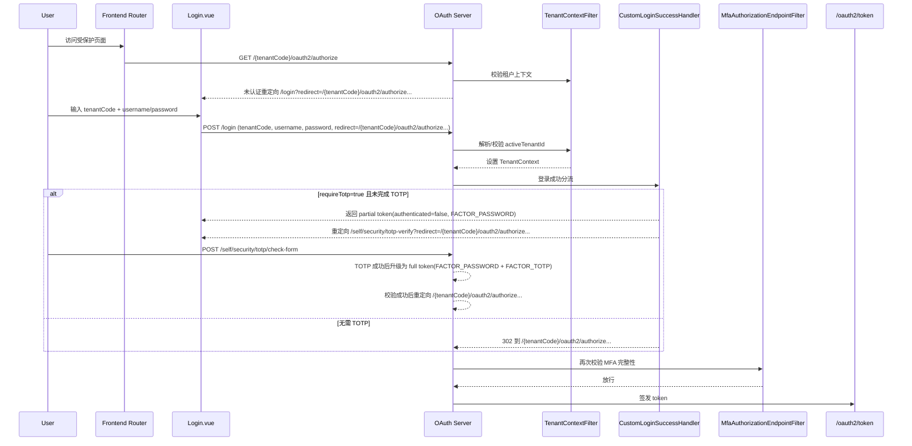

# 登录与租户认证流程（权威版）

最后更新：2026-03-04  
适用模块：`tiny-oauth-server`

## 1. 范围与结论

1. 运行时活动租户唯一键统一为 `activeTenantId`。  
2. 前端登录页提交 `tenantCode`，后端在认证前统一解析为租户 ID。  
3. 登录成功后，租户上下文冻结到 Session（主键 `AUTH_ACTIVE_TENANT_ID`）；后续请求优先信任 token/session 内活动租户，请求头统一使用 `X-Active-Tenant-Id`。  
4. 前端页面内部的路由 query 若需要表达“当前活动租户”，统一使用 `activeTenantId`；新接口不得再用 `tenantId` 表达当前上下文。  
5. 内部页面之间的首页/列表/详情回退可以保留 `activeTenantId`；登录页入口与 `/login` 跳转不通过路由 query 传递活动租户，而是继续使用 `tenantCode` 输入和认证链冻结的租户上下文。  
6. 请求日志、MDC 和应用日志模式中的当前上下文键统一使用 `activeTenantId`；存储层记录归属字段若仍为 `tenantId`，不得与日志上下文字段混用。  
6. OIDC/SAS 严格按 **官方多 issuer(path-based issuer)**：前端 authority 为 `http://host/{tenantCode}`，授权端点走 `/{tenantCode}/oauth2/authorize`。  
7. Authorization Server 开启 `multipleIssuersAllowed(true)`，并按 issuer 路由 `RegisteredClientRepository / OAuth2AuthorizationService / OAuth2AuthorizationConsentService`。  
8. `amr` 严格跟随真实完成因子：  
   - `mode=NONE`：只应有 `password`  
   - `mode=OPTIONAL/REQUIRED`：仅在真实完成 TOTP 后才出现 `totp`  
9. `OPTIONAL` 下“跳过绑定提醒”已持久化（按设备指纹 + 过期时间），避免会话间反复弹窗。
10. “半程 MFA” 会话使用 `MultiFactorAuthenticationToken`，并保持 `authenticated=false`；是否允许继续 challenge 流程由 factor authority（`FACTOR_PASSWORD` / `FACTOR_TOTP`）决定。  
11. 登录/MFA 流程中的 `redirect` 仅允许站内相对路径或内部授权链路径；外部客户端回调只允许由 `/oauth2/authorize` 经过已注册 `redirect_uri` 校验后决定。  
12. `POST /login` 与 `POST /self/security/**` 已启用 CSRF 防护，前端需先获取 `/csrf`。  
13. TOTP 在线验证已启用防爆破保护：默认 10 分钟窗口内连续失败 5 次后锁定 10 分钟，状态存放在 `LOCAL+TOTP` 认证方法配置中。
14. 密码登录失败已启用临时锁定：默认连续失败 5 次后锁定 15 分钟，状态存放在 `user.failed_login_count` / `user.last_failed_login_at`，登录页会显示剩余锁定时间；管理员手工解锁时会同步清零失败计数。

## 2. 决策表

### 2.1 租户上下文（`TenantContextFilter`）

| 场景 | 租户来源 | 处理 |
|---|---|---|
| 已认证请求 | token/session 中 activeTenantId | 作为唯一可信来源；与 header/session 冲突直接 `403 tenant_mismatch` |
| 未认证且 `POST /login` | 登录入口：`tenantCode` | 仅登录入口允许参数解析，并最终冻结为活动租户 ID |
| 未认证且访问 `/{tenantCode}/oauth2/**` | issuer path 中 `tenantCode` | 由 issuer path 解析目标租户 ID，并冻结到 session |
| 其他未认证请求 | 无可信租户来源 | `400 missing_tenant` |

### 2.2 MFA 与 `amr`

| 模式 | 用户状态 | 会话是否要求 TOTP (`requireTotp`) | `amr` 预期 |
|---|---|---|---|
| `NONE` | 任意 | `false` | `["password"]` |
| `OPTIONAL` | 未绑定/未激活 | `false` | `["password"]` |
| `OPTIONAL` | 已绑定且已激活 | `true` | 完成 TOTP 后 `["password","totp"]` |
| `REQUIRED` | 未绑定/未激活 | 由强制绑定流程拦截 | 不签发最终 token |
| `REQUIRED` | 已绑定且已激活 | `true` | 完成 TOTP 后 `["password","totp"]` |

### 2.3 安全端点访问边界

| 端点 | 允许的认证状态 | 补充约束 |
|---|---|---|
| `/self/security/status` | partial / full | 仅查看状态 |
| `/self/security/totp-bind` `/self/security/totp-verify` | partial / full | 仅页面 challenge |
| `/self/security/totp/bind-form` `/self/security/totp/check-form` | partial / full | 需携带 CSRF |
| `/self/security/totp/skip` `/self/security/skip-mfa-remind` | partial / full | 仅未激活 TOTP、非 `REQUIRED`、非 `NONE` 时可用 |
| `/self/security/totp/check` `/self/security/totp/bind` | full | 需先完成完整登录 |
| `/self/security/totp/unbind` | full + `FACTOR_TOTP` | 高敏降权操作，必须已完成 TOTP |

## 3. 时序图



## 4. 错误码清单

| HTTP | error | 触发点 | 说明 |
|---|---|---|---|
| 400 | `missing_tenant` | `TenantContextFilter` | 缺少有效活动租户 ID |
| 403 | `tenant_mismatch` | `TenantContextFilter` | token/session/header 租户不一致 |
| 401 | `未登录`（页面参数） | `SecurityController` | 访问需要认证的安全接口 |
| 400 | `当前状态不允许跳过二次验证绑定提醒` | `SecurityController` | 已激活 TOTP / 强制 MFA / MFA 禁用时调用 skip 接口 |
| 400 | `验证码错误` / `TOTP 验证尝试过多，请 X 分钟后重试` | `SecurityServiceImpl` / `MultiAuthenticationProvider` | TOTP 校验失败或触发临时锁定 |
| 302 -> `/login?message=...` | `账号已被锁定，请联系管理员` / `登录失败次数过多，请 X 分钟后重试` | `MultiAuthenticationProvider` / `CustomLoginFailureHandler` | 手工锁定或密码失败达到阈值后触发 |

## 5. Token Claims 约束

由 `JwtTokenCustomizer` 添加并校验：

- `activeTenantId`：必须存在且来自认证上下文
- `amr`：来自 factor authority（兼容读取 `MultiFactorAuthenticationToken.completedFactors`）
  - `PASSWORD -> password`
  - `TOTP -> totp`
  - 不允许在未实际完成 TOTP 时自动补齐 `totp`

## 5.1 Redirect / CSRF 约束

1. 登录成功处理器、TOTP 绑定页、TOTP 验证页只接受站内相对路径作为 `redirect`。  
2. `https://...`、`//host`、`javascript:` 等外部/危险值一律回退到 `/`。  
3. `/oauth2/authorize?...` 与 `/{tenantCode}/oauth2/authorize?...` 仍允许作为内部跳转目标。  
4. 外部客户端回调地址必须通过 OAuth2 授权端点上的已注册 `redirect_uri` 校验，不能通过 `/login?redirect=...` 直接决定。  
5. 前端在提交登录/MFA 表单前，必须先获取 `/csrf` 并回填 `_csrf` / `X-XSRF-TOKEN`。
6. 登录失败后跳回 `/login` 时，后端会保留内部 `redirect` 并附带 `message` 查询参数；登录页直接展示该消息。
7. `/login` 及相关登出/失效跳转默认不附带 `activeTenantId` query；登录页仍通过 `tenantCode` 和认证前置解析恢复租户上下文。
8. 示例脚本、历史接口或业务 DTO 中若仍出现 `tenantId`，默认应视为遗留字段或存储层语义；新接口应优先迁移到 `activeTenantId`、`recordTenantId`、`executionTenantId` 或 `createdTenantId`。

## 6. 回归矩阵（已自动化）

已落地自动化用例：  
`src/test/java/com/tiny/platform/core/oauth/e2e/AuthenticationFlowE2ERegressionTest.java`

执行命令：

```bash
mvn -pl tiny-oauth-server -Dtest=AuthenticationFlowE2ERegressionTest test
```

矩阵维度（12 组合）：

| 维度 | 值 |
|---|---|
| MFA 模式 | `NONE` / `OPTIONAL` / `REQUIRED` |
| TOTP 状态 | 已绑定激活 / 未绑定 |
| 租户一致性 | 匹配 / 不匹配 |

自动断言规则：

1. `tenant mismatch`：必须 `403 tenant_mismatch`，后续链路不得执行。  
2. 租户匹配时的登录跳转路径：  
   - `NONE`：`http://localhost:5173/`  
   - `OPTIONAL + 已绑定激活`：`/self/security/totp-verify?redirect=%2F`  
   - `OPTIONAL + 未绑定`：`/self/security/totp-bind?redirect=%2F`  
   - `REQUIRED + 已绑定激活`：`/self/security/totp-verify?redirect=%2F`  
   - `REQUIRED + 未绑定`：`/self/security/totp-bind?redirect=%2F`  
3. 会签发 token 的场景必须断言 claim：`activeTenantId=1`。  
4. `amr` 必须符合真实完成因子：  
   - `NONE`：`["password"]`  
   - `OPTIONAL/REQUIRED` 且已完成 TOTP：`["password","totp"]`  
   - 跳转绑定页场景（未完成认证链）不应进入 token 断言。  
5. partial MFA 会话应满足：  
   - `authenticated=false`  
   - 具备 `FACTOR_PASSWORD`  
   - 能访问 challenge 端点，不能访问 `/self/security/totp/unbind`。  
6. TOTP 连续失败达到阈值时，后续登录/step-up/bind/unbind 应统一返回锁定错误。  

## 7. 关键实现文件

- `src/main/java/com/tiny/platform/core/oauth/tenant/TenantContextFilter.java`
- `src/main/java/com/tiny/platform/core/oauth/config/DefaultSecurityConfig.java`
- `src/main/java/com/tiny/platform/core/oauth/config/CustomLoginSuccessHandler.java`
- `src/main/java/com/tiny/platform/core/oauth/config/AuthorizationServerConfig.java`
- `src/main/java/com/tiny/platform/core/oauth/config/OAuth2DataConfig.java`
- `src/main/java/com/tiny/platform/core/oauth/multitenancy/TenantPerIssuerComponentRegistry.java`
- `src/main/java/com/tiny/platform/core/oauth/security/MultiFactorAuthenticationSessionManager.java`
- `src/main/java/com/tiny/platform/core/oauth/security/MultiFactorAuthenticationToken.java`
- `src/main/java/com/tiny/platform/core/oauth/security/TotpVerificationGuard.java`
- `src/main/java/com/tiny/platform/core/oauth/security/RedirectPathSanitizer.java`
- `src/main/java/com/tiny/platform/core/oauth/config/JwtTokenCustomizer.java`
- `src/main/java/com/tiny/platform/core/oauth/controller/SecurityController.java`
- `src/main/java/com/tiny/platform/core/oauth/controller/CsrfController.java`
- `src/main/webapp/src/views/Login.vue`
- `src/main/webapp/src/auth/oidc.ts`

## 8. 租户审计 SQL 验证（新增）

脚本：`scripts/verify-auth-audit-tenant.sh`

用途：

1. 校验 `user_authentication_audit` 是否包含 `tenant_id / tenant_resolution_code / tenant_resolution_source`。  
2. 输出最近窗口内 `tenant_resolution_code/source` 分布。  
3. 扫描异常组合（如 `resolved + tenant_id is null`、source 非法值）。  
4. 展示最近 20 条审计记录用于排障。

执行：

```bash
# 默认连接 127.0.0.1:3306/tiny_web，窗口 120 分钟
./scripts/verify-auth-audit-tenant.sh

# 自定义连接
AUTH_AUDIT_VERIFY_DB_HOST=127.0.0.1 \
AUTH_AUDIT_VERIFY_DB_PORT=3306 \
AUTH_AUDIT_VERIFY_DB_USER=root \
AUTH_AUDIT_VERIFY_DB_PASSWORD=your_password \
AUTH_AUDIT_VERIFY_DB_NAME=tiny_web \
AUTH_AUDIT_VERIFY_MINUTES=60 \
./scripts/verify-auth-audit-tenant.sh

# 严格模式（发现异常直接失败）
AUTH_AUDIT_VERIFY_STRICT=1 ./scripts/verify-auth-audit-tenant.sh
```

## 9. 旧文档下线

下列文档不再作为流程依据：

- `登录流程梳理.md`
- `登录流程优化总结.md`
- `登录额外参数使用示例.md`
- `多认证方式验证流程.md`

统一入口：`认证文档索引.md`。
