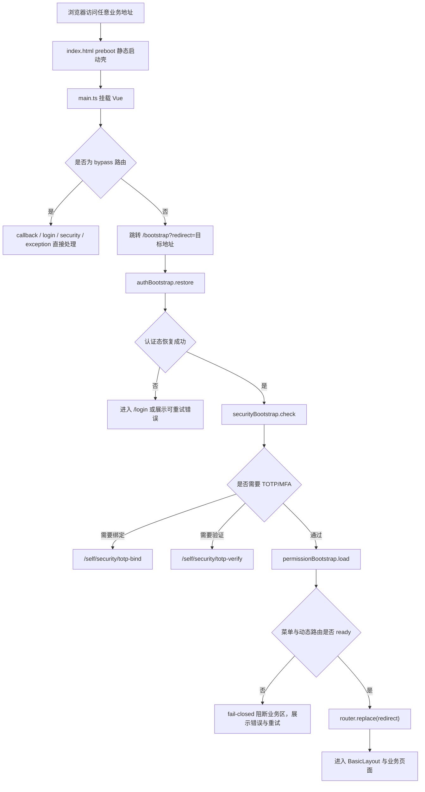

# 前端启动与认证编排说明

> 当前态：2026-05-08。  
> 适用范围：`tiny-oauth-server/src/main/webapp` 的登录恢复、OIDC callback、TOTP 安全流程、菜单权限加载与动态路由注册。

## 目标

前端启动链路的目标不是“把请求做快一点”，而是避免认证恢复、平台 Session 桥接、OIDC silent login、TOTP 安全检查、菜单权限加载和动态路由注册发生在用户不可见阶段。

当前标准是：

- `main.ts` 只负责挂载 Vue 应用。
- `index.html` 提供 Vue 资源加载前的静态 preboot 壳。
- `/bootstrap` 负责展示可见启动状态和统一编排启动流程。
- router guard 只做轻量分流，不承载重型异步流程。
- `BasicLayout` 只在认证、安全状态、菜单权限和动态路由都 ready 后进入。

## 标准流程



## 路由分类

| 类别       | 路由                                                     | 行为                                                         |
| ---------- | -------------------------------------------------------- | ------------------------------------------------------------ |
| 启动编排   | `/bootstrap`                                             | 只负责启动状态展示与编排，不能再次被重定向到 `/bootstrap`    |
| OIDC 登录回调 | `/callback`                                             | 必须绕过启动回环；callback 完成 code 处理后回流 `/bootstrap` |
| OIDC 静默续期 | `silent-renew.html`                                     | 独立 HTML iframe 入口，只执行 `signinSilentCallback()`；不注册 Vue Router 路由，不进入 `/bootstrap` 守卫 |
| 登录页     | `/login`                                                 | 未认证入口；已认证时回到 `/bootstrap` 或首页                 |
| 安全流程页 | `/self/security/totp-bind`、`/self/security/totp-verify` | 需要已认证会话，但不依赖菜单、动态路由或 `BasicLayout`       |
| 异常页     | `/exception/**`                                          | 最小可用错误展示，不依赖业务权限菜单                         |
| 业务页     | `/`、`/system/**`、`/platform/**` 等                     | 必须等 `/bootstrap` 完成后进入                               |

## 启动状态

`BootStatus` 用于驱动 `/bootstrap` 的用户可见状态：

| 状态                 | 用户含义                   |
| -------------------- | -------------------------- |
| `checking_auth`      | 正在检查登录状态           |
| `restoring_session`  | 正在恢复登录态             |
| `checking_security`  | 正在检查安全状态           |
| `loading_permission` | 正在加载菜单和权限         |
| `registering_routes` | 正在注册动态路由           |
| `redirecting`        | 正在进入目标页面           |
| `ready`              | 启动完成                   |
| `error`              | 启动失败，可重试或返回登录 |

## 失败策略

- OIDC `prompt=none` 返回 `login_required` / `interaction_required` / `consent_required` 时，进入登录页。
- 静默恢复超时、网络异常、Cookie/iframe 受限时，停留在 `/bootstrap` 展示可重试错误。
- `invalid_state` 等认证状态异常应清理本地态并回到登录流程。
- 菜单为空、菜单 URL 非内部路径、组件缺失、重复 path 等情况必须 fail-closed，不能进入半可用业务区。
- `stale_permissions`、`token_revoked`、`missing_tenant`、普通 `401` 会广播授权运行态 reset，当前 tab 和其他 tab 都应取消旧 bootstrap 并清理动态菜单路由。

## 运行态一致性信号

当前启动链路把“权限漂移、菜单结构变化、token/session 强制失效”拆成三条独立信号，不能互相替代：

| 信号 | 归属 | 解决的问题 | 典型响应 |
| ---- | ---- | ---------- | -------- |
| `permissionsVersion` | 用户在 active scope 下的授权快照 | 角色分配、角色层级、角色权限、权限启停等导致旧 token 权限 claims 漂移 | Bearer 旧快照返回 `401 stale_permissions`，前端 silent renew 一次并重试；失败则回登录 |
| `MENU_CONFIG` | 菜单结构和菜单权限 requirement 的运行态配置版本 | 菜单路径、组件、排序、显隐、权限 requirement 变化导致旧菜单树/旧动态路由不可再信任 | `/sys/menus/tree` 返回新 `ETag` / `X-Menu-Config-Version`，前端重拉菜单并重建动态路由 |
| `tokenSecurityVersion` + `tokenNotBefore` | 用户 token/session 安全状态 | 用户禁用、删除、密码或 TOTP 安全状态变化，需要强制旧 access token 和旧 session 失效 | 返回 `401 token_revoked`，前端不 silent retry，清理运行态并进入重新登录 |

后端当前采用 DB 兜底实现：

- `permissionsVersion` 由 `PermissionVersionService` 基于当前授权真相源计算，不落到浏览器长期缓存。
- `MENU_CONFIG` 由 `runtime_version_signal` 表承载版本域；菜单新增、修改、删除、排序和兼容资源写链会 bump。
- `tokenSecurityVersion/tokenNotBefore` 由 `user_token_security_state` 表承载；新签发 access token 写入 `tokenSecurityVersion` 和 `tokenNotBefore` claims，请求过滤器按当前安全状态 fail-closed 校验。

前端处理边界：

- `stale_permissions` 表示 token 仍可能通过 silent renew 自愈，所以只允许重试一次原请求。
- `token_revoked` 表示安全状态已明确变更，禁止 silent retry，必须重新登录。
- 菜单缓存只有在后端 `304 Not Modified` 后才复用本地菜单树；任何未通过后端版本校验的本地菜单都不能作为权限或路由真相源。

## 菜单缓存

菜单缓存采用“后端权威版本 + HTTP 条件请求 + 前端可验证缓存”：

- 后端 `/sys/menus/tree` 返回 `ETag`、`X-Menu-Config-Version`、`X-Permissions-Version`，并支持 `If-None-Match` 命中时返回 `304`。
- `permissionsVersion` 表示当前用户在 active scope 下的权限快照；`menuConfigVersion` 表示菜单结构、路由字段、显隐、排序与菜单权限 requirement 的配置版本。
- `menuConfigVersion` 的当前兜底实现为 DB 持久化版本信号表 `runtime_version_signal`，版本域为 `MENU_CONFIG`；首次缺失时由现有 `menu` / `menu_permission_requirement` 数据生成初始指纹，后续菜单新增、修改、删除、排序通过 `RuntimeVersionStore` bump 版本。
- 服务端菜单树缓存仍通过 `MenuRuntimeTreeCacheStore` 抽象，当前实现为单节点内存缓存；如需多节点共享缓存，可替换为 Redis 或 DB 缓存实体，但前端只信任后端 ETag/版本校验结果。
- 前端只在后端返回 `304` 后复用 `localStorage` 中的菜单树；不会无条件长期复用本地菜单。
- 前端缓存索引按 `userId + activeScope + permissionsVersion + appVersion` 隔离，缓存实体再绑定 `menuConfigVersion + ETag`；权限或菜单变化后会重新拉取并重建动态路由。

## TOTP 流程

TOTP 绑定或验证成功后，后端不直接把用户送进业务页，而是回到：

```text
/bootstrap?redirect=原目标地址
```

这样可以重新执行：

1. OIDC 登录态恢复。
2. 安全状态检查。
3. 菜单权限加载。
4. 动态路由注册。
5. 进入原目标页。

TOTP 跳过同样必须回流 `/bootstrap`，且 redirect 必须经过同源/内部路径净化，避免 open redirect。

## 关键文件

| 文件                                        | 职责                                                    |
| ------------------------------------------- | ------------------------------------------------------- |
| `index.html`                                | Vue 资源加载前的静态 preboot 壳；资源过慢时给出可见提示 |
| `src/main.ts`                               | 挂载应用，不等待认证初始化                              |
| `src/router/index.ts`                       | 轻量路由分流                                            |
| `src/router/routePolicy.ts`                 | bypass、backend-only redirect、redirect 净化策略        |
| `silent-renew.html` / `src/auth/silent-renew.ts` | OIDC silent renew 的独立 iframe 回调入口，不进入 Vue Router |
| `src/bootstrap/appBootstrap.ts`             | 启动编排、single-flight、runId 过期结果丢弃             |
| `src/bootstrap/bootState.ts`                | 启动状态机与阶段耗时                                    |
| `src/auth/authBootstrap.ts`                 | OIDC user 恢复与平台 Session 静默桥接                   |
| `src/security/securityBootstrap.ts`         | TOTP/MFA 安全状态检查                                   |
| `src/permission/permissionBootstrap.ts`     | 菜单权限加载、动态路由注册与 fail-closed                |
| `src/permission/menuTreeCache.ts`           | 菜单树本地可验证缓存，不作为权限真相源                  |
| `src/permission/menuTreeLoader.ts`          | `If-None-Match` 校验、304 后复用缓存、失效后重拉菜单     |
| `src/permission/dynamicRoutes.ts`           | 菜单转路由、组件解析、脏菜单诊断                        |
| `src/runtime/authorizationRuntimeEvents.ts` | 授权运行态 reset 的同 tab / 跨 tab 事件通道             |

## 回归验证

基础验证：

```bash
cd tiny-oauth-server/src/main/webapp
npm run type-check
npm run test:unit -- src/router/index.test.ts src/auth/auth.test.ts src/api/security.test.ts src/views/security/TotpBind.test.ts src/views/security/TotpVerify.test.ts
npm run build-only
```

后端 TOTP redirect 验证：

```bash
mvn -pl tiny-oauth-server -Dtest=SecurityControllerRedirectTest test
```

本地全链路快速验证：

```bash
bash tiny-oauth-server/scripts/verify-platform-local-dev-stack.sh
```

浏览器验收建议覆盖：

- 未登录访问 `/`：看到 preboot 或 `/bootstrap` 可见状态，不出现白屏。
- 平台 Session 已存在但前端无 OIDC user：`/bootstrap` 展示“恢复登录态”，成功后进入业务页。
- TOTP 跳过：后端回到 `/bootstrap?redirect=/`，再进入业务页。
- Slow 4G / 3G：静默恢复超时应展示错误和“重新尝试 / 返回登录”，不黑屏不白屏。
- 菜单接口失败或脏菜单：业务区 fail-closed，显示菜单权限加载失败。
- `/callback`、`/bootstrap` 之间不得出现守卫回环；`silent-renew.html` 不注册 Vue Router 路由，避免 iframe silent renew 进入完整应用启动链路。
